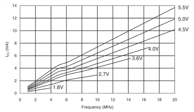
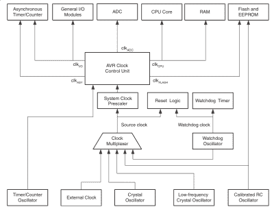

# 嵌入 Elliot:用 AVR 微控制器换挡

> 原文：<https://hackaday.com/2015/06/18/embed-with-elliot-shifting-gears-with-avr-microcontrollers/>

大多数现代计算机能够动态地调整它们的工作频率，以便在不频繁使用时节省电能，并在负载增加时提供看似瞬时的响应。你可能会惊讶地听到，低 8 位 AVR 微控制器也可以切换 CPU 速度齿轮的飞行。在本期《嵌入埃利奥特》中，我们将深入探讨 AVR 不被看好的 CPU 时钟预分频器。

## 保险丝

大多数(全部？)AVR 微控制器直接从工厂出厂，其系统时钟设置为内部振荡器速度的八分之一。例如，一个普通的 ATmega168 有一个内部 RC 振荡器，以 8 MHz 的频率运行，但默认情况下它会被分频到 1MHz。在过去糟糕的日子里，当恐龙在地球上漫游，ATmega8 是块中的新芯片时，你必须"[烧保险丝](http://hackaday.com/2012/08/30/avr-fuse-bits-explained/)来改变这一点，并让芯片全速运行。

保险丝是配置位，在重新启动后保持不变，不能从您的代码或引导加载程序中更改，必须使用外部硬件程序员来更改。这个想法是，它们包含非常敏感的配置位，您不希望像错误代码这样普通的东西把它们弄乱。诸如低功耗掉电检测、芯片启动时间、阻止您读取程序存储器的锁定位等等都存储在熔丝位中。

基本上，保险丝包含所有可以“砌砖”AVR 的设置，并迫使您接触到[高压编程器](http://www.der-hammer.info/hvprog/index_en.htm)。计算你需要的保险丝设置有点乏味:我总是使用一个[在线保险丝计算器](http://www.engbedded.com/fusecalc)来确保我得到正确的设置。

 Atmel 显然最初认为 CPU 时钟速度是那些不可触碰的参数之一。够公平；我们将研究当你在下面换档时会发生什么故障。

但是阻止你动态地改变时钟速度也就去除了降低芯片功耗的一个重要手段。所以新的芯片可以让你通过软件控制系统时钟预分频器。

请注意，如果您使用外部晶振，您仍然需要对适当的熔丝位进行编程，以使其能够使用。您不能在代码中从外部时钟切换到内部时钟。然而，一旦 AVR 在外部晶振上运行，您仍然可以使用时钟预分频器动态改变(相对于晶振的频率)。也就是说，您可以在基于 AVR 的 Arduino 上更改 CPU 预分频器。

## 使用预分频器

哪些芯片系列具有软件可调时钟预分频器？所有 ATmegax8 芯片(48、88、168 和 328)和大多数现代 Tiny，从 Tiny2313 到 Tinyx4、x5 和 x61 系列，都支持动态改变时钟乘法器。还有其他的，你可以筛选你最喜欢的芯片的 io.h 文件来寻找 CLKPS 的定义。

简而言之，你的芯片可能会有一个预分频器，除非你有一堆新石器时代的 ATmega8，你试图最终用完。

改变预分频器的实际顺序被故意弄得有点复杂:就像转动钥匙发射核导弹一样，这不是你想误做的事情。首先，为了改变时钟分频位，必须设置预分频器改变使能位。但启用位在开启后的四个 CPU 时钟周期内会自动重置，因此获取新的除法位的时间很紧。如果在此过程中触发了中断，您将无法及时设置时钟速度，因此在改变速度时，您最好也关闭中断。

非常方便的是， [GNU AVR libc](http://www.nongnu.org/avr-libc/user-manual/index.html) 提供了预写的汇编代码来帮你跳这个舞，处理芯片间的差异，并让你的代码在这个过程中更容易阅读。一旦你包含了“ [avr/power.h](http://www.nongnu.org/avr-libc/user-manual/group__avr__power.html) ”，改变 CPU 时钟就像 clock _ prescale _ set(clock _ div _ 64)一样简单。现在你的芯片运行在 125kHz (= 8MHz / 64)。

取代老式的让芯片全速运行的保险丝闪烁，只需在初始化例程中的某个地方包含 clock_prescale_set(clock_div_1)。小菜一碟。

## 困难之处

所以现在你可以从你的代码中随意改变所有的 CPU 时钟速度。会出什么问题呢？简而言之，所有依赖系统时钟计时的东西。

 正如你所看到的，大多数 AVR 的硬件外设使用的时钟都是通过系统时钟预分频器从 CPU 系统时钟中获得的。定时器/计数器、所有串行 I/O (USART、SPI 和 I2C)以及模数转换器(ADC)都有自己的子时钟，这些子时钟是系统时钟的分频版本。

好消息是，改变其中的任何一个来工作在新的 CPU 速度上就像重新设置它们的时钟分频器一样简单。最简单的解决方案是编写类似“switch_to_8MHz()”的函数，该函数切换 CPU 速度并同时重新初始化各种硬件外设。

常用的标准延迟函数 _delay_ms()和 _delay_us()将会被搞乱，因为它们依赖于一个编译时宏定义 F_CPU，并且只能取一个值。如果宏 F_CPU 被设置为 1MHz，但是你将时钟速度降低到 125kHz，当你运行缓慢时，你所有的延迟将会是原来的 8 倍。

延迟问题有点棘手，因为内置的延迟函数只接受常量作为参数，所以您需要编写自己的延迟例程，将当前的 CPU 速度考虑在内。举例来说，当你运行 CPU 的速度是原来的 8 倍时，这可能就像简单地在一个固定的延迟上循环 8 次一样简单。设置一个“delay_multiplier”全局变量来指定循环次数，并在改变 CPU 速度时更新它，这可能是最好的方法。

## 最后

因此，你可以看到，虽然从你的代码改变时钟速度是微不足道的，需要一点点小心，以确保所有的 AVR 外设一起发挥作用。但是，如果你想节省一点电力，睡眠模式对你来说不合适，改变划分系统时钟的齿轮是一个很好的方法。即使你不打算在运行中改变 CPU 速度，至少你不必为了让 AVR 芯片全速运行而烧掉熔丝位。给 CPU 预分频器一个眼神！