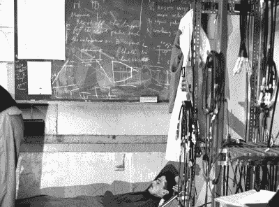

# 欧洲核子研究中心竞赛——工作到累倒

> 原文：<https://hackaday.com/2015/06/19/caption-cern-contest-work-until-you-drop/>

CERN 竞赛的第 19 周现在已经被记录在案，尽管我们确信在接下来的几周内我们会收到来自 HR 的关于该事件的“安全更新”邮件。感谢所有不顾一切提交说明的人！这绝对是欧洲粒子物理研究所的医疗室或急诊室。我们仍然不太清楚为什么他们需要一个完整的骨架。我们不得不怀疑这个可怜的前人类参与了多少次实验室恶作剧。

搞笑的是:

*   “第二个测试对象比第一个活得好一点，如果你想知道，第一个测试对象正站在角落里”——[[jakewisher 125](https://hackaday.io/hacker/62731-jakewisher125)]
*   "人们很快意识到，将现场安保工作委托给使用激光的鲨鱼是一个错误。"-[ [罗伯·史密斯](https://hackaday.io/zenmaster.bob)
*   “疼就眨一下是什么意思？你说真的？”–[[rollyn 01](https://hackaday.io/Rollyn01)]

本周的获奖者是[[威尔·弗兰基安](https://hackaday.io/hacker/7113-will-frankian)]“班克斯博士再也没有尝试目测电子束的排列”。祝贺[将]成功！享受来自 Hackaday 商店的[浅蓝色咖啡豆！](http://store.hackaday.com/products/lightblue-bean)

#### 第 20 周

 任何参与过重大项目的人，无论是专业的、个人的，还是像[hack aday 奖](https://hackaday.io/prize)这样的竞赛，都知道马拉松会议。那些你竭尽全力推进项目直到你放弃的时候。这位科学家无疑付出了他的全部，甚至更多！他可能一直在黑板下工作，正在那里打盹。这张图片没有标题，尽管它附在一个名为[直线加速器控制室](https://cds.cern.ch/record/2002738)的相册里。不过，这些照片似乎都没有显示出多少控制室的样子。似乎早在 1966 年，CERN 的摄影师对沉睡的科学家比对科学本身更感兴趣。

你认为这幅图像中发生了什么？你能从黑板上的图表中看出什么有趣的东西吗？试试看！本周的奖品是来自 Hackaday 商店的一个棍子。

将您的幽默标题作为评论添加到此项目日志中。确保你评论的是 [**比赛日志**，](https://hackaday.io/contest/4200-caption-cern-contest/log/19679-caption-cern-contest-week-20)而不是比赛本身。一如既往，如果你真的有关于图像或图像中的人的信息，请在[原始图像讨论页面上让 CERN 知道。](https://cds.cern.ch/record/1767189)

祝你好运！