# 深圳的刺激——电子极客的糖果乐园

> 原文：<https://hackaday.com/2015/06/22/the-thrill-of-shenzhen-candyland-for-electronics-geeks/>

对于一个不同的岗位来说，到达深圳是一次冒险，但 Hackaday 的工作人员做到了，并在上周四度过了我们在这座城市的第一个全天。

与周三在香港的经历不同，你遇到的大多数人不会说英语，标志上一般也没有英文单词。这使得出行变得困难，因为很难弄清楚你要去哪里。向出租车司机传达目的地或将其转化为公共交通同样困难。我可以坐出租车去软件产业基地，因为我在手机上存了汉字地址，并给出租车司机看了。但是当旅行结束的时候，我不知道该付多少钱……计价器显示 10 元，但是有几元的额外费用，我回想起来才知道。但我的司机对此非常友好，给了我零钱和微笑。

## 参观 Seeed 工作室

 [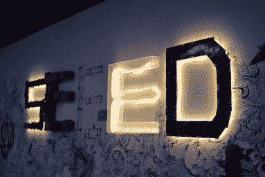](https://hackaday.com/2015/06/22/the-thrill-of-shenzhen-candyland-for-electronics-geeks/seeed-office-reception/) Seeed Studio sign as you walk in [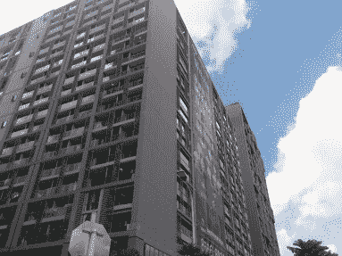](https://hackaday.com/2015/06/22/the-thrill-of-shenzhen-candyland-for-electronics-geeks/img_20150618_102459/) Shenzhen Industrial Software Base [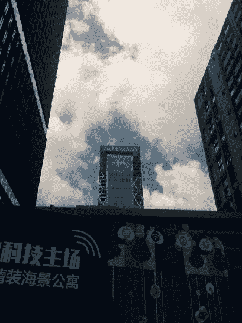](https://hackaday.com/2015/06/22/the-thrill-of-shenzhen-candyland-for-electronics-geeks/img_20150618_102455/) Huge Makerfaire Banners

你可能认为找到正确的建筑很简单。但深圳工业软件基地是一个由类似建筑组成的庞大建筑群。一个友好的保安看了看我保存的地址，用人行道上的方块作为地图，非语言地指引我正确的方向。SZMF 的主办方 Seeed Studio 有一个漂亮的新办公室，其装饰是现代工业风格。有玻璃墙的会议室，但大部分空间在设计上是开放的，因为它围绕着六七层楼的半层楼的外部。

## 冲击市场

在为第二天的黑客日研讨会做了一些规划后，Seeed 的[Chris]主动提出带我们去电子市场。你怎么能拒绝这个提议呢？我们先在一家韩国餐馆停下来吃午饭，然后跳上一辆略显拥挤的出租车去见已经在市场的[马特]和[艾里克]。

 [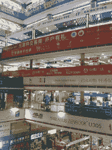](https://hackaday.com/2015/06/22/the-thrill-of-shenzhen-candyland-for-electronics-geeks/img_20150618_135441/) Many floors [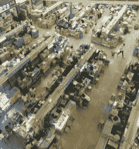](https://hackaday.com/2015/06/22/the-thrill-of-shenzhen-candyland-for-electronics-geeks/img_20150618_135446/) Booth after booth [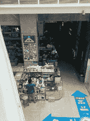](https://hackaday.com/2015/06/22/the-thrill-of-shenzhen-candyland-for-electronics-geeks/img_20150618_135334/) after booth [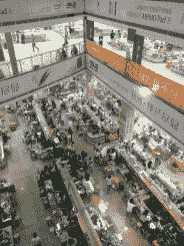](https://hackaday.com/2015/06/22/the-thrill-of-shenzhen-candyland-for-electronics-geeks/img_20150618_135450/) after booth [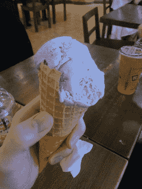](https://hackaday.com/2015/06/22/the-thrill-of-shenzhen-candyland-for-electronics-geeks/img_20150618_141018/) Rice Ice Cream (purple flavor… yum!) [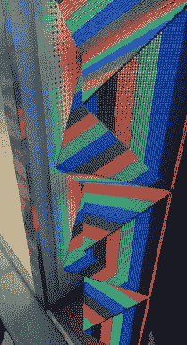](https://hackaday.com/2015/06/22/the-thrill-of-shenzhen-candyland-for-electronics-geeks/img_20150618_145042/) Triangle LED modules form pyramid displays [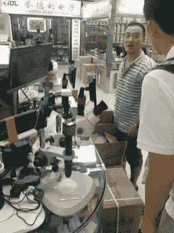](https://hackaday.com/2015/06/22/the-thrill-of-shenzhen-candyland-for-electronics-geeks/img_20150618_150904/) mmmmm… binoc-scopes

华强北市场是布满摊位的多层建筑。我们先是进错了一个，原来是二手设备楼。销售商专门翻新电子产品。一层又一层的摊位上摆满了设备——通常是三层或更多层的笔记本电脑(打开并运行)包裹着每个摊位，其占地面积约为一张特大床。

回到正轨后，我们来到了一座崭新的建筑，这座建筑看上去已经完全挤满了展位。这个地方什么都有，一般按楼层划分。最上面的两层主要是各种各样的发光二极管，或者说是它们的驱动器。我们在寻找可寻址的 led，但似乎没有任何传说中的便宜货。这可能是一个量的问题，因为我后来从一个朋友那里听说，他以一首歌的价格获得了 25 米的 12V WS2812 条。

接下来是寻找“婴儿电话”。这是一部看起来像微型 iPhone 的 Android 手机。他们很可爱。一个又一个街区，一个又一个街区的行走，原路返回，偶遇加入狩猎的熟人，最后爬上阴暗的楼梯和昏暗的过道，这些都得到了回报。哒哒，(索菲的)新手机！

我们跳上地铁从市场回来。我喜欢尝试不同城市的公共交通，这没有让我失望。车站非常干净，在华氏 85 度和 80%的湿度下，空调简直是天堂。

## 超赞的地铁

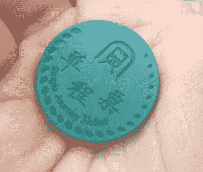

Image Source: WhereAmI.org (also [an interesting Shenzhen read](http://whereami.org/?p=7))

你购买一个代币，它是一个绿色的塑料圆盘，大约有两个美国硬币那么大，叠放在一起。重量非常轻，非常注重技术。每个都是一个 RFID(或其他非接触式)标签。进来的时候敲一下，出去的时候把它扔进投币口。在返程途中，我们意识到我们要改变 Hackaday 周六深圳聚会的地点。我们下了火车，骑上另一条路，换了线路，突然出现在深圳一个美丽的地方。这个城市的一切似乎都是新的，都在建设中。NYPD 比萨店位于一个部分完工的综合建筑中间，但却有着时髦、新潮的 divebar-neveau 风格，是一个令人敬畏的聚会场所。检查回那个故事，值得它自己的职位。

有点累了，我们回到酒店吃了点晚餐，放松了一下。但是谁会错过这个标志着黑客训练营结束的户外烧烤聚会的机会呢？这个由 Hackaday 校友和 Dangerous Prototypes 创始人[Ian Lesnet]发起的创意邀请工程师和硬件创作者来深圳参观，并在史诗般的社交晚会之间尽可能多地学习制造知识。

## 湿淋淋的烧烤聚会

还是那句话，想清楚去哪里真的很难！我们跳上地铁，到达了正确的车站，但要到达感觉像住宅区的烧烤巷，需要漫无目的地闲逛，并撞上两个已经去过派对的不同的人。

 [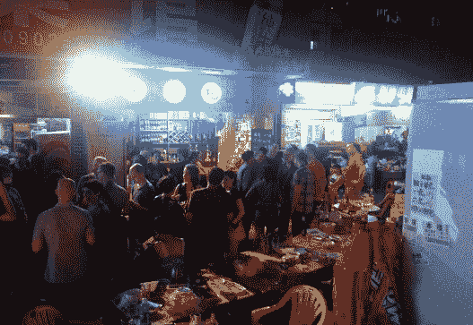](https://hackaday.com/2015/06/22/the-thrill-of-shenzhen-candyland-for-electronics-geeks/img_20150618_231128/) Party in an Alley [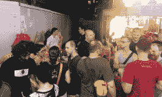](https://hackaday.com/2015/06/22/the-thrill-of-shenzhen-candyland-for-electronics-geeks/img_20150618_222911/) Hot hot hot [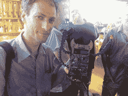](https://hackaday.com/2015/06/22/the-thrill-of-shenzhen-candyland-for-electronics-geeks/img_20150618_231430/) Showing off hardware [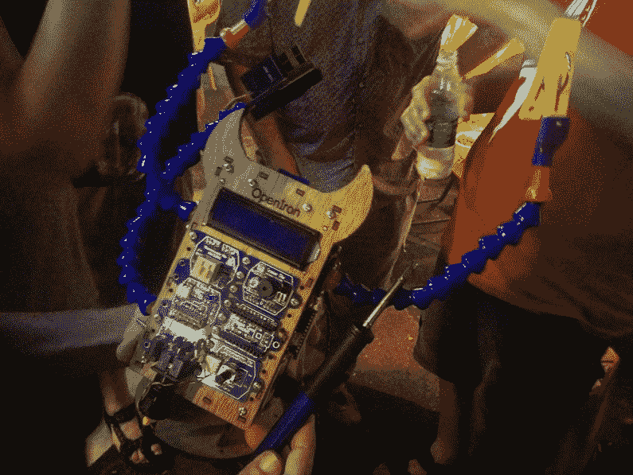](https://hackaday.com/2015/06/22/the-thrill-of-shenzhen-candyland-for-electronics-geeks/img_20150618_231418/) Soldering station lets you program your own features

空气又粘又热。每个人都汗流浃背，喝着一大杯饮料。[看看这张高清专辑](https://hackaday.io/project/5898-hackaday-photography/log/19889-shenzhen-log-01-dangerous-prototypes-dinner)就知道了。有几家餐馆，一个露天酒吧，和一个卖不到一美元的青岛啤酒的杂货铺。对我来说，这似乎是一条死路，但每隔几分钟，就会有一辆鸣着喇叭的摩托车摇摇摆摆地穿过满是汗水的人群。老成持重的外国人和当地人用玻璃杯喝啤酒，但外国游客似乎坚持用瓶子。

这绝对是我一生中最激动人心的一天。我喜欢冒险。这座城市给人一种安全友好的感觉——但是旅行(尤其是在晚上)更让人兴奋。