# 老式电子杂志预测了我们现在的未来

> 原文：<https://hackaday.com/2015/07/13/vintage-electronics-magazines-predicted-our-current-future/>

你记得《大众电子》杂志吗？无线电电子学怎么样？这些杂志通常是我们接触黑客世界的第一手资料。12 月，我们得知[Americanradiohistory.com 已经不辞辛苦地扫描了这两本书的几乎每一份副本](http://hackaday.com/2014/12/03/popular-electronics-magazine-archive-online/)，并继续添加许多许多其他副本——[将它们发布到网上供我们再次欣赏](http://www.americanradiohistory.com/)。从那时起，我们一直在通过档案馆倾倒拉出一些最好的怀旧，娱乐和迷人的工程。

是的，这些材料大部分都已经过时了；CB 无线电，全能计算机，相控器，眩晕枪，悬浮机器，用于简单任务的过于复杂的电路，以及飞行员眼镜。但在所有这些中，我们发现了许多创新的混合信号电路和其他有趣的想法，它们已经发展成为我们以技术为中心的世界。许多你已经欢迎进入你生活的现代发明实际上在很久很久以前就开始于这些出版物中展示的前瞻性思维。上面看到的谷歌眼镜的前身只是一个例子。继续阅读，看看我们倾向于认为是“新”的技术的早期根源。

## 小心谷歌眼镜！

关于谷歌眼镜的消亡已经写了很多，但对于无线电电子产品的读者来说，我们知道谷歌眼镜确实排在第二位。

 [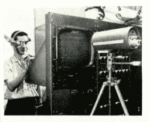](https://hackaday.com/2015/07/13/vintage-electronics-magazines-predicted-our-current-future/watch-tv-from-behind-your-tv/) watch TV from behind your TV [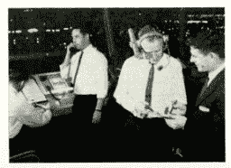](https://hackaday.com/2015/07/13/vintage-electronics-magazines-predicted-our-current-future/get-distracted-while-trying-to-direct-ait-traffic/) You can watch TV from behind your TV, get distracted while trying to direct air traffic, and many more applications for the ‘Television Monocle,’ (Radio Electronics, Sept. 1962). [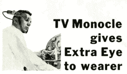](https://hackaday.com/2015/07/13/vintage-electronics-magazines-predicted-our-current-future/take-an-mmooc-on-learning-to-fly-aircraft/) take an MMOOC on learning to fly aircraft [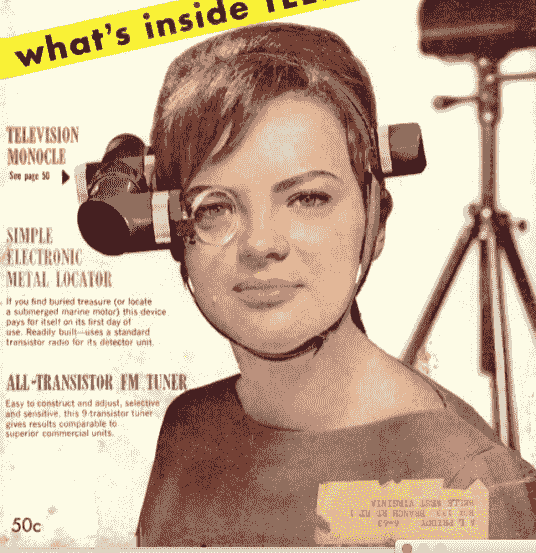](https://hackaday.com/2015/07/13/vintage-electronics-magazines-predicted-our-current-future/screen-shot-2015-05-11-at-7-07-58-am/) 

## **七八十年代的工程技术人员**

作为尖端技术的创新者，我们通常不以时尚感著称。这一点在翻阅我们最喜欢的老式电子杂志时显而易见。

 [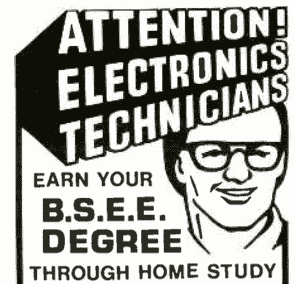](https://hackaday.com/2015/07/13/vintage-electronics-magazines-predicted-our-current-future/screen-shot-2015-05-11-at-11-44-19-am/)  [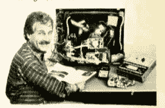](https://hackaday.com/2015/07/13/vintage-electronics-magazines-predicted-our-current-future/let-jimmy-buffet-repair-your-tv/) Let jimmy buffet repair your TV  Saturday Night Feaver meets tape drives [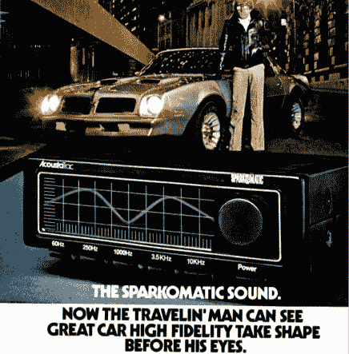](https://hackaday.com/2015/07/13/vintage-electronics-magazines-predicted-our-current-future/screen-shot-2015-07-09-at-9-32-26-pm/)  [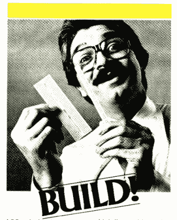](https://hackaday.com/2015/07/13/vintage-electronics-magazines-predicted-our-current-future/screen-shot-2015-07-09-at-9-31-37-pm/) 

## **世界各地和您手中的电脑**

在 70 年代中期和 80 年代，计算机可以做任何事情。你能想象把全世界的电脑连接在一起，或者把一台电脑握在手中的情景吗？

 [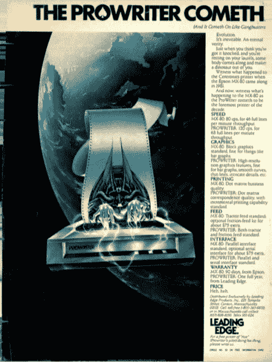](https://hackaday.com/2015/07/13/vintage-electronics-magazines-predicted-our-current-future/omg-this-dot-matrix-printer-is-attacking-us-from-outer-space/) OMG this dot matrix printer is attacking us from outer space [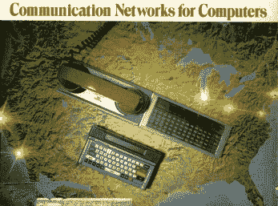](https://hackaday.com/2015/07/13/vintage-electronics-magazines-predicted-our-current-future/screen-shot-2015-05-11-at-7-25-08-am/)   

## **广告比扎罗:**

一些广告和一些项目延伸了现实的边界。

 [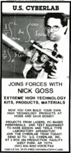](https://hackaday.com/2015/07/13/vintage-electronics-magazines-predicted-our-current-future/screen-shot-2015-05-11-at-11-41-10-am/)  [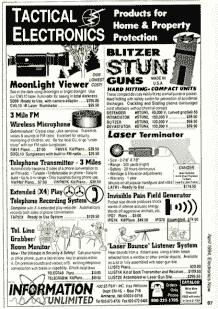](https://hackaday.com/2015/07/13/vintage-electronics-magazines-predicted-our-current-future/screen-shot-2015-05-11-at-11-53-11-am/)  [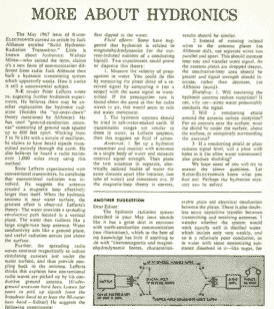](https://hackaday.com/2015/07/13/vintage-electronics-magazines-predicted-our-current-future/radio-electronics-08-1967-hydronics/) Radio Electronics 08 1967 Hydronics [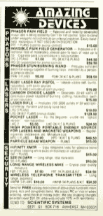](https://hackaday.com/2015/07/13/vintage-electronics-magazines-predicted-our-current-future/screen-shot-2015-05-11-at-7-32-12-am/) 

## **断路器**断路器

在 20 世纪 70 年代，这一切都是关于 CB 无线电。对于那些生活在 70 年代的人来说，不要否认这一点，你可能仍然在地下室或车库里放着那个 CB 收音机。我承认，甚至在 90 年代初，我就拥有两台 CB 收音机，并从中获得了很多乐趣。

 [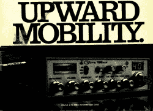](https://hackaday.com/2015/07/13/vintage-electronics-magazines-predicted-our-current-future/screen-shot-2015-05-11-at-8-33-07-am/)  [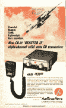](https://hackaday.com/2015/07/13/vintage-electronics-magazines-predicted-our-current-future/screen-shot-2015-05-11-at-9-49-30-am/)  [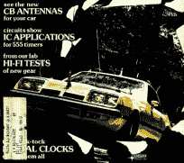](https://hackaday.com/2015/07/13/vintage-electronics-magazines-predicted-our-current-future/screen-shot-2015-05-11-at-8-33-41-am/)  [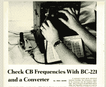](https://hackaday.com/2015/07/13/vintage-electronics-magazines-predicted-our-current-future/screen-shot-2015-05-11-at-9-53-38-am/) 

## **测试者测试者和更多测试者:**

所有这些测试人员都怎么了？晶体管测试仪、集成电路测试仪和许多其他相当复杂的测试设备有许多项目。

## [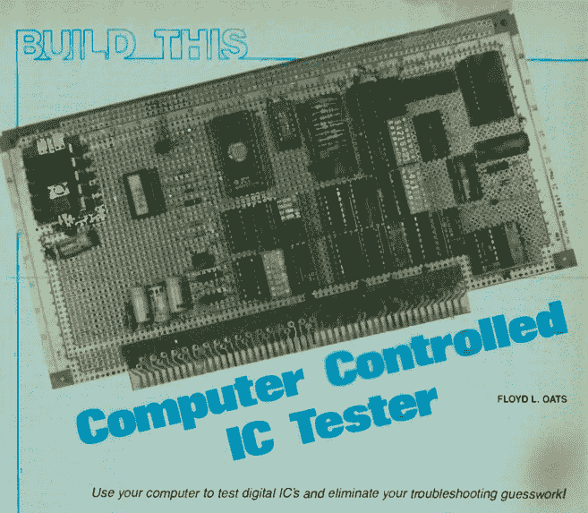](https://hackaday.com/wp-content/uploads/2015/07/whats-up-with-all-of-these-testers-re-sept-1984.png) 
**有用且相关的电路:**

拿我们的电子产品过去开玩笑很有趣，但严肃地说，这些杂志中的许多项目都非常好，杂志提供了出色的文档。许多例子展示了模拟和数字电路的巧妙融合。其他人深入解释音频功率放大器的基础知识，如何使用不寻常的真空管，甚至如何从头开始构建自己的激光器。

 [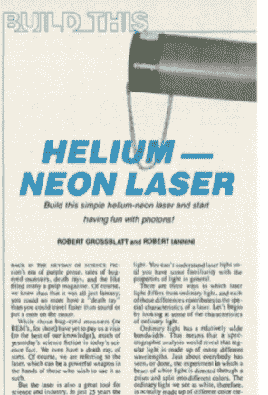](https://hackaday.com/2015/07/13/vintage-electronics-magazines-predicted-our-current-future/build-a-he-laser-radio-electronics-june-1986/) Build your own Helium Neon Laser (Radio Electronics June 1986). [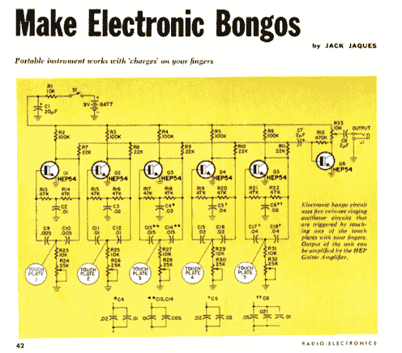](https://hackaday.com/2015/07/13/vintage-electronics-magazines-predicted-our-current-future/radio-electronics-7-1969/) Make your own Electronic Bongos (Radio Electronics, July 1969).  Learn how to use a Dekatron tube or how to build your own shortwave radio (Radio Electronics, Sept. 1962). [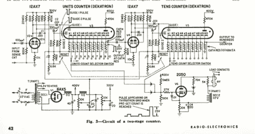](https://hackaday.com/2015/07/13/vintage-electronics-magazines-predicted-our-current-future/screen-shot-2015-05-11-at-7-17-38-am/)  [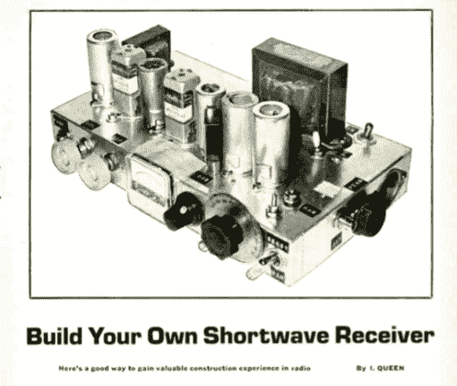](https://hackaday.com/2015/07/13/vintage-electronics-magazines-predicted-our-current-future/screen-shot-2015-05-11-at-9-55-03-am/) 

## **EEVBlog 涉水通过一个巨大的集合**

甚至[戴夫·琼斯]有时也会进入老式电子杂志。

[https://www.youtube.com/embed/Qo7sWu8iQRM?version=3&rel=1&showsearch=0&showinfo=1&iv_load_policy=1&fs=1&hl=en-US&autohide=2&wmode=transparent](https://www.youtube.com/embed/Qo7sWu8iQRM?version=3&rel=1&showsearch=0&showinfo=1&iv_load_policy=1&fs=1&hl=en-US&autohide=2&wmode=transparent)

漫步记忆巷，开怀大笑，了解一两件关于模拟电路设计的事情。我们的黑客传统已经被流行和无线电电子杂志很好地记录下来。谁知道呢，也许有一些伟大的未实现的想法仍然潜伏在这些页面上，等待你去重新发现它们！