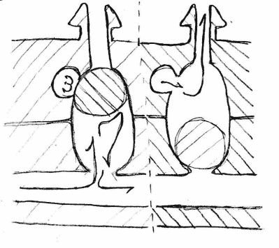

# 气动多路复用器

> 原文：<https://hackaday.com/2015/06/23/pneumatic-multiplexer/>

这是一个非常酷的项目【塞巴斯蒂安·莫拉莱斯】正在做——一个 [3D 打印气动多路复用器](http://www.instructables.com/id/Pneumatic-Multiplexer/?ALLSTEPS)。大型互动装置、动态艺术和许多其他应用需要控制大量的致动器。对于这些类型的项目来说，大量的致动器意味着更高的分辨率，这使得观众能够被作品所吸引。

系统变得越大，控制所有这些致动器就变得越复杂。[Sebestian]希望用相对较少的输入移动大量的组件。他想到创造一种类似于人们熟悉的电子 X-Y 矩阵的机械模型，可以用很少的输入来控制大量的输出——用一种更具描述性的形式来说，就是 Outputs=(Inputs/2)^2.

 他研究了将液体变成气体的化学反应，但那似乎相当复杂。空调中使用的制冷剂看起来很有前途，但它们的处理和安全方面看起来很有挑战性。

最终，他决定用 [air logic](http://hydraulicspneumatics.com/200/TechZone/PneumaticValves/Article/False/6455/TechZone-PneumaticValves) 来看看。空气逻辑使用气动设备来创建继电器，限位开关，与门，与非门，或门，放大器，相当于电路。电能被压缩空气取代。他的计划是建造一个多路复用器，其元件只有在两条线之间的压力组合正确时才会打开。与电子学一样，NAND 逻辑很容易实现。移动元件产生密封，并且仅当底线低而顶线高时才允许空气流出。

他可以使用高分辨率的树脂 3D 打印机，这使他能够创建完全气密的系统。他从一个 4×4 的小矩阵原型开始测试他的设计，在他能够让它工作之前，必须经过 6 到 7 次迭代。下一步是创建由 20 个输入控制的 100 个元素的更大矩阵(10×10 矩阵)。他创造了 omni farious——一个展示变形物体概念的动态雕塑。Omnifarious 是一个[六面体](https://en.wikipedia.org/wiki/Deltoidal_hexecontahedron)，它能够通过其表面上的 59 个气球来转换其表面以呈现不同的几何形状。下面，你可以查看他制作各种原型的视频和另一个展示全方位雕塑的视频。

样机研究

[https://www.youtube.com/embed/XVwUvNYuu-o?version=3&rel=1&showsearch=0&showinfo=1&iv_load_policy=1&fs=1&hl=en-US&autohide=2&wmode=transparent](https://www.youtube.com/embed/XVwUvNYuu-o?version=3&rel=1&showsearch=0&showinfo=1&iv_load_policy=1&fs=1&hl=en-US&autohide=2&wmode=transparent)

包罗万象——变形物体

[https://www.youtube.com/embed/9mbb-HvnnR0?version=3&rel=1&showsearch=0&showinfo=1&iv_load_policy=1&fs=1&hl=en-US&autohide=2&start=10&wmode=transparent](https://www.youtube.com/embed/9mbb-HvnnR0?version=3&rel=1&showsearch=0&showinfo=1&iv_load_policy=1&fs=1&hl=en-US&autohide=2&start=10&wmode=transparent)