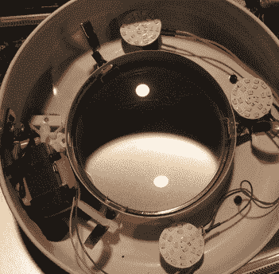
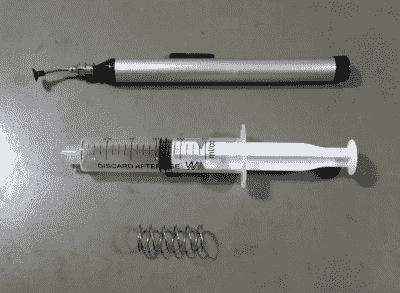
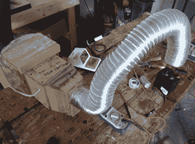
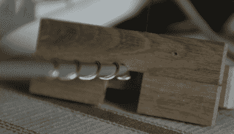

# 小技巧 53–快速工具技巧

> 原文：<https://hackaday.com/2015/06/26/hacklet-53-quick-tool-hacks/>

他们说需要是发明之母。当你意识到你可以创建一个简单的工具来使你当前的任务变得更容易的时候，你曾经在一个项目的中途吗？可能是一个绕线机，或者是一个可以把. 100 接口直接固定在孔里的装置。比你说“天方夜谭”还快，你正在一个项目中做一个项目。它可能不漂亮，但它完成了任务。本周的 Hacklet 都是关于快速工具黑客的——帮助商店或黑客空间的小项目。

 我们先从【theonetruestickman】和[华丽放大镜 LED 转换](https://hackaday.io/project/6283)说起。[theonetruestickman]在 Goodwill 花了 4 美元买了一个铰接式放大镜灯。这些灯是随处可见的长椅的主要部分。唯一的问题是开关和荧光灯管都出故障了。虽然[theonetruestickman]没有为灯感到难过。他取出灯管、镇流器和启动器，换上 led。他用 12 V 3 瓦的 LED 模块代替了电子管。三个模块提供充足的光线。一个老墙疣捐赠了它的变压器。由于这些 LED 模块在交流电下运行良好，因此不需要桥式整流器。现代化的灯现在正愉快地摆放在[theonetruestickman]的工作台上。

 接下来是【奎瓦兹】带着[拿起工具乱砍](https://hackaday.io/project/3519)。[Kwisatz]是一个沉默寡言的人。整个项目就由两个词组成。具体来说就是“注射器”和“弹簧”。令人欣慰的是[Kwisatz]提供了几张照片向我们展示他们到底创造了什么。如果你曾经使用过中国的廉价工具，你就知道(Kwisatz 的)痛苦。工具内部的细小手术管会产生微弱的真空。这些工具只能在真空衰减到足以掉落零件之前保持零件几秒钟。[Kwisatz]保留了工具的尖端，但用注射器替换了身体。当零件被放置时，弹簧被用来产生恰到好处的真空来保持零件。

 【迪伦·布莱耶】用[一台 20 美元](https://hackaday.io/project/5609)的简单抽油烟机让他店里的空气呼吸起来更安全一点。焊料和助焊剂加热时会产生一些讨厌的烟雾。一般来说，烟雾直接飘到黑客的脸上，偷看他们试图焊接的 0402 电阻。偶尔吸一点烟可能没那么糟糕，但多年下来，影响会越来越大。[迪伦]使用两个 120 伏交流电浴室风扇，一些金属管道，胶合板，和一些时间来制作这个抽油烟机。[Dylan]是第一个说它不符合 UL、CE 或 ROHS 标准的，但它确实完成了工作。他甚至加了一个屏风，防止虫子从室外排气口飞进。

 【费特里根】需要为天线缠绕螺旋线圈，于是他建造了[螺旋缠绕器](https://hackaday.io/project/3011)。螺旋本质上是弹簧，所以这应该很简单，对吧？事实证明，制作一个漂亮均匀的螺旋线并不是世界上最容易的事情。螺旋绕线机是一种夹具，可以使缠绕这些特殊的线圈更加容易。在木块上以特定的角度钻孔。金属丝穿过该块并卷到铝管上。旋转管子上的块迫使金属丝变成螺旋形状。唯一的缺点是每个缠绕器只能缠绕一次螺旋。

我注意到，这些快速的黑客在 hackaday.io 上没有得到应有的爱。所以，如果你注意到这样一个很酷的黑客，请发表评论，给这个项目一个头骨。如果你想看到更多这样的技巧，请查看我们新的[快速工具技巧列表！](https://hackaday.io/list/6443-quick-tool-hacks)看到一个我可能错过的项目？不要害羞，[在 Hackaday.io 上给我留言就行了](https://hackaday.io/adam)。这就是本周的 Hacklet，一如既往，下周见。同样的黑客时间，同样的黑客频道，带给你最好的 [Hackaday.io！](https://hackaday.io/)