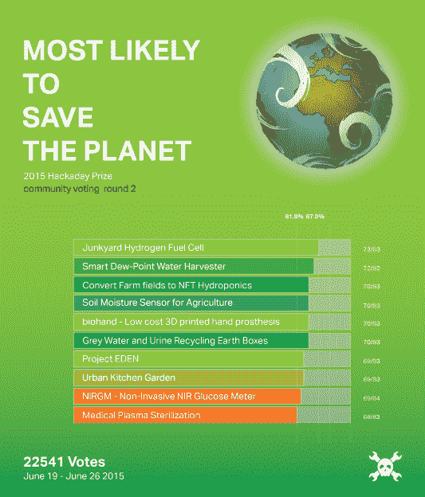

# THP 社区投票:结果&新一轮

> 原文：<https://hackaday.com/2015/06/29/thp-community-voting-results-a-new-round/>

上周五[我们结束了 Hackaday 奖](https://hackaday.io/prize/vote)的一轮社区投票。主题？最有可能拯救地球。现在是时候公布一些结果了:

Hackaday.io 社区投票选出的最有可能拯救地球的项目依次是:

*   [垃圾场氢燃料电池](https://hackaday.io/project/5523-junkyard-hydrogen-fuel-cell)
*   [智能露点水采集器](https://hackaday.io/project/5103-smart-dew-point-water-harvester)
*   将农田转换成 NFT 水培法
*   [农业用土壤湿度传感器](https://hackaday.io/project/5206-soil-moisture-sensor-for-agriculture)
*   [bio Hand——低成本 3D 打印假手](https://hackaday.io/project/6411-biohand-low-cost-3d-printed-hand-prosthesis)
*   [灰水和尿液回收土箱](https://hackaday.io/project/4912-grey-water-and-urine-recycling-earth-boxes)
*   [伊甸园项目](https://hackaday.io/project/6148-project-eden)
*   [城市厨房花园](https://hackaday.io/project/6324-urban-kitchen-garden)
*   [NIR GM–无创 NIR 血糖仪](https://hackaday.io/project/5508-nirgm-non-invasive-nir-glucose-meter) *
*   [医用等离子灭菌](https://hackaday.io/project/5884-medical-plasma-sterilization)

祝贺每一个有项目被投票选为第一名的人。尽管这些社区投票不会决定哪些项目进入 Hackaday 奖半决赛，但你已经赢得了同行的尊重和一件漂亮的 Hackaday 奖 t 恤。

自从上周[NIR GM——无创 NIR 血糖仪](https://hackaday.io/project/5508-nirgm-non-invasive-nir-glucose-meter)获奖以来，我们将名单向下移动到第 11 位，并授予 [SciPlo](https://hackaday.io/project/4861-scipio) 一件 Hackaday Prize t 恤。

## 新一轮投票！

本周，我们要求 Hackaday.io 社区[投票选出最令人惊讶的工程项目](https://hackaday.io/prize/vote)进入 Hackaday 奖。为了吸引大家投票，我将在下周五 22:00 UTC 左右随机挑选一名 Hackaday.io 用户。*如果那个人投了*，他们会得到一张价值 1000 美元的 [Hackaday 商店](http://store.hackaday.com/)的礼品卡。如果那个人没有投票，我会给那些投票的人一些奖品。上周，我们分发了一个 [SmartMatrix](http://store.hackaday.com/products/smartmatrix-bundle) ，一个[模拟步进规](http://store.hackaday.com/products/analog-gauge-stepper)，以及一个 [Simon 说套件](http://store.hackaday.com/products/sparkfun-simon-says)。我们可能会在本周改变这种情况；不知道会是什么，但是*投票的人*会有收获。想象一下；仅仅因为点击一个按钮就放弃一些东西。我们能有多大度？

与每次社区投票更新一样，[请您投票](https://hackaday.io/prize/vote)。如果你需要一点提示来理解这是如何运作的，[这里有一个关于如何投票的视频教程](https://www.youtube.com/watch?v=DeEf_VLKUl4)。