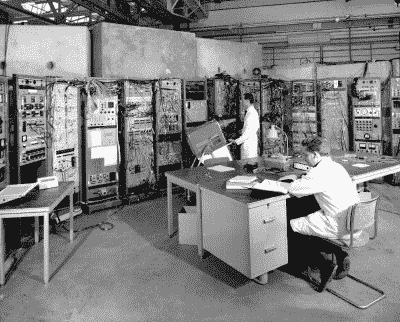

# 描述 CERN 竞赛——剪断黑线

> 原文：<https://hackaday.com/2015/07/04/caption-cern-contest-cut-the-black-wire/>

欧洲核子研究中心竞赛第 21 周已经成为历史。这是一个伟大的字幕周，所以像往常一样，一个巨大的感谢出去给每个人谁进入。我们仍然不知道这两位欧洲核子研究中心的科学家在研究什么。镜头、开关和一个巨大的玻璃屏幕，后面可能有任何东西。这是一个棘手的问题。但是我们缺乏的事实，你们都用幽默弥补了。

搞笑的是:

*   "我用我的量子眼侦查，有 75%的可能性会被旋转起来！"- [ [bbarrett90](https://hackaday.io/DiscipleOfGtG) ]
*   “在准备 Voight-Kampff 装置时，他们从他们不幸的前辈那里学到，在他们和心烦意乱的复制人主体之间安装一面镜子防弹玻璃可能是个好主意。”-[ [李国章](https://hackaday.io/hacker/10708)
*   “玛丽和史蒂夫发誓说他们会赢得今年的沃尔多在哪里比赛，不幸的是，他们输给了隔壁实验室的 SEM。”–[[trollintemo](https://hackaday.io/trollinteemo)]

本周的获奖者是楼，他说:“欧洲粒子物理研究所早期对视网膜扫描仪的尝试有点麻烦和耗时。你不得不提前 20 分钟上班，只是为了通过安检。”楼的简历是“有机械背景的测试工程师，喜欢拆东西”。我们打赌他会喜欢用他从 Hackaday 商店买的新 [Teensy 3.1，用他从拆卸中剩下的所有零件来建造新的东西！](http://store.hackaday.com/products/teensy-3-1)

#### 第 22 周

 圣索戈尔，小兵！[这张照片可能会让一名网络工程师或 IT 人员落泪](https://hackaday.io/contest/4200-caption-cern-contest/log/20333-caption-cern-contest-week-22)，但在欧洲核子研究中心早期，这一切都是正常的。14 架设备，到处都是同轴电缆。让我们希望所有这些补丁都连接到正确的端口！这两位欧洲核子研究中心的科学家在研究什么？因为 CERN 丢失了记录，所以由您来告诉我们！

当你在你的标题上工作的时候，检查一下老科学家正在使用的示波器。示波器推车曾经是必要的。今天，除了最强大的示波器之外，所有示波器的重量都不到 10 磅。

本周的奖品是来自 Hackaday 商店的[贴纸。将您的幽默标题作为评论添加到此项目日志中。确保你评论的是](http://store.hackaday.com/products/stickvise) [**比赛日志**](https://hackaday.io/contest/4200-caption-cern-contest/log/20333-caption-cern-contest-week-22) ，而不是比赛本身。和往常一样，如果你真的有关于图像或图像中的人的信息，请在[原始图像讨论页面](https://cds.cern.ch/record/1789370)上让 CERN 知道。

祝你好运！