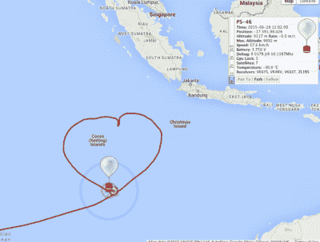

# 皮可太空气球环绕地球飞行两次

> 原文：<https://hackaday.com/2015/07/05/pico-space-balloon-circumnavigates-the-globe-twice/>

我们以前报道过“太空”气球。见鬼，我们中的一些人甚至已经发射了一些。通常他们会飞到空中，拍一些很酷的照片，然后在同一天下午在开车(和取回)的距离内着陆。你经常会得到惊人的照片和吹牛的权利，你拍这些照片是为了一个非常大的氦气球和填充物的很低很低的价格。

但是如果你把所有东西都缩小了呢？在过去的几年里，[Andy，VK3YT]一直在发射更小更轻的气球，搭载非常低功率的业余无线电爱好者无线电载荷。所以没有相机和照片，但回报是他发射了重约 13 克的有效载荷，包括全球定位系统、无线电、太阳能电池和电池。它们可以几个星期不睡觉，走得很远。除了极简的“太阳能派对气球，25mW TX”之外，我们很想看到一些建造细节。但这差不多就是全部了。

 我们有没有提到，这个“派对气球”从澳大利亚出发，访问了非洲，再次穿越澳大利亚，第二次访问非洲，在雅加达郊外做了一个心形环，然后降落在澳大利亚？

[有效载荷在几个频道上发送非常慢(QRSS)、非常低功率(QRP)的无线电信号](http://picospace.net/?p=552)，并使用两种不同的编码方案( [WSPR](http://wsprnet.org/) 和 [JT9](https://en.wikipedia.org/wiki/WSJT_%28Amateur_radio_software%29#JT9) )，以最大化地面上有人接收到它们的机会。选择频率相对较低的 20m 和 30m 频段有助于低瓦数水平下的长距离信号传播。

为了节省电力，除非电池充满电，否则信标每小时只广播几次。接收站使用软件无线电技术从噪音中提取出低慢信号。当任何人接收到信号时，他们可以将遥测数据上传到高空气球跟踪网络 [habhub](http://habhub.org/) ，以计算出信号的来源和去向。

绕地球两圈真是不可思议。但请注意，这是[安迪]的第 46 个这样的气球。他的第一个微型气球(讽刺的是，PS-2)只停留了 15 个小时，飞行了不到 800 公里。熟能生巧？

如果你对廉价开始 WSPR 感兴趣，我们已经在 Raspberry Pi (代码和硬件)上写了 [WSPR。](http://hackaday.com/2013/03/21/wspr-transmitter-shows-true-value-of-raspberry-pi-for-hacking/)

感谢[焊烟](http://soldersmoke.com)的【比尔·米拉】的提示。