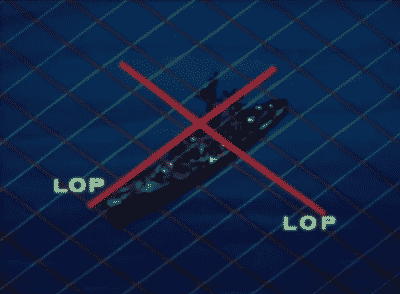

# 奥米加导航系统

> 原文：<https://hackaday.com/2015/07/08/retrotechtacular-the-omega-navigational-system/>

1971 年，美国海军为潜艇和水面舰艇推出了欧米茄导航系统。该系统使用无线电频率和相位差计算来确定全球定位。这个系统由遍布全球的八个甚低频(VLF)发射站组成，需要其他六个国家的合作。

欧米茄定位精度在 1 到 2 海里之间。她的八个[发射台](http://www.haikuvalley.com/History/OMEGA-NAVIGATION-SYSTEM/8839335_kzKJLd)分布在地球周围，这样地球上的任何一点都可以从至少五个发射台接收到有用的信号。所有的发射器都与铯原子钟同步，并按分时时间表发射信号。

某船接收设备通过比较检测到的信号之间的相位差进行导航。这种计算是基于“车道”的，这些车道用于将车站之间的距离分成相等的部分。由八个站点的重叠信号形成的这些车道的网格提供了位置的交叉线(LOP ),这给了水手他的定位。

为了使航线号码有意义，水手必须根据地图在港口拨入他的起始航线号码。然后，他将选择离他最近的一对测站，用字母 A 到 h 表示。他将查阅天波校正表，并根据大气条件和其他变化进行小的调整。最后，他会手动设置他的航线号，然后起航。

[https://www.youtube.com/embed/7mFAemn1pSw?version=3&rel=1&showsearch=0&showinfo=1&iv_load_policy=1&fs=1&hl=en-US&autohide=2&wmode=transparent](https://www.youtube.com/embed/7mFAemn1pSw?version=3&rel=1&showsearch=0&showinfo=1&iv_load_policy=1&fs=1&hl=en-US&autohide=2&wmode=transparent)

感谢提示，[MicroGadgetHacker]！

Retrotechtacular 是一个每周专栏，以旧时的黑客、技术和媚俗为特色。通过[发送您对未来分期付款的想法](mailto:tips@hackaday.com?Subject=[Retrotechtacular])，帮助保持新鲜感。