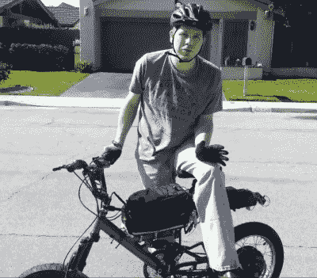

# 激烈的无刷 DC 阶段带来更多的电动自行车的权力

> 原文：<https://hackaday.com/2015/07/07/intense-brushless-dc-stage-brings-more-e-bike-power/>

【僵尸】在[无尽球体](http://endless-sphere.com/forums/)论坛上撰文分享了他的新开放硬件[无刷 DC 电机高功率输出级](http://endless-sphere.com/forums/viewtopic.php?f=30&t=58341)的最新迭代。该线程是一个金矿的有用信息的设计，建设和调试高功率电子设备和整个事情值得一读。这包括他面临的问题的故事，共模噪声由他的 Rigol 上的探针引线拾取，这使项目暂时偏离了方向。

 我们之前已经讨论过各种各样的 [ebike](http://hackaday.com/2014/12/06/extending-the-range-of-an-electric-bike/) [hacks](http://hackaday.com/2014/12/06/extending-the-range-of-an-electric-bike/) ，但是 endless sphere 的家伙们似乎正在这个领域开发许多可靠的开放硬件设计。这包括[僵尸]结合他的设计使用的[勒保斯基控制器](http://endless-sphere.com/forums/viewforum.php?f=30)。

他已经在他的电动自行车上安装了控制器和输出级，你可以在下面的视频中看到首批试运行之一。我们期待着听到更多来自无尽领域的令人敬畏的黑客们的消息！

[https://www.youtube.com/embed/6AfwYrW8OpY?version=3&rel=1&showsearch=0&showinfo=1&iv_load_policy=1&fs=1&hl=en-US&autohide=2&wmode=transparent](https://www.youtube.com/embed/6AfwYrW8OpY?version=3&rel=1&showsearch=0&showinfo=1&iv_load_policy=1&fs=1&hl=en-US&autohide=2&wmode=transparent)