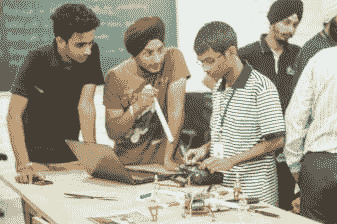
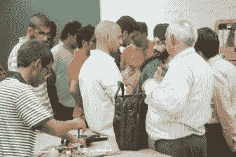
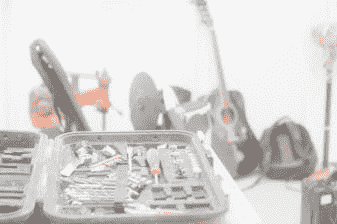
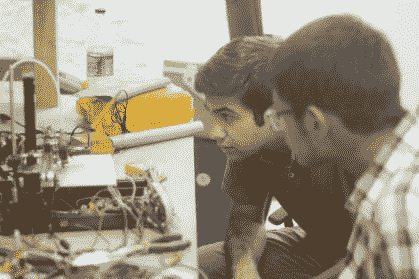
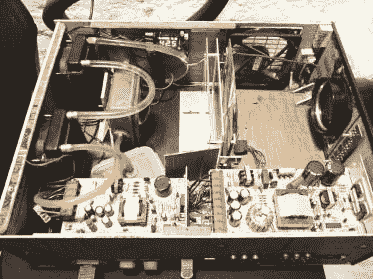

# 全球黑客日奖:新德里创客庇护所

> 原文：<https://hackaday.com/2015/07/09/hackaday-prize-worldwide-makers-asylum-new-delhi/>

7 月 18 日和我一起参加[全球黑客日奖:新德里](https://hackaday.io/event/6438-hackaday-prize-worldwide-new-delhi)——一个 KiCad 研讨会、硬件展& tell，以及一个让你认识该领域其他黑客和制造者的机会。

黑客空间正在印度兴起，这一发展确实让我兴奋。当我在孟买帮助创建了印度第一个社区黑客空间——创客庇护所(T1)时，一切都很孤独。这距离 2013 年 11 月还不到两年。上个月，我们开放了新德里最新的、[创客收容所的](http://www.makersasylum.com)第二空间。新德里已经有几个其他的黑客空间，你现在可以在孟买、新德里、浦那、班加罗尔、钦奈、科钦、密鲁特、加尔各答、苏拉特、艾哈迈达巴德、达兰萨拉、海得拉巴、拉马钱德拉普拉姆找到黑客空间——而且这个列表还在继续增长。

为了帮助建立社区，并将 Hackaday 奖提供的机会带给当地黑客，我在孟买的[创客庇护所](https://hackaday.com/2015/03/23/hackaday-prize-worldwide-makers-asylum/)和班加罗尔的[工作台项目](http://hackaday.com/2015/05/06/hackaday-prize-worldwide-workbench-projects-bengaluru/)举办了 Hackaday 奖全球活动。这个月，7 月 18 日，我将在新德里的创客收容所举办另一场 [Hackaday 奖全球活动。我喜欢一有机会就谈论和支持开源硬件。因此，在这次活动中，我将会就 KiCad——这款出色的开源 EDA 工具——进行一次相当长且详细的研讨会，持续几个小时。在为期一天的研讨会结束时，我希望让其他黑客完成一个设计，可以发送给 PCB 制造。晚上稍事休息后，我们将进行展示，让大家展示他们正在做的项目。他们中有许多人已经提交了 Hackaday 奖的全部内容，所以听他们谈论他们的经验并分享技巧和想法将会很有趣。](https://hackaday.io/event/6438-hackaday-prize-worldwide-new-delhi)

这个活动我们只能容纳有限的几个人，名额很快就满了。所以，如果你在新德里或附近的某个地方，赶快点击这个链接回复。期待一个有趣的事件。休息过后，看看新德里创客收容所开幕派对的一些照片。

            

#### 2015 年[黑客日奖](http://hackaday.io/prize)由以下机构赞助:

