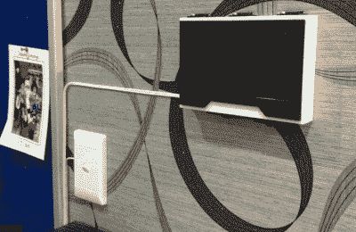
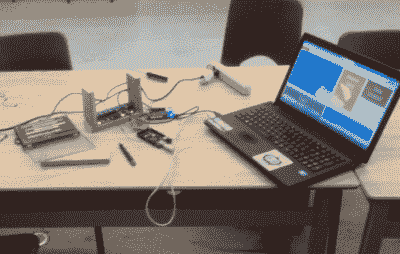

# hack let 55–家庭自动化项目

> 原文：<https://hackaday.com/2015/07/10/hacklet-55-home-automation-projects/>

家庭自动化——智能家庭的概念是监视和控制室内环境，接受居住者的命令，并使生活变得更容易。几十年来，黑客、制造商和工程师一直在构建他们自己的智能家居愿景。由于手机和“物联网”的革命，家庭自动化现在进入了公众的视野。但是黑客们并没有停止攻击。他们仍在构建梦想，一次一个电路和一行代码。本周的 Hacklet 致力于介绍 [Hackaday.io](https://hackaday.io) 上一些最好的家庭自动化项目！

 我们从顶部开始——【IamTeknik 的】[Jarvis](https://hackaday.io/project/1214)项目在 Hackaday.io 上的 skulled 和 viewed 项目一直排在前五位，只要我们有记录。正如虚构的托尼·斯塔克设计启发了它的名字一样，贾维斯是基于人工智能的。[IamTeknik]使用 BeagleBone Black 创建了一个系统，运行他自己的定制软件。他还从头开始创造贾维斯——甚至连中继模块都是由[IamTeknik]设计和建造的。到目前为止，Jarvis 已经有了一个很棒的 3D 打印门锁装置和一个非常好的壁挂式平板电脑。我们正在关注[IamTeknik]接下来会添加什么模块！

【Morrison piano】没有家庭自动化 noob。二十年来他一直在运行自己的系统。 [HCS_IV 家庭自动化系统](https://hackaday.io/project/3710)是升级他的 HCS_C 家庭自动化系统的项目。对于外行来说，最初的 HCS 是由 Byte and Circuit Cellar fame 的[Steve Ciarcia]创建的。从那以后，硬件和软件已经发展了好几代，许多黑客加入了他们自己的定制功能。[Morrisonpiano]正在用恩智浦 Arm Cortex M4 CPU、三个大 Altera Cyclone FPGAs 和大量闪存更新他的系统。为什么要在家庭自动化系统中使用 FPGA？当然是 I/O！HCS 使用大量 I/O。有 16 个 RS485 端口和 10 个 RS232 串行端口。使用 FPGA 也使事情变得灵活。想加 CAN 总线？只需放入一些 CAN HDL 代码，您就大功告成了！

teven 通过 Squirco 智能家居系统传感器网络 T2 赋予智能家居更多的感官。除了在恒温器上安装一个温度传感器，或者在前门厅安装一个运动探测器，[Steven]想要一个不显眼的传感器网络覆盖整个家庭。他通过用一个智能模块取代普通的灯开关来实现这一点，该模块具有温度、湿度和人类存在的传感器。[Steven]已经花了相当多的时间研究和实验微波断层成像作为探测人类的一种手段。用微波炉意味着没有明显的红外窗口。

 最后，我们有【安萨夫·艾哈迈德】与[比格伯恩·布莱克家庭自动化](https://hackaday.io/project/5410)。这个项目的想法来自最优化的微积分课程。[Ansaf]通过监控设备的使用模式和当前需求，将数学定理应用于现实世界。有了这些数据，他可以优化使用，让事情变得更环保。到目前为止，[Ansaf]一直在试验一种灯。该系统有一个使用 PHP 的 web 前端。板上的 GPIO 引脚通过 Python 和 Flask 控制。作为一个早期项目，BeagleBone 家庭自动化做得很好——它已经在他的计算机工程课上获得了[Ansaf]高分！

如果你想要更多智能家居的好处，请查看我们更新的[家庭自动化项目列表](https://hackaday.io/list/2401)！我错过你的项目了吗？不要害羞，只要[在 Hackaday.io](https://hackaday.io/adam) 上给我留言。这就是本周的 Hacklet，一如既往，下周见。同样的黑客时间，同样的黑客频道，带给你最好的 [Hackaday.io](https://hackaday.io) ！