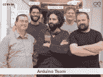
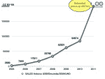
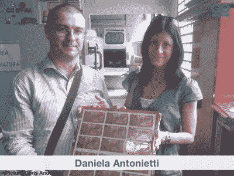
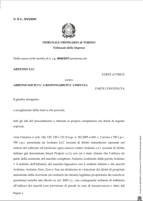
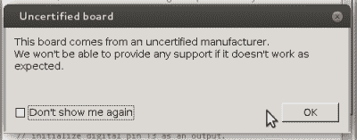
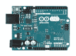

# 阿杜伊诺 SRL 公司的[Federico Musto]讨论了阿杜伊诺的法律状况

> 原文：<https://hackaday.com/2015/07/23/hackaday-interviews-federico-musto-of-arduino-srl/>

最近，我们有机会坐下来，在一顿丰盛的晚餐上，采访了 Arduino SRL 公司的首席执行官[Federico Musto]。他的公司是 Arduino vs Arduino 惨败的一方，这场官司让 Arduino.cc 和 Arduino.cc 在“Arduino”商标上展开了一场战争。

鉴于媒体对[Massimo Banzi]和 Arduino LLC 的大量报道，我们非常想知道[Frederico Musto]所在的地方(Arduino.org)的整体情况。最终，我们得到了一个我们认为更加平衡和完整的情况，以及关于 Arduino SRL 阵营未来产品的有趣消息。[Musto]对过去和现在的法律程序的处理简直令人着迷。

## 快速复习

除非你坐在一大块熔融硅下面，否则你可能会读到或听到一些关于两个 arduino 的[之战。创始人[Massimo Banzi]和 Arduino 团队的其他成员计划基于他的一个学生[Hernando Barragán]的软件项目(](https://hackaday.com/2015/03/12/arduino-v-arduino-part-ii/)[布线](http://www.wiring.org.co/))制造一个负担得起的、可访问的微控制器/物理计算平台。2004 年，Arduino 创始人之一【Gianluca Martino】和【Daniela Antonietti】[后来的 Arduino LLC 首席财务官](https://blog.adafruit.com/2011/10/07/ada11-daniela-antonietti-cfo-of-arduino/)成立了 SRL 智能项目公司，开始生产 Arduino 主板。Arduino 的大部分历史是没有争议的。

资金开始流入，Arduino LLC 于 2008 年在美国成立，软件和文档方(Arduino LLC)与董事会组建方(Smart Projects SRL)之间的关系开始紧张。2014 年，Smart Projects(在意大利)更名为 Arduino SRL，被[Federico Musto]收购，一切都变得混乱了，不一定是这个顺序。

## 过去，根据[Musto]

Arduino 分裂的核心问题是谁拥有“Arduino”品牌的商标。在美国，目前是 Arduino LLC，尽管 Arduino SRL 公司提交了一份申请，要求该商标无效，这一问题在 2016 年初之前不太可能得到解决。(当然，Arduino LLC 已经在美国提出了自己的反诉讼。)

在义大利、瑞士，或许还有世界其他地方，这个商标似乎属于 Smart Projects，也就是现在的 Arduino SRL。这是因为 Smart Projects 于 2008 年 12 月在意大利申请了该商标，就在 Arduino LLC 合法成立几个月后，该公司在 2009 年春天才开始申请。很自然，Arduino LLC 也在意大利法庭上对此提出质疑。

这就是混乱。我们是怎么进去的？Arduino LLC 声称，[Gianluca Martino]直到 2010 年被授予意大利商标时才通知他们。为什么 Arduino 核心团队的一名成员不告诉其他人就擅自注册了这个名字？[Federico Musto]讲述的故事让[Gianluca]抢先注册商标的行为看起来更合理了，即使还不完全光明正大。

 2008 年是 Arduino 大爆发的一年。销售额每天超过 100 块电路板，Smart Projects 很难满足需求。在这一点上，它开始看起来像是在 Arduino 中有真正的钱可以赚，无论是对那些有所顾忌地提供 Arduino 附加屏蔽的公司，还是对那些毫无顾忌地出售 Arduino 品牌“官方”电路板仿制品的公司。如何处理克隆人并从 Arduino 品牌中赚钱是 Arduino 集团中每个人的想法，但对于如何做到这一点存在分歧。

Smart Projects 的 mean while【gian Luca Martino】和【Daniela Antonietti】刚刚扩建了生产线，以满足对电路板的需求。资助这些投资并不容易。在其他资金来源中，[Daniela Antonietti]抵押了她的房子来购买专业的回流焊炉。对[Martino]和[Antonietti]来说，保护他们在 Arduino 项目中的个人投资不受未经授权的克隆浪潮的影响似乎非常重要。他们把事情掌握在自己手中，据称是在[Banzi]的背后，并注册了“Arduino”商标。

证实[Musto]版本的[Gianluca]的故事的所有细节是不可能的，并且可能相当快地转变成他说的，她说的和道听途说的，所以我们在这里将保持它简短。但是，任何在团队中工作过的人都知道，一个人是如何主导一场讨论，让其他人感到被边缘化和孤立的，我们也可以理解采取反抗行动的诱惑。

我们可以想象，如果你的投资中有不成比例的百分比在起作用，这种感觉会成倍增加。[Musto]讲述的故事是，Smart 项目团队承担的财务风险被[Banzi]低估了，而[Martino]作为 Arduino 五人组中唯一的生产方利益以及 Smart 项目的首席执行官，在财务上采取了相当于自卫的行动。

如果不是 Martino 和 Antonietti 在 2008 年冒险投资建造了一条生产 Arduino 的装配线，arduino 肯定不会有今天。Arduino 成功的关键是将固件和文档与基于硬件的物理计算平台相结合。这两个部分都是必要的，但是构建硬件需要更多的资本，并且涉及真正的金融风险。

那么 Arduino SRL 公司或 Arduino LLC 是“真正的”Arduino 吗？我们认为两者都是。不幸的是，没人问我们。这个问题正在意大利和美国的法庭上上演。

## 诉讼清单

诉讼已经成为一种时尚，而事实证明我们只知道冰山一角。之前，我们曾报道过 Arduino SRL 公司申请取消 Arduino LLC 在美国的商标以及 Arduino LLC 公司以牙还牙申请取消 Arduino SRL 公司在意大利的商标。但[费德里科·穆斯托]为我们列出了一长串我们不了解的法律案件。

当[Musto]买断[Gianluca Martino]在 Arduino LLC 和 Arduino SRL 的股份时，他希望看到他拥有 20%股份的公司的会计账目。到这个时候，马蒂诺和班奇之间的嫌隙太深了，据穆斯托说，他们拒绝给他看那些书。他将美国 Arduino LLC 和瑞士注册的 Arduino SA 告上法庭，并分别在美国和瑞士胜诉。

还记得 Arduino IDE 中包含的[一个弹出窗口，它将 all Arduino】有限责任公司生产的所有 Arduino 主板标记为“非官方”吗？直到各种商标案件在法庭上得到解决，这可能是诽谤。[Musto]告诉我们，Arduino LLC 只是在 Arduino SRL 采取法律行动后才放弃这一立场。(我们对 Arduino LLC 主动放弃一个坏主意给予了肯定。)](http://hackaday.com/2015/03/12/arduino-v-arduino-part-ii/)

 最近，Arduino LLC 在意大利申请了一项禁令，以商标侵权为由阻止 Arduino SRL 公司销售其 Arduino 板。[这一说法最近被否认](http://www.arduino.org/blog/1-the-new-blog/first-round-won)，我们已经阅读了都灵法院的裁决。它提到 Arduino LLC 不可能早在 2005 年就控制 Arduino 品牌，当时 Smart Projects 正在以 Arduino 的名义生产电路板。

我们不是(意大利)律师，但意大利拒绝简易禁令似乎进一步质疑 Arduino LLC 在意大利获胜并在美国以外使用 Arduino 商标的能力。因此，Arduino 板在美国以外的销售转向了“Genuino”品牌名称。

总的来说，[Musto]对从[Martino]那里购买智能项目时陷入全面纠纷表示有点沮丧，并强调了许多诉讼的防御性质——回应被禁止查看公司的账目，特别是 IDE 弹出窗口。另一方面，Arduino SRL 公司确实在 USPTO 案件中对 Arduino LLC 提起了诉讼，[Musto]也提到他的律师不喜欢“Genuino”品牌和标志，可能会被迫对其采取行动。

简而言之，Arduino SRL 已经取得了许多法律上的胜利，但是两个最大的案件仍然悬而未决。(马西莫·班齐)和(费德里科·穆斯托)都对持续的诉讼表示厌倦，但双方似乎都愿意提起新的诉讼。在意大利和美国做出最终决定之前，我们猜测他们都将不得不忍受痛苦。

## 社区分裂和代码分叉

听到[Musto]关于 arduino.org 和 ide 代码分叉背后的故事也很有趣。

由于之前的紧密合作，[Gianluca Martino]和 Smart Projects 都使用 arduino.cc 域名作为他们的电子邮件地址。控制该域名的 Arduino LLC 在 2014 年秋季切断了他们的电子邮件，使得整个 Smart Projects / Arduino SRL 团队没有业务电子邮件通信。一旦 Arduino LLC 试图关闭他们，他们必须重新建立一个域名，并迅速建立电子邮件和业务存在。因此 arduino.org。

 【费德里科·穆斯托】说他对代码分叉感到后悔，并希望 Arduino SRL 能等到法院迫使 Arduino LLC 从代码库中删除他们的煽动性弹出窗口。另一方面，一旦 Arduino LLC 表明他们愿意玩弄 IDE 代码，将你的生计与一家(现在的)竞争对手公司联系起来似乎不是一个好主意，这家公司似乎愿意将你排除在外。(没有一个真正假冒的 Arduino 板触发弹出窗口，只有那些 Arduino SRL 制造的。)

简而言之，[Musto]将 Smart Projects / Arduino SRL 的许多争议行为解释为对 Arduino 集团内部分歧的反应，以及 Arduino LLC 随后的激进行为。与[Banzi]描绘的 Arduino LLC 的无辜画面相反，很明显双方都有欺诈行为。

## 未来

直到 2016 年初，美国专利商标局的裁决下来，这两家公司都悬而未决。具有讽刺意味的是，这并没有真正影响到最终的黑客(我们)。如果有什么不同的话，两家公司都加倍努力，不仅用他们的媒体宣传，而且用他们的产品和软件来影响我们。这种情况会持续多久，未来会带来什么新东西？我们询问了(穆斯托)关于 SRL 的计划。

### Arduino 基金会？

鉴于 Arduino SRL 公司和 Arduino LLC 公司可能永远不会友好地解决他们的分歧，Arduino 品牌会变成什么样？[Musto]提出了一个 Solomonic 解决方案:将“Arduino”的控制权从任何个人或公司手中拿走，将其交给一个社区指导的基金会。

[Musto]告诉我们，他设想建立一个“Arduino 基金会”,拥有清晰公开的资产负债表和民主的治理结构。想想 Mozilla 基金会与 Debian 治理的融合。该基金会将向 Arduino 社区的所有利益相关者开放。[Musto]说他目前正在进行文书工作，可能会有公告发布。我们讨论了这样一个基金会如何被用来为 Arduino 社区提供一些资金，因为毕竟 Arduino 的成功很大程度上要归功于用户的代码贡献。

### 新产品，新 IDE

[Federico Musto]称自己是一个对射频硬件情有独钟的“软件人”。考虑到前者，他说他对他们在新的实体产品开发上花费的时间感到惊讶，但他的 RF 根源肯定会表现出来。他设计的 Arduino Yún 是一款结合了 AVR 微控制器的 Linux WiFi SOC，毕竟是[Musto]进入 Arduino 世界的入门产品。

在这种情况下，我们提出了[Musto]我们的 64k 美元问题:鉴于 Yún 和类似的主板面临来自下方的 ESP8266 和上方的 Rasberry Pi 等产品的压力，Arduino SRL 的未来方向是什么。更大还是更小？还是留在中间？他回答说，他们有各种规模的项目。

在大的方面，我们有 Yún 和未来的 Linux/微控制器混搭设备，[Musto]和现在的 Arduino SRL 正在继续开发其 Linino 发行版。Linino 是一个基于 OpenWRT 的 Linux 发行版，经过修改可以很好地与外部微控制器配合使用。据我们估计，Linino 的杀手锏是 MCUIO 子系统，它使低级 Linux 驱动程序能够访问相关的微控制器——微控制器上的引脚在 Linux 文件系统上显示为设备。小型嵌入式 Linux 与用于 I/O 的微控制器的结合[现在显然是一个有趣的领域](http://hackaday.com/2015/05/08/c-h-i-p-is-a-linux-trojan-horse-for-nine-bucks/)，如果两者之间的通信没有那么困难就好了。MCUIO 的目标是改变这种状况。

在最小的一端，Arduino SRL 正在开发一个微型(想想 [littleBits](http://littlebits.cc/) )互联设备的新产品线，使用可视的拖放界面进行编程。他们也是(都？)就要无线了。这个项目仍处于开始阶段，但[Musto]表示，如果人们对开发该平台的代码感兴趣，他会对早期的 alpha 版本感兴趣。我们迫不及待地想看到它的工作。

### Uno-plus

然后在事情进行到一半的时候，[Federico Musto]提到将会有一个即将到来的“Uno-plus”板，它带有一个尚未披露的 ARM 芯片，将于秋季推出。我们的目标是以合理的价格打造一款超级 Arduino 外形主板。

对于物联网项目，我们讨论了很多关于 WiFi 和亚 GHz 无线电的问题。我们的经验是，目前的 WiFi 设备(包括 Hackaday-darling 的 ESP8266)都很耗电，不是可以用电池供电的设备。[Musto]提到了一些他见过的新 WiFi 设备，这些设备尚未投入生产，当它们上市时，将大大有助于 WiFi 电力预算。Arduino SRL 公司希望在可能的情况下将它们整合到物联网设备中。敬请关注。

撇开硬件不谈，Arduino LLC 和 Arduino SRL 都推出了新的 ide，它们看起来比以前的版本好得多。[Arduino SRL 版](http://labs.arduino.org/Arduino+Studio)基于 Javascript 和 Node.js，使用 Adobe 的括号编辑器。简而言之，这一切都赶上了当今网络编码员的新宠，这可能是一件好事。(最后，代码补全！)现在还在 alpha 中，不过欢迎大家来看看。

## 结论

Arduino 对 Arduino 的法庭戏剧为我们创造了很好的爆米花时间，毫无疑问，这对双胞胎 Arduini 和所有直接参与的人都很伤脑筋。但我们也很高兴看到两家公司都在硬件和软件方面继续创新。

回想起来，我们关于市场定位的问题是错误的。Arduino SRL 公司的重点不是设备规模，而是无线技术与微控制器的总体融合，以及在无线环境中开发 Linux/微控制器集成的支持软件。至于 Arduino LLC 的新产品方向似乎是有线和/或可穿戴，我们想知道尽管商标问题，黑客经济中是否有两家公司蓬勃发展的空间？