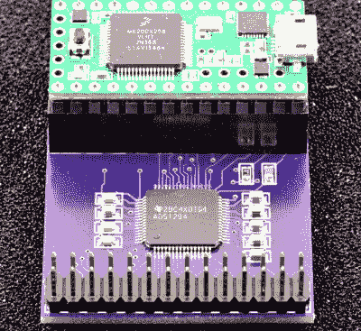
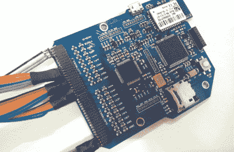
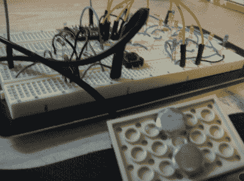
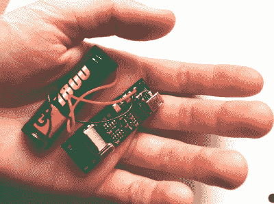

# 黑客 56-大脑黑客

> 原文：<https://hackaday.com/2015/07/17/hacklet-56-brain-hacks/>

大脑是人类已知的最强大也是最不为人所知的计算机。正是因为这些原因，用大脑工作长期以来一直吸引着黑客、制造者和工程师。从脑电图到磁刺激，再到真正的植入，一切都已经进入了项目。本周的 Hacklet 是关于 [Hackaday.io](https://hackaday.io) 上一些最好的头脑黑客！

 【保罗·斯托佛雷根】，少年之父，正在努力制作[生物电位信号库](https://hackaday.io/project/5809)，他的参赛作品 [2015 年黑客奖](https://hackaday.io/prize)。[Paul]不仅仅是侵入他自己的大脑，他还使用 Teensy 3.1 创建了一个库和参考设计。这个库将允许任何人读取脑电图(EEG)信号，而不必担心线路噪声过滤、信号处理和所有其他使记录 EEG 信号变得困难的细节。[Paul]通过让 Teensy 的 cortex M4 处理器在后台执行中断驱动采集和过滤来实现这一点。这使得用户的 Arduino 草图可以自由地处理数据，而不是获取数据。初始硬件设计将从 TI ADS129x 芯片收集数据，这些芯片是具有 4 或 8 个同步通道的 24 位 ADC。[Paul]计划将来向库中添加更多芯片。

 接下来是【宰财】与[清醒梦的交流环节](https://hackaday.io/project/2733)。[Jae]希望在梦幻世界和现实世界之间建立联系。为了做到这一点，他们利用了 BioEXG，一种旨在收集几种生物信号的设备。数据通过几个主动探头进入系统。这些探针使用普通的弹簧针来接触佩戴者的皮肤。[Jae]说主动探针甚至能透过它们浓密的毛发读取脑电图信号！梦和现实世界的交流将通过眼球运动来完成。我们已经有一段时间没有[Jae]的消息了——所以我们希望他们不会陷入困境！

【qquuinn】正从不同的角度打造 [bioloop](https://hackaday.io/project/6701) ，他们的参赛作品在 2015 年 Hackaday 奖。[Qquuiinn]没有使用 EEG 信号，而是使用[皮肤电反应(GSR)](https://en.wikipedia.org/wiki/Electrodermal_activity) 。与 EEG 信号相比，GSR 易于测量。[Qquuiinn]正在使用 Arduino Pro Mini 执行他们所有的信号采集和处理。这种生物反馈信号已经被像测谎仪这样的设备使用了几十年。GSR 值随着汗腺的活跃而变化。它为了解一个人的心理或生理压力水平提供了一个窗口。[Qquuiinn]希望 bioloop 对个人和心理健康专家都有用。

 最后，我们有【Marcin Byczuk】和[生物监测器](https://hackaday.io/project/6760)。生物监测器可以读取脑电图和心电图(EKG)信号。与今天 Hacklet 上的其他项目不同，Biomonitor 是无线的。它使用蓝牙无线电将数据传输到附近的 PC 或智能手机。生物监测器中的主处理器是一个 8 位 ATmega8L。由于 8L 不能进行大量的信号处理，所以[Marcin]用传统的方式进行大量的滤波工作——在硬件中。当测量这些类型的信号时，精心设计的基于运算放大器的有源滤波器提供了足够的性能。Biomonitor 已经进入学术界，被用于 PalCom 项目和脑机接口研究。

如果你想要更多的脑洞大开的好处，看看我们的[脑洞大开项目清单](https://hackaday.io/list/6803-brain-hacking-projects)！我错过你的项目了吗？不要害羞，[在 Hackaday.io 上给我留言就行了](https://hackaday.io/adam)。这就是本周的 Hacklet，一如既往，下周见。同样的黑客时间，同样的黑客频道，带给你最好的 Hackaday.io！