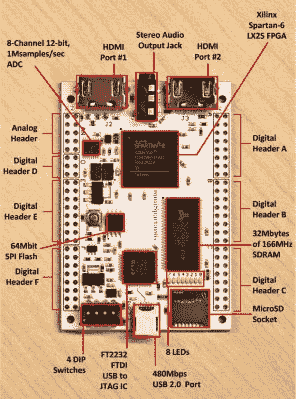

# 用 VHDL 为 FPGAs 设计 CPU:OMG。

> 原文：<https://hackaday.com/2015/07/20/designing-a-cpu-in-vhdl-for-fpgas-omg/>

如果你一直在考虑摆弄 FPGAs 和/或对 CPU 设计感兴趣，[Domipheus]已经开始了一个[博客系列文章](http://labs.domipheus.com/blog/category/projects/tpu/)，你应该看看。通常我们会等到整个系列完成后再发布，但是它看起来很好，所以我们想在它还在进行中的时候与你分享。到目前为止，共有五个部分。

 在[第一部分](http://labs.domipheus.com/blog/designing-a-cpu-in-vhdl-part-1-rationale-tools-method/)，【多米菲斯】讲述了他对 CPU 的基本原理和计划。如果你有兴趣跟进，这篇文章是必读的。不过，概括来说，他的目标是在 Spartan 6+ FPGA 上制作一个精简的 16 位处理器，具有基本的算术和控制流程，并为其编写一个汇编程序。

在第二部分的[中，【Domipheus】讲述了渲染 VHDL 代码并上传到 FPGA 的细节，并以构建 CPU 的八个寄存器为例。如果你是 FPGAs 新手，请特别注意本文末尾的测试平台代码。Xilinx 的 ISE 包使得为您的 FPGA 代码构建测试套件变得非常容易，考虑到系统的最终复杂性，为每个阶段设置测试是一个很好的主意。在接下来的文章中，测试将是一个反复出现的主题。](http://labs.domipheus.com/blog/designing-a-cpu-in-vhdl-part-2-xilinx-ise-suite-register-file-testing/)

在第三部分[中，【Domipheus】完成了他对指令集的选择，并开始编写指令集解码器。在](http://labs.domipheus.com/blog/designing-a-cpu-in-vhdl-part-3-instruction-set-decoder-ram/)[第四部](http://labs.domipheus.com/blog/designing-a-cpu-in-vhdl-part-4-alu-comparisons-branching/)中，我们可以看到一个 [ALU](https://en.wikipedia.org/wiki/Arithmetic_logic_unit) ，跳转命令被执行。[第五部分](http://labs.domipheus.com/blog/designing-a-cpu-in-vhdl-part-5-pipeline-and-control-unit/)构建一个基本的控制单元，将解码器、ALU 和寄存器连接在一起，进行一些数学运算和计数。

我们不能等待进一步的分期付款。如果你对这类事情感兴趣，并且在关注[多米菲乌斯]的进展，一定要让他知道:我们必须让他继续工作。

当然，这并不是第一次有人在 FPGA 中构建软 CPU。(添加 OMG 主要是为了与其他[tla](https://en.wikipedia.org/wiki/Three-letter_acronym)一起使用。)这里有一只[小的](https://hackaday.com/2010/12/01/j1-a-small-fast-cpu-core-for-fpga/)，一只[大的](https://hackaday.com/2015/03/20/the-oldland-cpu-32-bit-fpga-core/)，还有一只[诡异的](https://hackaday.com/2013/03/11/building-new-weird-cpus-in-fpgas/)。