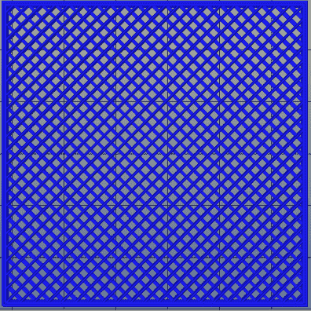
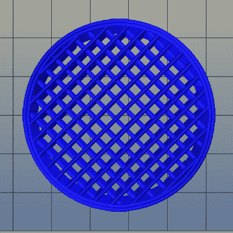

# 通过混合切片技术获得更好的 3D 打印效果

> 原文：<https://hackaday.com/2015/07/22/better-3d-prints-by-mixing-slicing-techniques/>

大多数 3D 打印项目从某种 3D 模型开始。切片程序将模型转换成 gcode。gcode 文件包含实际驱动打印机的命令。分割模型有不同的方法，有时您希望在一个模型上使用多种方法。我一直在想办法让这变得更简单。

对 3D 打印模型进行切片时，可以为生成的 gcode 文件选择不同的属性。例如，您可以将切片器设置为产生不同的填充密度、温度或打印速度。这些设置会对打印结果产生很大影响。例如，一件需要高强度的物品可能需要比一些小饰品或钥匙链更密集的填充物。你可能希望一个艺术作品有一个更好的层高度，而不是一些没有人会看到的小工具的内部部分。

## 一刀切？

问题是，对于大多数开源切片器来说，这些设置将适用于整个模型。Cura 有一些插件可以改变不同 Z 高度的设置，Slic3r 可以改变图层高度，但在一般情况下，你为切片器设置的内容会应用于整个模型。当然，一个 gcode 文件只不过是一个文本文件，所以如果你很勤劳，你可以手动将两个或更多的文件合并成一个。

手动合并是一件痛苦的事情，[这也是我写 gblend](http://github.com/wd5gnr/gblend) 的原因。它可以将 gcode 文件缝合在一起，以获得各种效果。该程序将多个 gcode 文件作为输入，并可以以不同的方式组合它们。最有用的功能是允许您从每个源文件中获取一定数量的图层，并将它们组合成一个打印件。测量单位是毫米，所以你不用担心层数。整个过程比我遇到的任何事情都要简单得多。

## 何时使用多重切片

对于一个常见的实体对象，你不会真的想要 100%填充。打印时间太长，还会导致翘曲问题。实际上，20%或 30%的填充物对于大多数目的来说已经足够了。然而，有一种常见的情况，你不想要任何填充物:如果你是一个花瓶或杯子。

在花瓶或杯子的例子中，你实际上只是在打印物体的壁，而你希望内部完全是空的。大多数切片机有一个“花瓶”或“螺旋”模式，这将自动完成。设置后，生成的 gcode 将使用一根塑料细丝跟踪对象的轮廓。不会有任何层，只是一个塑料线圈构建整个形状。

图片中的火箭是一个来自 [Thingiverse](https://www.thingiverse.com/thing:580192) 的模型，它是用螺旋或花瓶切片打印出来的。然而，我将模型导入到 OpenSCAD 中，并添加了 20mm 高的底座(如果您添加了铭牌，这将成为一个很好的奖励式奖杯)。

理想情况下，你希望基础是坚固的(正如我提到的，20%或 30%的填充物)。然而，打印固体火箭是对塑料的浪费，并改变了物品的外观，因为它将有多层而不是单一的细丝。

## 实心切片与螺旋切片

 [](https://hackaday.com/2015/07/22/better-3d-prints-by-mixing-slicing-techniques/solidbase/) Square base with infill [](https://hackaday.com/2015/07/22/better-3d-prints-by-mixing-slicing-techniques/solid-tube/) Regular slicing infills entire model

当您将整个模型作为实体对象进行切片时，它会变成一系列层。在左边你可以看到从火箭底部的底座中间开始的十层。每层都有一个方向的对角线，并且各层交替。综合起来，你得到了这个纵横交错的模式(虽然你可以在切片软件中选择其他模式)。不幸的是，火箭的管子看起来是一样的。在右边，你可以从管子的某处看到十层。

请记住，这两张图片都只有十层。当您将模型切片为螺旋时，每层仅包含一个点，层距离变得非常小。螺旋切片模型的十层只是由十个点组成的一小段线段。这里有大约 1000 个靠近火箭鳍的螺旋层:

请注意，管子是中空的，1000 层仅形成几个同心环。一旦文件被混合，你会看到底部是一个交叉影线，分层的物体，而火箭体是一个空心管，都在一个文件中。

## 混合文件

关键是将同一个模型切片两次。有一次你把整个东西切成了固体。第二次在激活“螺旋切片”设置的情况下对其进行切片。知道底部是 20 毫米高，您可以使用 gblend 来选择每个文件的部分。你可以在下面的视频中看到这个过程。

gblend 软件是一个命令行工具。要使用它，您需要对您的切片器的配置做一个小的修改。切片器将有地方设置你的开始和结束代码。这通常是启动打印机挤压机、设置温度和向打印机发送校准数据的代码。在 start gcode 的末尾，您需要添加一个注释:

```
; %%%GBLEND_START
```

在结束代码的开头，需要设置一个类似的注释:

```
; %%%GBLEND_END
```

因为这些是评论，所以一直把它们留在里面是完全没问题的。您还需要复制所需的开始和结束代码，并将它们放在单独的文件中以备后用。gblend 软件将忽略开始注释之前和结束注释之后的所有内容，因此您需要将开始和结束代码添加到新的混合文件中。

一旦设置好了，就像平常一样切割模型，每次保存到不同的文件名。在我的例子中，我有四个文件:

*   start.gcode(您可以将该文件用于任何型号)
*   end.gcode(用于任何型号)
*   rocketstat-solid.gcode(填充 20%的模型)
*   rocketstat-spiral.gcode(带有螺旋切片的模型)

命令行工具应该可以在 Linux 或 Windows 下工作(如果您使用 Windows 并且 Github 上有预构建的二进制文件，您可能会发现使用 [Cygwin](http://www.cygwin.com) 更容易)。下面是我使用的命令行:

```
gblend = start.gcode [ rocketstat-solid.gcode 20.0 rocketstat-spiral.gcode ] = end.gcode >rocketstat.gcode
```

项目的主页解释了所有的选项，但是对于这个例子，您需要知道的只是等号将一个文件复制到输出中；左括号获取文件的开始；20.0 在 20 毫米标记处停止第一个文件并开始下一个文件。右括号告诉 gblend 将 rocketstat-spiral.gcode 文件一直放到最后。

## 超越基本

生成的 rocketstat.gcode 文件将打印出来，并具有一个实心底座和一个空心火箭。当然，使用这种技术你可以得到很多效果:不同的层高度，填充模式，冷却设置，速度——任何你可以指示切片机改变的东西。没有理由你不能拥有多个细分市场。例如，我可以切换回火箭尖端的实体模型，或者选择第三个 gcode 文件，如果我愿意的话。

虽然这不是火箭科学(尽管有打印的模型)，但它确实自动化了一项单调乏味的任务。试试看！

[https://www.youtube.com/embed/TipKMcrckCY?version=3&rel=1&showsearch=0&showinfo=1&iv_load_policy=1&fs=1&hl=en-US&autohide=2&wmode=transparent](https://www.youtube.com/embed/TipKMcrckCY?version=3&rel=1&showsearch=0&showinfo=1&iv_load_policy=1&fs=1&hl=en-US&autohide=2&wmode=transparent)