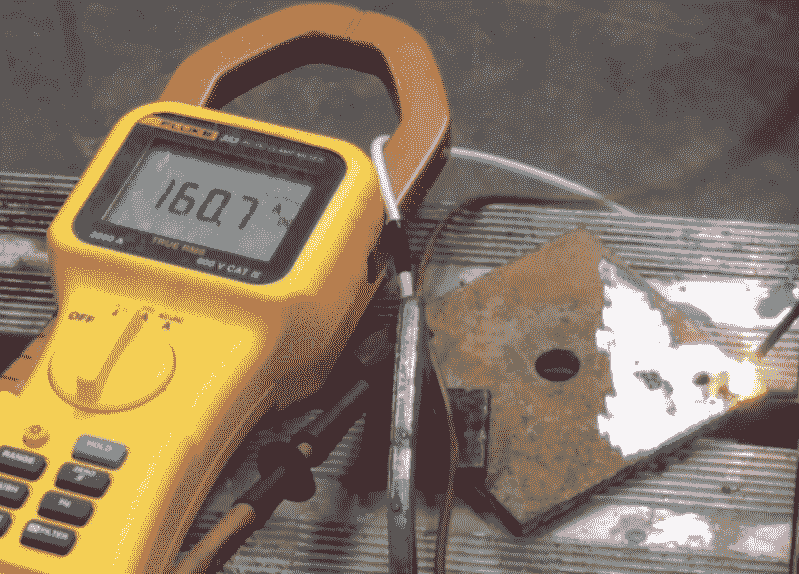

# 无线工具电池组的现场便利电焊机

> 原文：<https://hackaday.com/2015/07/25/field-expedient-stick-welder-from-cordless-tool-battery-packs/>

自称是“YouTube 上最聪明的白痴”的人又回来了，他带来了“不要在家里尝试这个”文件中的另一个条目。[AvE]最近拆卸了一个新的 DeWalt 无绳电钻驱动器，在设法将所有东西重新组装起来后，一名观众向他挑战[将 20V 电池组改装成一台即兴电焊机](https://www.youtube.com/watch?v=bABCvucGATc)。

【AvE】送达——算是吧。他的第一次尝试是将两个电池组并联，以获得更高的电流，但他很难用他所用的 1/8”杆引弧。一个定格画面显示了令人难以置信的 160A 短路电流和一根接近变成等离子体的焊条。切换到串联模式，[AvE]能够打出一个合理的电弧，并最终打下一个单一的飞溅点焊，这看起来比我们的一些 MIG 焊接更好。最终，他的钻机释放出蓝色烟雾，拆除废弃包装的事后检查既有趣又有教育意义。

虽然我们不建议为了一次点焊就毁掉价值 100 美元的锂离子电池组，但看看你用这些无绳电钻之一在手掌中掌握了多少能量还是很有趣的。几年前，我们在稍微复杂一点的版本中看到了类似的技术。遗憾的是，那篇文章中的 YouTube 视频已经不活跃了。但你可以在休息后继续关注最初的[AvE] DeWalt 拆卸，其中释放出不同性质的蓝色烟雾。

[https://www.youtube.com/embed/PBMIlq2IFQk?version=3&rel=1&showsearch=0&showinfo=1&iv_load_policy=1&fs=1&hl=en-US&autohide=2&wmode=transparent](https://www.youtube.com/embed/PBMIlq2IFQk?version=3&rel=1&showsearch=0&showinfo=1&iv_load_policy=1&fs=1&hl=en-US&autohide=2&wmode=transparent)