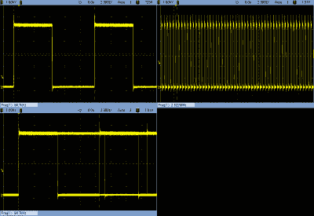
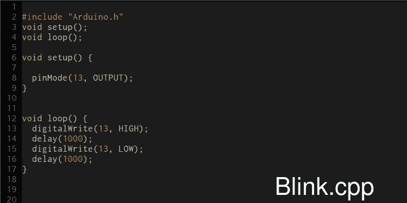
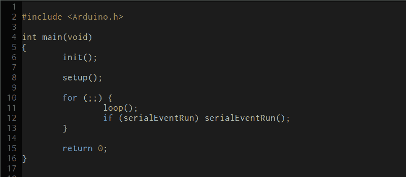

# 嵌入 Elliot:没有 Arduino“语言”

> 原文：<https://hackaday.com/2015/07/28/embed-with-elliot-there-is-no-arduino-language/>

本期《嵌入埃利奥特》以一个疯狂的咆哮开始。如果你想大声朗读接下来的几段，就像美国口音的戴夫·琼斯抱怨一样，这可能不会有什么坏处。因为，尽管 Arduino 为黑客观众做了很多好事，但有两个方面确实让我们恼火。

(*咆哮——模式开启！*)

首先是“素描”的事情。听好了，阿杜伊诺人，你们不是在写“草图”！这是代码。你不是在画草图，你是在编码，即使你是一个艺术家。如果你继续称 C++代码为“草图”，我们可以称我们的下一个水彩作品为“写错误的 COBOL”。

你也没有写“在 Arduino”。你正在用 C/C++编写，使用一个函数库和一个相当一致的 API。没有“Arduino 语言”和你的”。ino”文件离标准 C++还差三行。这种混淆伤害了作为 Arduino 用户的你，并且人为地阻碍了你成为“真正的”程序员。

咆哮结束。)

让我们认真对待第二个问题，深入研究 Arduino 库，看看是 Arduino 一直向下，还是下面有陆地。如果你是从 Arduino 开始的，并且你正在寻找下一步来推动你的编程进步，这是一个打破 Arduino 限制的温和方法。或者只是想看看黑盒里面。

## Arduino 是 C/C++

点击 arduino.cc 首页[的“什么是 Arduino”框，会看到下面这句话:](https://www.arduino.cc/)

> “Arduino 软件:你可以通过用 Arduino 编程语言编写代码来告诉你的 ARDUINO 做什么……”

导航到[常见问题](https://www.arduino.cc/en/Main/FAQ)，你会看到

> “Arduino 语言仅仅是一组可以从你的代码中调用的 C/C++函数”。

在我们那里，用编程语言编写的一堆函数被称为[库](https://en.wikipedia.org/wiki/Library_(computing))。到底是哪一个，Arduino？

([语言参考页面](https://www.arduino.cc/en/Reference/HomePage)完全是一团乱麻，将标准 C 的部分与 Arduino 核心库中定义的函数结合在一起。)

也许这并不像声称已经提出了一种新的编程语言那样性感或具有革命性，但区别很重要，而且它只是一组库，这是一件非常好的事情。因为 Arduino 库的美妙之处在于你不必使用它们，你可以从中挑选。由于这些库是用真正的编程语言(C/C++)编写的，如果你理解这些语言，它们是一个非常有用的文档。

另一方面，c 和汇编语言是不同的语言。如果你正在编写汇编程序，你可以很容易地准确指定芯片的哪条本机指令用于任何特定的操作，但在 C 语言中并非如此。在 CPU 的特定寄存器中存储数据在汇编程序中是正常的，但在 C 语言中却是非凡的。因此，如果你开始用 C 语言编写代码，然后发现你需要汇编程序的一些功能，你就完了。你停止用 C 写，把你所有的代码移植给汇编程序。你必须转换语言。你没资格挑挑拣拣。

(是的，GCC 中有内联汇编器。那是作弊。)

Arduino 完全不是这样:它根本不是一种编程语言，这是一件非常好的事情。你是用 C/C++写的，上面有一些额外的方便的库，所以如果这些库很糟糕，或者很不方便，你就不必使用它们。就这么简单。

一个主要的例子是 Arduino 的核心库中的`digitalWrite()`，在“ [wiring_digital.c](https://github.com/arduino/Arduino/blob/master/hardware/arduino/avr/cores/arduino/wiring_digital.c) 文件中找到。当速度或时间很重要时，使用慢得可笑的`digitalWrite()`功能是疯狂的。与直接翻转输出寄存器中的位相比，`digitalWrite()`要慢 20-40 倍。

 这里的范围镜头是从 Arduino 附带的 Blink.ino 示例代码中简单地删除延迟语句——实质上是全速切换 LED 引脚。左上是用 digitalWrite()来翻转引脚状态。右上使用的是 C: `PORTB ^= (1 << LED_BIT);`中的直接位操作，因为 Arduino 的`digitalWrite()`命令中有一堆没有被编译器优化掉的`if...then`语句，所以运行速度慢了 28 倍。

(更糟糕的是，正如您在左下角看到的，Arduino 代码运行时偶尔会出现计时故障，因为中断服务例程会被定期调用来更新毫秒计时器。这对于`digitalWrite()`本身来说不是问题，但是当试图使用 Arduino 缺省值进行严格计时时，这是一个警告。)

好吧，所以`digitalWrite()`对时间关键的编码没有好处。如果 Arduino 是一门真正的语言，而你被`digitalWrite(),`所困，你将无法使用这门语言做任何特别复杂的事情。但这只是一个方便的功能。因此，您可以在代码的`setup()`部分随意使用`digitalWrite()`,因为它不太可能是时间关键的。这并不意味着当时机很重要时，你必须在`loop()`部分使用它。

这也意味着你不再被允许说“Arduino 很烂”。Arduino 是 C/C++，至少 C 不烂。(Zing！接招吧，C++爱好者们。这是无可争议的。如果你认为一些 Arduino 库很糟糕，你真的需要具体说明你指的是哪些库，否则我们会叫你出来，因为没有人强迫你大量使用它们。事实上，如果你在基于 AVR 的 Arduino 上编码，你已经拥有了整个 [avr-libc 项目](http://www.nongnu.org/avr-libc/)。而且不难吃。

## 的”。伊诺”是个谎言

所以如果 Arduino 只是 C/C++，那它又是怎么回事呢”。ino "文件类型？为什么不是”。c“或者”。cpp "像你期望的那样？根据 [Arduino 构建过程文档](https://github.com/arduino/Arduino/wiki/Build-Process)，

> “Arduino 环境在将主草图文件传递给 avr-gcc 编译器之前，会对其执行一些转换(草图中所有选项卡的连接，没有扩展名)。”

真正的 C/C++风格要求你在定义函数之前[声明(prototype)](https://en.wikipedia.org/wiki/Declaration_%28computer_programming%29) 你将要使用的所有函数，这通常是在一个单独的头文件中完成的。h”文件。当 C 编译你的代码时，它只是简单地将每个函数转换成机器码。在一个哲学上(通常也是实践上)截然不同的步骤中，对函数的引用与代表它们的编译后的机器码联系起来。然后，链接器只需要知道每个函数的名称以及它需要和返回什么类型的变量——确切地说是函数声明中的数据。

长话短说:在 C 语言中函数需要预先声明，而你的"。ino”代码定义了`setup()`和`loop()`，但从未声明它们。这是 Arduino IDE 为您做的一件事。它增加了两个(或者更多，如果你在你的。inos”)的函数原型。

IDE 的预处理器做的另一件事是将`#include "Arduino.h"` 添加到代码的顶部，这将拉入核心 Arduino 库。

(然后，出于某种神秘的原因，它还删除了代码中的所有注释，使得以后的调试更加困难。有人知道 Arduino IDE 为什么会这样做吗？)

原来如此。三行(或者更多)非常简单的样板文件将“草图”从有效的 C/C++代码中分离出来。这样做大概是为了简化新手的编码体验，但是考虑到几乎每个新手都会从模板项目开始，不清楚这样做是否有用。

另一方面，对微控制器新手造成的伤害相当大。新手不知道它实际上是 C/C++，也不了解这种语言最基本的(虽然不需要动脑筋)需求之一:函数声明。

当新手最终想要包含外部代码时，新手无论如何都需要学习`#include`语句，所以隐藏`#include "Arduino.h"`是不一致的，并且会造成未来的混乱。简而言之，新手对一些有用的学习机会视而不见，只是为了避免一些模板化的样板文件。

### 直接在 Arduino IDE 中编写 C++

如果你不相信 Arduino 是 C/C++，试试下面的实验:

1.  保存示例 Blink 项目的副本。
2.  进入“sketch’s”目录，将 Blink.ino 复制到 Blink.cpp。
3.  在 Arduino 中重新打开项目，并删除 Blink.ino 中的所有内容
4.  将所需的样板文件添加到 Blink.cpp。(一个 include 和两个函数声明。)
5.  验证，闪光，以及其他任何你想要的。

您刚刚学会了从 Arduino IDE 中直接编写 C/C++。

(注意:由于某种原因，Arduino IDE 需要一个 Blink.ino 文件，即使它完全是空的。不要问我们。)

## 主页面

那么如果 Blink.ino 变成了 Blink.cpp，`setup()`和`loop()`函数是怎么回事呢？他们什么时候接到过电话？等等，不是所有的 C 和 C++程序都需要一个`main()`函数来启动吗？你正走在开悟的道路上。

看看 hardware/arduino/AVR/cores/arduino 中的 [main.cpp](https://github.com/arduino/Arduino/blob/master/hardware/arduino/avr/cores/arduino/main.cpp) 文件。

这就是你的`main()`功能！尽管我们为了演示稍微简化了文件，但也就是这么简单。

在运行任何代码之前，都会调用`init()`函数。它在“ [wiring.c](https://github.com/arduino/Arduino/blob/master/hardware/arduino/avr/cores/arduino/wiring.c) 中定义，并设置微控制器的一些硬件外设。AVR 平台上的这些任务包括为毫秒滴答和 PWM ( `analogOut()`)功能配置硬件定时器，以及初始化 ADC 部分。如果你从未做过 AVR 芯片的底层初始化，通读`init()`函数和 AVR 数据表的相应章节；没有 Arduino 也是这么做的。

然后我们吃肉。调用`setup()`函数，在一个无限的 for 循环中，继续调用`loop()`函数。就是这样，这是你用 C/C++为地球上任何其他微控制器编写的相同代码。那就是神奇的 Arduino `setup()`和`loop()`。皇帝没有衣服，绿野仙踪只是一个躲在窗帘后面的可怜小人。

如果你想更深入地了解 Arduino 核心库的内部，在本地安装中搜索“Arduino.h ”,或者在 Github 上点击[核心库。](https://github.com/arduino/Arduino/tree/master/hardware/arduino/avr/cores/arduino)

## Arduino 编译阶段

所以我们有了 C/C++代码。将它编译成 Arduino 项目出人意料地简单，并且在 [Arduino docs wiki](https://github.com/arduino/Arduino/wiki/Build-Process) 中有很好的记录。但是如果您只是想自己看看，请进入首选项并在编译期间启用详细日志记录。现在，当您单击“验证”时，整个构建过程将在那个小窗口中闪现。

要理解的东西很多，但几乎都是重复的。编译器根本没有做任何奇怪或独特的事情。它编译 Arduino 核心文件中的所有函数，并将结果函数放入一个大的(静态)库文件中。然后把你的代码和这个库连接在一起。如果您正在编写自己的 C/C++代码，这就是您要做的全部工作。只是你不知道它正在发生，因为你正在按一个看起来像旧随身听上的播放按钮的东西。但这不是火箭科学。

这里还有一个细节。如果您通过菜单包含了一个库文件，并且它不是核心 Arduino 库的一部分，IDE 会找到它的源代码并编译，然后链接到核心库。它还将`#include`行输入到您的。ino”文件。这很好，但不是一个交易破坏者。

如果你想以 Makefile 的形式查看这个构建过程，这里有[(我们的)原始版本](https://github.com/hexagon5un/arduino_CLI.git)更有助于理解，而[这个版本](https://github.com/sudar/Arduino-Makefile)更适合生产使用。

## 后续步骤

如果 Arduino 是嵌入式电子世界的入门药物，那么 Arduino 程序员要成为一名“真正的”嵌入式程序员和烧油的海洛因瘾君子，下一步应该做什么？那要看你了。

你是不是已经很擅长用 C/C++这样的低级语言编码了？然后你需要专注于微控制器方面的事情。您已经准备好深入 Arduino 代码库了。试着拿几个例子，或者甚至一些你自己的“草图”,看看包含的 Arduino 库的源代码。在 ide 之外重新编写一些简单的代码，确保可以链接到 Arduino 核心代码。然后用你自己的代码替换部分核心代码，确保它仍然工作。你会花一半的时间研究相关的微处理器的数据表，但这对你有好处。

你喜欢电子产品，但对编码感到困惑吗？你可能会花一些时间学习类似 C 语言的东西。[艰难地学习 C 语言](http://c.learncodethehardway.org/book/)是惊人的，虽然它是针对在更大的计算机上工作的人，但它有很多背景知识，你需要通过 Arduino 代码库并超越它。您将需要学习(相对琐碎的)语言约定和样板文件，以便熟悉 C/C++，然后您可以深入研究 Arduino 源代码。

无论你在哪里，请记住 Arduino 不是一种语言:它是一组用 C/C++编写的库，其中一些非常好，还有一些(我们正在看你的 [EEPROM](https://github.com/arduino/Arduino/blob/master/hardware/arduino/avr/libraries/EEPROM/EEPROM.h) )只是现有的 [avr-libc EEPROM 库](http://www.nongnu.org/avr-libc/user-manual/group__avr__eeprom.html)上的 C++包装器。这意味着，对于你编写的每个 Arduino 项目，你在 C/C++中都有相同的源代码，等待你去钻研。谢天谢地，他们没有发明自己的编程语言！