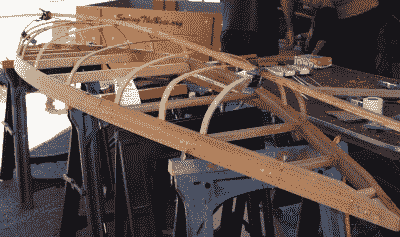
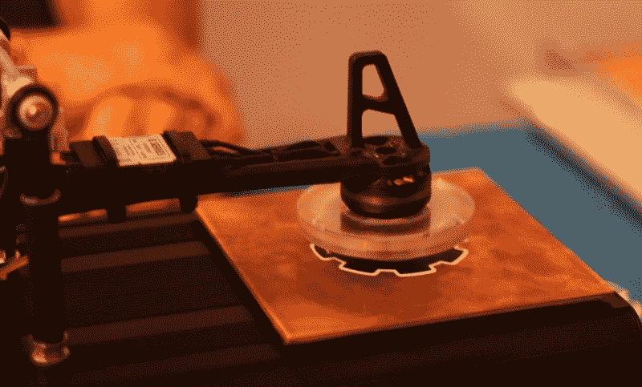
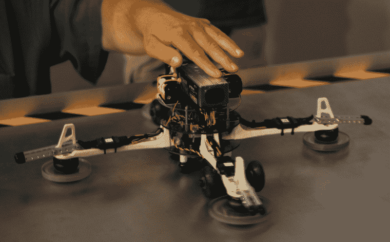
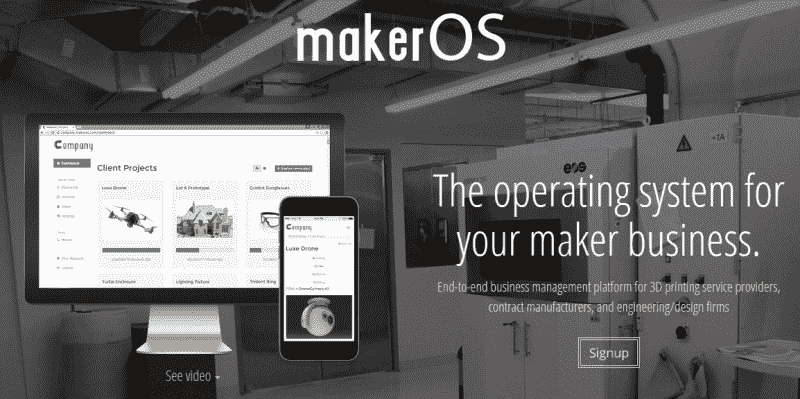
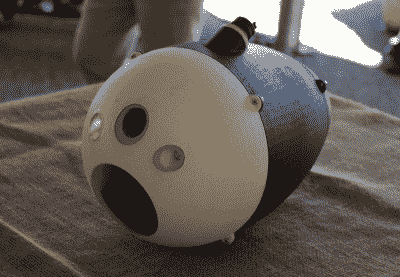

# 底特律 Maker Faire 上的磁悬浮列车、潜水器和更多

> 原文：<https://hackaday.com/2015/07/30/maglev-submersibles-and-more-at-maker-faire-detroit/>

刚刚过去的这个周末，创客节又回到了汽车城。虽然它似乎比前几年小了一点，但该活动仍然吸引了来自底特律大都市地区和其他地区的大量优秀制造商。

虽然我们没有太多的木工项目，但在展会上有相当多的木工，他们的项目从用自制铁模具压制的定制长板到由密歇根当地皮艇建造者团体制作的精致木制骨架的 DIY 皮艇。皮艇给人留下了深刻的印象:手工缝制的尼龙面板包裹着由蒸白橡木制成的定制框架。很高兴能与制造商谈论皮艇制造所需的专业技能。

来自密歇根州卡尔顿的制造商带来了一个非常有趣的装置，演示由涡流产生的磁悬浮。他的简单演示由一个摆臂和一个安装在无刷电机上的旋转丙烯酸盘组成。几个磁铁以交替的北/南模式附着在环上。当马达在铜或铝板上旋转时，手臂开始在离表面约一厘米的地方悬停。这种设计类似于一直流传的各种悬浮滑板概念所使用的技术。

为了让设计更进一步，他将自制的“悬停引擎”安装在四轴飞行器框架上。四轴飞行器能够在一个小铝片上悬停，尽管他不能驾驶四轴飞行器四处飞行，但他相信调节马达可以在一定程度上控制转向和推力。有趣的是，安装在四轴飞行器上的起落架是必不可少的:当磁盘非常接近表面时，马达无法旋转。为了解决这个问题，四轴飞行器在发动机旋转时保持轮子向上，然后降低并开始悬停。

还有一个用 EMG(肌电图)感知肌肉活动的有趣演示。有一些 EMG 套件和开发板可以将您的身体信号放大到可用水平，但您可以轻松地使用几个电极和一些运算放大器来完成这项工作，就像这家制造商所做的那样。如果你对 EMG 入门感兴趣，看看我们在之前[发表的一些帖子。](http://hackaday.com/tag/emg/)

虽然软件项目不像展会上看到的硬件和机械项目那样引人注目，但来自 MakerOS 的家伙们表现不错。他们是底特律的一家小软件公司，正在为创客风格的企业开发基于网络的后端(我们在之前已经[写过)。他们的软件在底特律地区运营着几家 3d 打印公司，如果你想亲自体验一下，他们刚刚开放了一个测试版。](http://hackaday.com/2015/03/22/mrrf-makeros-for-maker-business-management/)

另一组展示了潜水器原型。整个(相当大的)底盘是 3d 打印的，并使用安装在车辆前部的单个推进器。推进器将水向后推，通过团队设计的 4 个不同的蝶阀。阀门本质上引导推力，并允许潜水器在没有多个推进器或任何其他控制表面的情况下被操纵。该团队的网站令人难以置信的模糊，但是他们说他们将很快发布更多的信息。