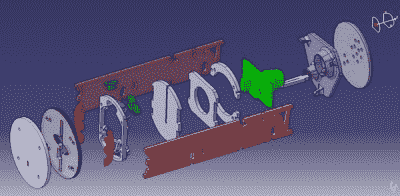

# 注意那些 VOC！开源空气质量监测器

> 原文：<https://hackaday.com/2015/08/09/watch-those-vocs-open-source-air-quality-monitor/>

有没有考虑过监测你家的空气质量？随着传感器成本的下降，制造监控几乎所有东西的设备变得越来越容易。[AirBoxLab]刚刚发布了一款[一体式室内空气质量监测器](http://airboxlab.foobot.io/)的开源设计，它看起来非常棒。

它能够监测挥发性有机化合物(VOCs)、基本颗粒物质、二氧化碳、温度和湿度，并负责测量房间空气质量的基本指标。

你需要的所有文件都在他们的 GitHub 上免费共享[，包括他们的 CAD——但真正令人惊叹的是](https://github.com/airboxlab)[通过他们的博客](http://blog.airboxlab.com/)回顾了他们从一个想法到一个成熟的开源设备的设计和制造过程。

我们提到过您可以非常轻松地添加自己的传感器吗？I2C 和模拟传感器的额外端口可用，使其成为一个相当有吸引力的可扩展家庭传感器中心。

为了降低工具包的成本，[AirBoxLab]严重依赖激光切割作为一种快速制造的形式，不需要昂贵的工具。该团队还使用了一些 3D 打印零件。看着完成的设备，我们不得不说，我们印象深刻。它会把家放在鸟巢或亚马逊回声旁边。或者，如果你想自己摆弄单独的传感器和一个树莓派，你可以做一个[来代替。](https://hackaday.com/2012/12/11/standalone-air-quality-monitor-based-around-raspberry-pi/)