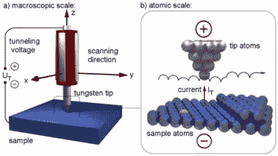
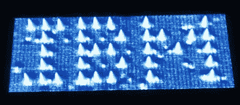
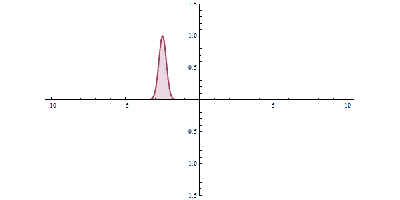

# 处理器中的量子力学:隧道和晶体管

> 原文：<https://hackaday.com/2015/07/31/quantum-mechanics-in-your-processor-tunneling-and-transistors/>

到 19 世纪初，大多数科学家都相信自然界是由原子组成的。[爱因斯坦] 1905 年关于布朗运动的论文将悬浮在液体中的微小粒子的行为与原子的运动联系起来，这给反原子人群的棺材钉上了钉子。然而，没有人能真正看到原子。单个原子的典型大小在 30 到 300 皮米之间。可见光的波长高达 400-700 纳米，根本不可能“看见”一个原子。这在可见光下是不可能的。1982 年夏天，IBM 苏黎士研究实验室的两位研究人员格尔德·宾宁和海因里希·罗雷尔向世界展示了第一张原子结构的视觉图像[。1986 年，他们因他们的发明被授予诺贝尔物理学奖。](https://www-03.ibm.com/ibm/history/exhibits/vintage/vintage_4506VV3181.html)

## 扫描隧道显微镜

IBM 的扫描隧道显微镜(Scanning Tunneling Microscope，简称 STM)使用原子级尖锐的针穿过(导电)物体的表面——针尖和物体之间的距离只有几百皮米，或者一个大原子的直径。

【图片[来源](http://www.ieap.uni-kiel.de/surface/ag-kipp/stm/stm.htm)

在针和物体之间施加一个小电压。电子从物体“移动”到针尖。针扫描物体，就像扫描阴极射线管屏幕一样。测量从物体到所需物体的电流。针尖上下移动，使得该电流值不变，从而允许针在扫描时完美地描绘物体的轮廓。如果在扫描完成后，将电流值制成可视图像，单个原子就变得可以识别了。有些听起来可能很熟悉，因为我们已经看到一些人从零开始制作电子显微镜。我们在这篇文章中要关注的是这些电子是如何从物体“移动”到针上的。除非你精通量子力学，否则答案可能会让你瞠目结舌，就像[这张图片](https://dberarddotcom.files.wordpress.com/2015/01/scan1-36_2.png?w=700&h=)来自[自制的](http://hackaday.com/2015/01/13/cheap-diy-microscope-sees-individual-atoms/) STM 机器。

## 量子隧穿

量子力学确实是一个奇怪的世界。我们认为理所当然的日常事物，如因果关系和基本经典定律在原子内部的世界中不起作用。粒子的出现和消失是这里的常态。

STMs can also relocate atoms, as IBM demonstrated with 35 xenon atoms

事实上，在我们工作的微小尺度上，粒子可以在一种被称为[互补性的现象中呈现出类似波动的特性，这是我们上周的主题](http://hackaday.com/2015/07/24/quantum-mechanics-in-your-processor-complementarity/)。电子是粒子。也就是亚原子粒子，这让他们了解了自然界的波粒二象性。如果我们把电子看作一个粒子，它们就没有办法从我们物体的表面移动到针上。电阻太大，小电压克服不了。这就是他们所说的能量屏障。但是电子显然正在穿过这个屏障。怎么会？好吧，如果我们认真对待量子力学，把电子看成一个波，穿越势垒就变得可能了。

## 波动力学的出现

1926 年，一个名叫[埃尔温·薛定谔]的人发表了一篇论文，描述了量子力学中一个令人难以置信的飞跃。其实“量子力学”这个标签是在他那篇著名论文之后才形成的。

The waveform hits the y axis barrier, but part is able to move past. “Quantum Tunnelling animation” by Yuvalr

之前只是叫量子理论。[薛定谔]意识到[海森堡的]测不准原理与粒子的波动行为有关。即使电子的粒子和波动性质是互补的，它们仍然是相关的。【薛定谔的】波动力学利用电子的波动性质，在一定的百分比内预测其位置。振幅越大，找到粒子的概率就越高。观察电子会导致所谓的“波函数坍缩”，它呈现出粒子或波的互斥性质。

很难用语言来表达这个发现有多重要。量子世界的波动力学类似于宏观世界的[牛顿]运动定律。它使科学家们有能力预测电子在原子中的可能位置。很多人会记得高中化学课上的 s，p，d 和 f 轨道。这些是通过量子数——薛定谔波动力学的结果——发展出来的。

量子隧穿现在可以用穿过能垒的非常小振幅的电子波来解释。在势垒的另一边，一些波的存在代表了电子出现的可能性。发送足够多的电子，就会有一些出现。

## 隧道晶体管

当你试图将晶体管缩小到如此之小时，量子隧道并不是一件好事。晶体管需要屏障。当电子开始隧穿这些障碍时，你就有问题了。大问题。事实上，量子隧道对小晶体管能达到多小设置了一个基本限制。如果任何内部势垒变得小于一纳米，当晶体管关闭时，就会有太多的电流通过隧道。然而，设计一种利用量子力学的处理器——量子计算机——可能是有用的。这将是下一篇文章的主题。

### *处理器中的量子力学*系列文章:

*   [互补性](http://hackaday.com/2015/07/24/quantum-mechanics-in-your-processor-complementarity/)
*   隧道和晶体管

### **来源:**

[http://www . nano science . com/products/STM/technology-overview/tunneling/](http://www.nanoscience.com/products/stm/technology-overview/tunneling/)

[http://www.azonano.com/article.aspx?ArticleID=1373](http://www.azonano.com/article.aspx?ArticleID=1373)

[http://www-03 . IBM . com/IBM/history/IBM 100/us/en/icons/microscope/](http://www-03.ibm.com/ibm/history/ibm100/us/en/icons/microscope/)

《化学:原子第一》,作者博奇·朱莉娅。第三章 ISBN-9781259208416