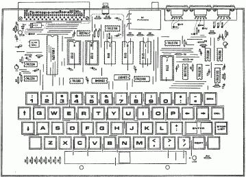
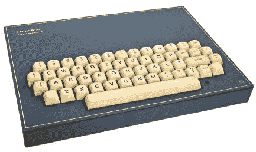

# 入侵数字和社交系统

> 原文：<https://hackaday.com/2015/08/03/hacking-the-digital-and-social-system/>

当你生活在一个极权的、被控制的、“快乐的”社会，你想成为一个黑客，你得先黑掉社会系统。仅仅是一个工程师是不够的，你必须同时是一个伪君子、持不同政见者和走私者。这是我个人故事的座右铭，从南斯拉夫开始，到塞尔维亚结束。不，我没有搬家，我还在贝尔格莱德，只是政治边界变了。

半个世纪前，我上小学的时候，发现了火腿收音机的神奇世界。我成为了两个业余无线电俱乐部的成员，通过了所有的考试，拿到了执照和呼号，是 YU1OPC。我很高兴，但五年后，派对结束了。发生了什么事？有一天，警察拜访了所有 CB 波段设备的注册所有者，并简单地拿走了设备。没有人知道他们为什么这样做，但这可能是不记录在案的，因为我们从未得到任何书面确认，也没有人再见过他们的设备。

我想知道他们为什么不把我们的业余无线电设备也拿走，这些设备和任何 CB 设备一样合法。我猜他们不知道如何使用它…为了他们自己的个人需要。没有什么能阻止我称之为穿制服的抢劫。

实际上，我对此并不太难过。我只丢失了一个日本 5W CB 收发器，但我对业余无线电不再感兴趣了。自从第一个商业业余无线电设备出现在市场上以来，用户的情况发生了巨大的变化——以前人们可以自己动手制作业余无线电设备，现在人们有足够的钱购买这些设备。也许是我反应过度了，也许还是有很多发烧友，但是我自己热情的魔力被破坏了，我转移到了数字技术。我不知道仅仅二十年后，同样的事情会在电脑上再次发生。

## “笔和纸”开发系统

从电子管到晶体管的转变令人着迷。这么小的管，有冷阴极，阳极电压低，这么便宜，用起来简单！我用我的零花钱买了我的第一个锗晶体管，并且制造了…你猜怎么着？人字拖！我以为是我发明的。我怎么会知道它已经在五十年前被发明了呢？

就在英特尔 4004 发布几年后，我就深深爱上了微处理器。我从美国订购了两台 z80，但很快发现其中一台不能用了——我很可能不知何故烧了它而没有意识到。不过，我还有第二个，所以我可以开始建立我的第一个微处理器项目。我应该用它做什么？

这是一个简单的问题。我被康威的[生命游戏](https://en.wikipedia.org/wiki/Conway%27s_Game_of_Life)迷住了，我房间的所有墙壁都贴满了手绘细胞群的纸，几百代。我的墙壁艺术有两个后果:我的父母和一半的朋友认为我疯了，我的第一个项目——生活的游戏，一个 16×16 的 LED 矩阵。当时 led 非常昂贵，所以我用不到一半的 led 完成了固件，并在接下来的几个月里逐渐填充了矩阵。

我没有电脑，所以我用笔和纸手工组装固件，然后用旋转开关一个字节一个字节地将代码输入我的编程器。然而，调试过程相对较快，因为我有两个 2708 EPROMs 事实上，我一开始有四个，但在调试我的 DIY EPROM 编程器时烧坏了其中的两个。因此，当其中一个在 UV 橡皮擦(由一个旧的日光浴灯制成)中时，我可以调试代码并编写另一个。

不管手动汇编代码看起来有多奇怪，我不知道可能还有其他方法。而当你没有更好的想法时，也没有理由对目前的不满意。于是，我继续走下去，完成了我的人生游戏。不幸的是，我不再拥有它了，但是几年后我复制了它，它在我的工作室里运行了将近 40 年——甚至 EPROM 仍然保留着它的内容。也许我应该在 Hackaday.io 项目页面描述它，作为一个仍然工作的旧 MPU DIY 项目之一？

## 请不要用电脑

当时的个人电脑相当昂贵，但这不是主要问题。如果你住在南斯拉夫，你根本买不到它们。没有明确禁止，但是你不能进口任何价值超过 50 德国马克的东西。所以我请我的一个美国朋友把我新订购的 [TRS-80](https://en.wikipedia.org/wiki/TRS-80) model 1 分成两部分，用不同的包裹寄给我，尽可能不引人注意。不得不剪断两个印刷电路板之间的带状电缆(没有连接器)令人沮丧，但犹豫了一会儿后，他抓起一把剪刀就剪了起来。过了好一会儿，我免税收到它们，贴上“技术垃圾”的标签，然后“修理”它。我自己的电脑革命开始了。

基本型号有 4KB 的动态 RAM，所以当我看到 16KB 扩展套件的广告时，我想知道谁会需要 4KB 以上的内存！具有讽刺意味的是，我很快发现自己使用的不是 16kb，而是 48KB，排列在三个捎带层中。主印刷电路板得到了大量的硬件升级:移位保持，2 倍时钟，单步模式，扬声器，和一个额外的 EPROM 与我自己的反汇编器和编辑器/汇编器。

一步一步地，微型计算机到处传播，但是政府仍然没有认识到新技术的潜力。我们要求对计算机进行新的法律处理，但是整整十年没有任何改变。我们的主要论点是，我们需要技术熟练的人和年轻的软件专家，一位政治家给了我们著名的、广为人知的答案:“我听说美国人将创造自我编程的计算机，所以我们不需要程序员。”

除了继续走私、贿赂和把设备藏在手提箱里的洗衣房下面，没有别的办法了。

## 1979 年的电脑动画

20 世纪 70 年代末，当我还是戏剧艺术学院的学生时，我被电脑动画迷住了。我在这里就像一个菜鸟，因为我必须从零开始。我只是从来没有见过用于它的设备。首先，我构建了图形界面，其中包含 90 个静态 ram 2114(4×1k bit)、一个 Z80A 和许多胶合逻辑。分辨率为 400×300，3 位单色像素。我借了一个可以逐帧操作的 16 毫米 Bolex 相机，并建立了一个带有相应计算机接口的螺线管触发器。我还用 BASIC 编写了动画软件，可以用线框模式绘制几何图形。一切都是 3D 的，包括可以移动、平移和缩放的摄像机。所有这些，包括琥珀色的显示器，都被封装在一个大木箱里，看起来很像一个棺材，但它的工作是保护系统免受环境光的影响，保护我的耳朵免受嘈杂的螺线管的影响。动画软件是在我的 DIY [TRS-80](https://en.wikipedia.org/wiki/TRS-80) 克隆体上运行的，配有 6MHz Z80B 微处理器，所以一帧只需要 10 分钟的渲染时间，平均下来一个镜头需要 24 小时。

我把结果给我的教授看了，他很高兴。他问我是否有可能让人类的形象栩栩如生，但我带着极大的权威和自信说:“绝不可能”！他建议我准备一个简短的电视节目，并配上一些动画例子。我准备好了，但是我找不到任何人对我的技术奇迹感兴趣。当时媒体报道的唯一话题是铁托总统的病。

[https://www.youtube.com/embed/6HnW1XnXFoA?version=3&rel=1&showsearch=0&showinfo=1&iv_load_policy=1&fs=1&hl=en-US&autohide=2&wmode=transparent](https://www.youtube.com/embed/6HnW1XnXFoA?version=3&rel=1&showsearch=0&showinfo=1&iv_load_policy=1&fs=1&hl=en-US&autohide=2&wmode=transparent)

36 年过去了，只剩下两个短镜头。我一直没找到能数字化它们的人，所以我用了一个平板扫描仪和改进的背光来数字化这个。

## galaksija:1983 年的 DIY 微型计算机

合法购买微型计算机是不可能的，也没有人试图在南斯拉夫生产微型计算机——所有东欧集团国家都面临着类似的问题。一切都表明我们在这件事上还停留在石器时代。我们没有计算机杂志或其他方式来教育人们有关技术的知识，所以媒体的报道仅限于“一种叫做电子大脑的奇怪装置，它甚至可以下棋”。

关于当时的微型计算机项目，最昂贵的部分是视频接口。我知道 ZX81 和 ZX Spectrum 拥有 ULA(非专用逻辑阵列)芯片，可以在软件的帮助下生成视频信号，但我做梦也想不到会有这样的芯片。所以我不得不黑掉微处理器，用现有的 TTL 芯片使视频控制器单元尽可能简单。

Z80 微处理器有一个透明计数器，称为 R 寄存器，用于动态存储器刷新。每次指令执行后，它只是递增并输出到地址总线。它可以用来产生视频信号的最快部分，而视频硬件的较慢部分可以简单地用软件代替。因此，我只需要一个由像素时钟和字符发生器驱动的移位寄存器，并且节省了视频地址计数器、选择器、三态缓冲器和消隐逻辑。这是一个值得尝试的概念。

仅仅几天后，它就完美地工作了，我开始构建操作系统。内存芯片很贵，所以我决定只使用 4KB(可扩展到 8K)的 ROM 和 3×2K 的静态 RAM。我从 TRS-80 一级 BASIC 中窃取了算术例程，并开始创建自己的行编辑器和 Basic 解释器。

得到的性价比太好了，我决定把它作为 DIY 项目发表在杂志上。在第一份南斯拉夫计算机杂志第一期即将出版的时候，我见到了作者[Dejan Ristanovic]，并与他达成协议，让我编写 DIY 手册。这一期的编辑【Jova Regasek】坚持将微型计算机命名为“ [Galaksija](https://en.wikipedia.org/wiki/Galaksija_%28computer%29) ”(银河)。1983 年 8 月，Galaksija 呈现在读者面前。

    

该杂志名为" ra unari u vaoj kui "(你家中的电脑)，计划于 1983 年 12 月底发行。所以我有五个月的时间来完成固件，有时在德扬的帮助下完成总体概念。只要尽力优化代码，你能往 4 KB 的 EPROM 空间里装多少东西，真是太神奇了！我在[我的项目页面](https://hackaday.io/project/6059-how-to-use-more-than-100-of-program-memory)中描述的许多想法之一是如何使用超过 100%的程序内存。

截稿前几天，我在编辑部，和 Jova 和 Dejan 聊天。Jova 问了一个耐人寻味的问题:有多少读者会制造微型计算机？我说“也许 50”，德扬说“我认为至少会有 200”，约瓦说“别傻了，会有 500 多”。我们嘲笑他，因为这似乎太过分了。但是我们已经收到了 8000 多封建造者的来信。计算机革命在我的国家开始了。

同年，我的朋友[ [Zoran Modli](http://www.modli.rs/) ]一位著名的电台主持人，开始在他的每周调频广播节目中，甚至在电视上播放所有当前微机的节目！那时既没有软盘也没有硬盘，所以唯一的磁介质是盒式磁带。数据编码在音频范围内进行，便于广播。所以我们在 1983 年有了无线网络(或者至少是它的前身)!

你可能认为只有盗版视频游戏被播放，但实际上绝大多数是由爱好者编写的原创节目。佐兰甚至创建了一个数字杂志，以数字形式播出。

在接下来的几年里，南斯拉夫每年大约有一台新的微型计算机。其中大部分都是限量生产的，而且主要是苹果 II 和微软 Basic 的复制品。

## 战争与不和平

从 1991 年开始，南斯拉夫在血腥的战争中解体。当我看到窗户下的军用吉普车时，我知道我别无选择，只能带上我的牙刷、剃须刀、随身听和一些衣服，让那些家伙把我带到镇外的住处。明天早上，我的军官问我目前的工作。当我说我和电脑打交道时，他让我去总部，去检查一台旧的苹果 II:“它已经坏了一年多了，没人能让它复活”。我主动提出在我的车间试着把它修好，因此被同一辆吉普车送了回来。

又回家了！我花了几分钟才发现唯一的问题出在视频监视器上。我把它拆开，更换了一个烧坏的二极管，一切正常。第二天，警官把我的身份证还给我，送我回家，并说了一句我至今仍记得的话:“保重，我需要你活着。谁知道这种平静什么时候会再次被打破”。

感觉像是沉睡后醒来，我加入了几个反战和反米洛舍维奇的运动，写文章反对恐怖。

1995 年，在我家发生了几起悲剧之后，我和我两岁的儿子被单独留在家里，没有钱，在这三天里我们不得不离开我们的公寓。然后我做了一件非常愚蠢的事情:我扔掉了我几乎所有的项目，包括 Galaksija 微型计算机的文档和五个原型。

## 希望与惩罚

战争时期的生活压力很大，所以我埋头工作来振作精神。1998 年，我用单片机设计制作了一个小型手持仪器。使用 PIC16F84，它是一个逻辑探头、单通道逻辑分析仪、50 MHz 频率计数器、RS 232 分析仪和电池充电管理器，所有这些仅用 1K 代码实现。我给 Microchip 发了邮件，并提供了一份应用说明。答案非常鼓舞人心:“PIC16F84 的集成度给我们留下了深刻的印象……”首先他们要了一个，然后又要了三个样品，这样他们就可以在会议中作为演示工具。

他们承诺我不仅会发表申请说明，还会在美国和欧洲的杂志上曝光，并获得官方顾问的身份。问及赔偿，我拒绝金钱，并表示，我宁愿有他们的在线仿真器。

我准备了一篇文章，很快这个项目就以 AN689 的名字出现在了微芯片的网站上。终于，在经历了所有的陷阱和失望之后，我终于有了上升的希望。但仅仅几个星期后，我就收到了来自微芯片的如下信息:

“显然，美国对南斯拉夫有某种贸易禁运……”等等。他们表示歉意，但仍然确信可以做出某种安排…

没有杂志文章，没有顾问身份，没有在线仿真器。就连应用笔记也从网站上删除了。

我在想，我的运气不会比这更差了，但仅仅几个月后，塞尔维亚就遭到了北约的袭击，密集轰炸了 78 天。没有一天休息，一天 24 小时，我们听着城市上空的战争警报、超音速爆炸、导弹和频繁的爆炸。

## 技术和五十年的遗产

2006 年，在几封邮件之后，我终于收到了来自 Microchip 的在线调试器，应用笔记也放回了原处。我坚信他们已经尽力了，所以我不能责怪他们。我仍然喜欢 PIC 平台，并且从未停止在我的中等规模项目中使用它。

很长一段时间，我一直听“专家”告诉我，我的 Galaksija 电脑比现代个人电脑慢 X 倍，比他们的智能手机慢 Y 倍。不过最近，我们似乎进入了一种技术文化的复兴。人们变得怀旧，更欣赏旧的东西。现在有许多针对 PC 的复古计算机仿真器，包括一个[银河仿真器](http://emulator.galaksija.org/)，还有一个名为 [μGalaksija](http://galaksija.petnica.rs/index.php/Specification) 的单片 FPGA 复制品，由 bu【Duan gru Ji】创建。

当贝尔格莱德的科技博物馆要求我捐赠一台 Galaksija 电脑的样品时，我感到很荣幸。如果我没有钱，我该怎么捐呢？幸运的是，我在我的地窖里发现了一个被遗忘的原型，清理了它，现在它是博物馆展览的一部分。

20 世纪的最后十年对我的国家来说是一场灾难，但对人们的思想造成了最严重的伤害。腐败蔓延，社会价值观受损最严重。就像中世纪一样，各种各样的千里眼、先知、庸医和伪科学充斥着媒体，没有一个来自理性的声音。

所以我想我可以试着再黑一次系统。我写了并出版了两本[书](http://www.voja.rs/dpdl.htm)和许多报纸文章和轻松小说，促进了对超自然现象的怀疑。这种方法奏效了，至少部分奏效了。我被邀请参加许多电视节目，一些知识分子开始大声反对现代迷信。我认为，至少部分是由于我的努力，一些骗子和庸医甚至被关进监狱。

不幸的是，90 年代的危机给我们留下了一些严重的后果。许多年轻的科学家和专家离开了这个国家，他们是这一代人中的佼佼者。一位著名的政治家说，没有造成伤害，因为在此期间，我们也接收了同等数量的难民。从数量上来说，我们是一样的。

以下是我对人才流失后果的看法。1960 年，南斯拉夫是拥有自己的计算机 CER-10 的六个国家之一。它是由我们在[米哈伊洛·浦品研究所](http://www.pupin.rs/en/)的工程师创造的，这个研究所离我家只有几百米。猜猜那些“科学家”今天在生产什么？磁性拖鞋！好吧，你们的媒体可能有伪科学，但是我们更进一步——我们的科学中有伪科学！

尽管如此，人们还是习惯了一切。在这一点上，如果事情变得更好，我会感到惊讶。至于我自己，我需要的只是四面墙和宁静，这样我就可以工作和创作了。我不需要很多钱，这就是为什么我的项目是开放的。我从来没有数过，但是我猜我有 50 到 100 个公开的项目发表在计算机杂志上。

去年，我遇到了米奇·奥特曼，他不仅因为《T2》电视节目而出名，还因为在世界各地教授电子产品入门课程而出名。当我们谈论一般的创造性工作时，我告诉他我的问题是我爱上了我的每个项目，他笑着说“这是一个多么好的问题啊”！他是对的，这是最好的问题，这也是为什么我的项目是公开的——当你坠入爱河时，你想告诉全世界，向每个人展示你爱的对象。也许你不会因此变得富有，但你一定会度过值得过的一生。

[插图由鲍勃·日夫科维奇绘制]

* * *

沃佳·安东尼克是一名自由微控制器工程师。他的第一个基于 Z80 的微处理器项目可以追溯到 1977 年，就在第一个英特尔 4004 出现的几年后。他用笔和纸手工组装固件。1983 年，他发表了自己的原创 DIY 微型计算机项目，名为 [Galaksija](http://en.wikipedia.org/wiki/Galaksija_(computer)) ，由前南斯拉夫大约 8000 名爱好者建造。到目前为止，他已经发表了 50 多个项目，大部分都是基于微控制器的，并且都是在公共领域发布的。