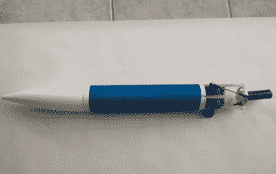
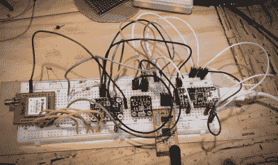

# hack let 68–火箭项目

> 原文：<https://hackaday.com/2015/07/31/hacklet-68-rocket-projects/>

倒数计时，看着火箭从发射台升空，直冲云霄，这是一件令人惊奇的事情。当火箭是你自己造的时候，兴奋感会倍增。几个世纪以来，业余火箭技术一直激励着黑客和工程师。在美国，现代业余火箭技术在人造卫星 1 号发射后开始流行，并在太空竞赛中继续发展。荷马·希卡姆(Homer hikam)的《火箭男孩》一书记录了这段历史，非常值得一读。本周的 Hacklet 致力于 [Hackaday.io](https://hackaday.io) 上一些最好的火箭项目！

 我们先从【萨加尔】和[制导火箭](https://hackaday.io/project/1162)说起。[Sagar]正在建造一个带有自动稳定系统的火箭。许多项目为此使用铰接式尾翼，而且[Sagar]计划在未来增加尾翼，但他正在从铰接式火箭发动机开始。马达位于万向节内，这使得它可以向任何方向倾斜大约 10 度。Arduino 是系统的大脑。Arduino 从 MPU6050 IMU 传感器收集数据，然后决定如何操纵火箭发动机。转向是通过一对连接到万向节的微型伺服系统来完成的。

 接下来出场的是【豪伊】，带着[自制火箭发动机的](https://hackaday.io/project/3331)。[Howie]正在他的炉子上煮一些非常热的东西。准确地说，是火箭糖果，类似于《火箭男孩》中的燃料[ [荷马·希卡姆](https://en.wikipedia.org/wiki/Homer_Hickam) ]所写。这种固体燃料如此命名是因为其中一种主要成分是糖。另一个主要成分是树桩去除剂，或硝酸钾。所有的东西混合在一起，在煎锅上加热大约 30 分钟，然后被推进火箭发动机管道。不言而喻，你不应该在家里尝试这个，除非你真的确定你在做什么！

每个人都想知道他们的火箭飞了多高。[Vcazan]创造了[alti rocket](https://hackaday.io/project/5686)来记录加速度和高度数据。AltiRocket 还通过无线电链路将数据传输到地面。Arduino Nano 可保持物品轻便。一个 BMP108 气压传感器捕捉压力数据，很容易转换成海拔高度。发射力由一个三轴加速度计捕获。一个微型脂肪电池提供能量。整个系统只有 23 克！[Vcazan]已经飞行了 AltiRocket，从今年夏天早些时候的几次飞行中收集数据。

 我们终于有了【J. M. Hopkins】，他正在从事一个庞大的项目，几乎要做所有的事情！[高功率实验火箭平台](https://hackaday.io/project/6381)包括设计和建造一切，从火箭燃料，到火箭本身，再到 GPS 制导降落伞回收系统。[J. M .霍普金斯]已经完成了他的两个目标，自己制造燃料和测试喷嘴设计。火箭上的电子设备令人印象深刻，包括 GPS、IMU、气压和温度传感器。数据将由一个 70 厘米的收发器发回地面。地面站将使用带有低噪声放大器的高增益人工引导八木跟踪天线来接收信号。

如果你想要更多火箭的好处，看看我们全新的[火箭项目清单](https://hackaday.io/list/7036-rocket-projects)！火箭项目进展很快，如果我错过了你的项目，不要犹豫[在 Hackaday.io](https://hackaday.io/adam) 上给我留言。这就是本周的 Hacklet，一如既往，下周见。同样的黑客时间，同样的黑客频道，带给你最好的 [Hackaday.io](https://hackaday.io/) ！