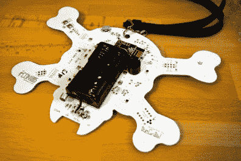
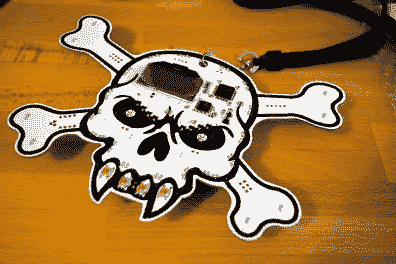
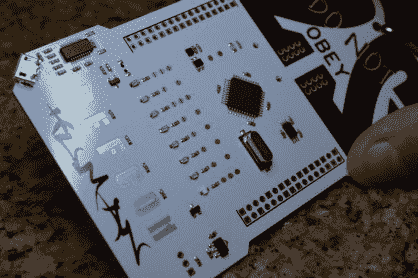
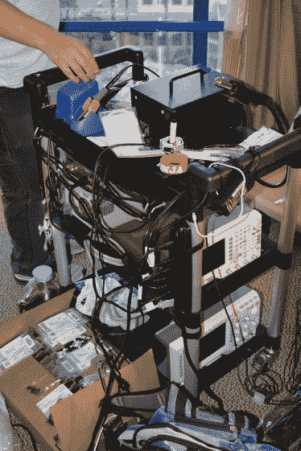
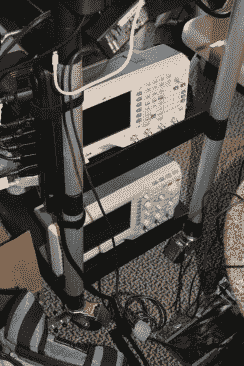
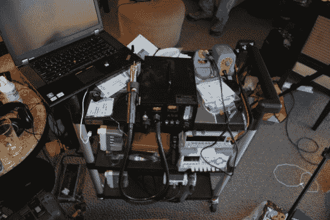
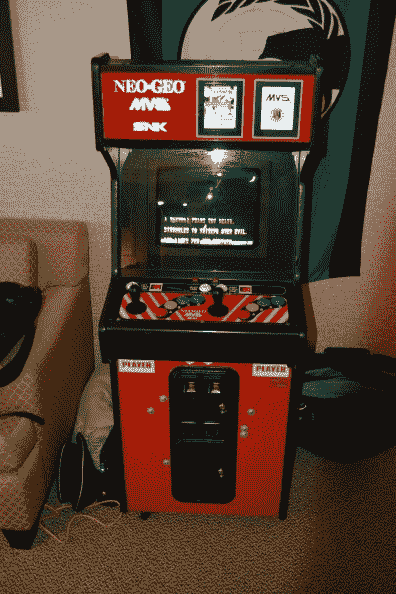
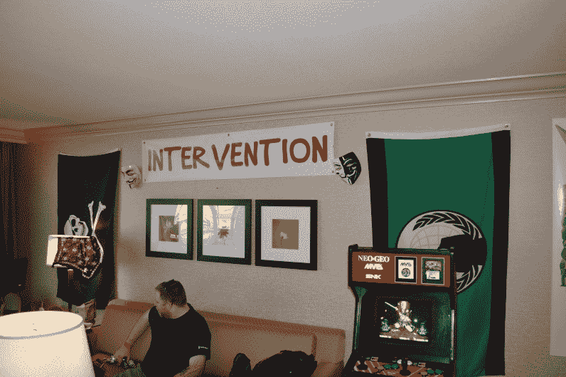

# 举办黑客会议的正确方式

> 原文：<https://hackaday.com/2015/08/03/the-right-way-to-do-a-hacker-conference/>

防御战规模很大。去年的上座率约为 16k，我们打赌今年会更高。[Brian]我和我都将参加(下面会详细介绍)，但我想借此机会向您展示召开黑客会议的正确方式。

## 打造您自己的徽章

    

去年我们在 DEFCON 22 上见到了很多人，但是威士忌海盗给我们留下了深刻的印象。我第一次看到他们的两个成员带着这个很棒的徽章在大厅里走着。你怎么能不停下来开始谈论这个话题呢？原来这群朋友已经在这里聚会多年了。今年他们全力以赴，设计了一个徽章来统治他们所有人。就像任何优秀的黑客项目一样，他们无法在到达酒店之前完成。

## 建立你的电子实验室

  Binoc microscope for rework  This badge’s LEDs changed to purple  Rack of equipment  Scopes  Hot air and more

所以，你离家前没把冲浪板装好？对于威士忌海盗来说，这根本不是问题。他们刚刚把电子实验室带到他们在里约酒店的套房里。

在浴室的梳妆台上，你可以找到双筒显微镜，这有助于排除官方会议徽章上 LED 灯的故障。一整车的热空气，多个焊接站，示波器，等等都在手边。我在工作人员给我的徽章上安装了表面贴装 led。当我看不清我的作品时，他们打电话给前台要一盏额外的灯。你真应该看看那个侍者走进来时脸上的表情！

一场马拉松式的集会，威士忌海盗队的每个人(包括我)都有一个工作徽章，在下面的视频中演示。但这并不是乐趣的终点。

## 组建一个团队

  You NEED a payphone  Coin-op anyone?  Plenty of extra decor

徽章和实验室设备并不一定能成为派对。威士忌海盗队也有。随着聚会的进行，工作站可以被推到一边。他们每天下午 3 点开门(假设其中一人在场)，但派对真正开始是在下班后。这里有额外的电视、投币柜，甚至还有电话亭。当我在聚会时间再次拜访时，这个地方挤满了人。一些人甚至带来了他们自己的项目并展示出来。曾经著名的黑客是树莓 Pi 驱动的音乐生成机器。它使用走廊上每隔几英尺的传感器作为输入。每当人们走过，音乐就变了。这个房间也不会闲置——在某个时候，他们会把所有人都赶出去睡觉，但我从来没有熬夜到足够晚看到这种情况发生。

## 晚上开派对，和 Hackaday 吃早午餐

今年我们肯定会停下来和这些人一起狂欢。房间号还没有公布，但请查看诱发癫痫的网站了解最新消息。

[Brian]我还将主持一个黑客日早餐聚会。周日上午 10:00 加入我们，一起聊聊天。我们还没有确定地点，所以请关注我们的活动页面。

[https://www.youtube.com/embed/8K6ZDaNXAow?version=3&rel=1&showsearch=0&showinfo=1&iv_load_policy=1&fs=1&hl=en-US&autohide=2&wmode=transparent](https://www.youtube.com/embed/8K6ZDaNXAow?version=3&rel=1&showsearch=0&showinfo=1&iv_load_policy=1&fs=1&hl=en-US&autohide=2&wmode=transparent)