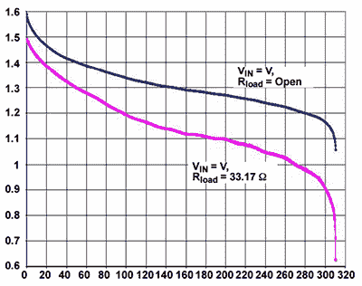
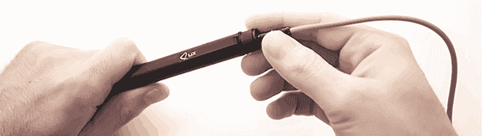
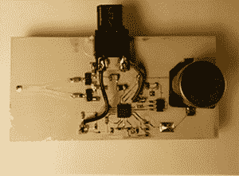

# 他们现在在哪里:糟糕的 Kickstarters

> 原文：<https://hackaday.com/2015/08/14/where-are-they-now-terrible-kickstarters/>

Kickstarter 最初是一个团购、小批量制造的平台，也是一个为项目提供资金的地方，否则这些项目将无法完成。任何认为这将永远持续下去的人都是天真的，因为这些卑微的开始，我们已经进入了 Kickstarter 的巅峰。现在，Kickstarter、Indiegogo 和所有其他众筹平台只是产品发布的另一个喉舌，只是任何需要或想要钱但从未听说过商业贷款的人的另一种策略。

当然，会有一些可疑的企业试图利用 Kickstarter 热潮赚钱，在过去的几年里，我们已经尽最大努力指出了那些不好的企业。找到每一个糟糕的 Kickstarter 是几项全职工作，但我们已经尽最大努力剔除这些最糟糕的闪亮例子。跟进这些失败的项目是我们一直忽视的事情，但现在不再是了。

以下是我们遇到的一些最离谱的 Kickstarters 和众筹活动，以及这些失败的创业努力的现状。

### 肥皂

[![A comparison between the first design images for SOAP (left) and [Bunnie]'s Novena laptop (right)](img/b32944dd468766231f6136dcfa7fd71a.png)](https://hackaday.com/wp-content/uploads/2015/08/soap.png) 

肥皂(左)和【邦尼】的 Novena 笔记本电脑(右)的第一个设计形象对比

它不仅仅是【比利·克里斯托】职业生涯的跳板；Soap Home Automation 路由器有望成为现存最强大的 WiFi 路由器之一。有了触摸屏显示器、所有能想到的收音机和一个非常强大的 iMX6 CPU，这是一个无所不能的路由器。Kickstarter 推出后不久，事情开始变得不可收拾。Soap 路由器的第一个设计插图实际上不是一个新设备，而是直接从[【邦尼】的 Novena 笔记本](https://www.crowdsupply.com/sutajio-kosagi/novena)项目的图纸中提取的。此外，结果是 iMX6 CPU 不能做千兆以太网。这是一个烂摊子，一个提前 6 个月启动的项目，一个注定失败的项目。

Soap 路由器被曝光后不久，[我设法得到了对创造者的采访](http://hackaday.com/2014/03/11/soap-drama-an-interview-with-the-soap-creators/)，事情实际上看起来有一段时间是积极的。他们雇佣了一个工程团队，完善了他们的项目目标，从完全定制的 PCB 转移到了系统级模块，并在总体上使活动*变得理智。从那以后，情况变得更糟了。*

SOAP 从他们的 Kickstarter 活动[中收集了142，112 美元，另外从 Indiegogo 活动](https://www.indiegogo.com/projects/it-s-a-router-it-s-a-android-tablet-it-s-home-automation-its-soap#/story)中收集了 260，079 美元。今年早些时候，在创始人之一[获得一辆非常好的车](https://archive.is/ffWmC)后，他们参加了 CES。在那之后， [SOAP 通过 Kickstarter 更新](https://www.kickstarter.com/projects/soaprouter/soap-first-smart-router-w-touch-display-powered-by/posts/1122103)发布了一份新闻稿，讲述了一个关于处方药成瘾的故事，跳过了这个国家，然后最终创造了现存最先进的家用路由器之一。

SOAP 死了，它不会被发布， [Kickstarter 和 Indiegogo 上的支持者要求退款](https://www.kickstarter.com/projects/soaprouter/soap-first-smart-router-w-touch-display-powered-by/comments)。

### 打人者

Discharge curves, courtesy of Dave Jones’ debunking

啊，[击球手](http://batteriser.com/)。这种微型金属夹适合 AA、AAA、C 和 D 电池，可将电子设备的电池寿命延长 800%。它是如何工作的？这个金属夹里藏着一个小型升压转换器，它将电池的能量全部提取出来*。这完全是胡扯，正如[达夫·琼斯]向[展示的那样，大多数电子设备已经从电池中吸走了所有的电子](https://www.youtube.com/watch?&v=4iEshd6izgk)。哦，还有，打蜡机的一个失败模式是火，如果你的设计目标是制造一个糟糕的产品，这是非常好的。*

自从它推出以来，Batteriser 背后的人遭受了那些知道他们的东西的人的吊索和箭，迫使他们在社交媒体上为自己辩护:“ [Batteriser 在新设备上证明是有效的！一个帖子说:“这是我们用新的苹果蓝牙键盘](https://plus.google.com/+BatteriserBatteroo/posts/PwvVj6Qp9j9)做的一个测试”，表明就像他们的电池一样，殴打者只使用了他们大脑的 10%。

[达夫·琼斯]在拆除太阳能道路的过程中表现出了坚韧不拔的精神，并在这个问题上发了很多帖子。不幸的是，[打击者战役仍在进行](https://www.indiegogo.com/projects/batteriser-extend-battery-life-by-up-to-8x#/story)，这场战役将会成功。至少我们得到了[一些关于测试电池放电](https://www.youtube.com/watch?v=dnXiLBabSTU)的精彩视频。

### Lix，USB 驱动的 3D 打印笔

Lix, the 3D printing pen that defies the laws of thermodynamics

在过去的几年里，市场上已经出现了许多 3D 打印笔，其中大部分都是有趣的工具。它们不像把塑料细丝放在 Dremel 中并在 3D 打印部件上进行摩擦搅拌焊接那么酷，但这些设备可能很有用。

到目前为止，我们见过的最光滑的 3D 打印机笔是 Lix。它比普通的 2D 笔大不了多少，而且方便地通过 USB 端口供电。当我们称这种笔是一个骗局时，理由很简单:你需要大量的电力来以合理的速度熔化灯丝，而 Lix 的最大功耗大约是 3D 打印机热端消耗的三分之一。

Lix Kickstarter 的初始交付日期为 2014 年 10 月。现在，2015 年 8 月[支持者疯狂了](https://www.kickstarter.com/projects/lix3d/lix-the-smallest-3d-printing-pen-in-the-world/comments)。从那以后，市场上出现了许多类似的产品，[包括这个售价 19 美元的小家伙](https://www.kickstarter.com/projects/magicbox/skypen-first-dual-color-3d-pen-with-incredible-off)。这是一个挑战，一个不知道热量和能量之间关系的人支持未经证实的技术。

### 能自己充电的手机

A ptototype of the Nikola Labs cell phone case

一种可以利用手机的能量*给手机充电的手机壳。等等，什么？这是[尼古拉实验室手机壳](https://www.kickstarter.com/projects/nikolalabs/nikola-phone-case-power-your-phone-with-wasted-ene/description)，它没有任何意义。*

这个手机壳最好的类比是一个太阳能充电手电筒，太阳能电池板就在灯泡前面。是的，它会自己充电，但是任何一个有两个电动机的 12 岁孩子都会告诉你，永动机是不可能的，而且天下没有免费的午餐。尽管有令人难以置信的早期公关推动，Kickstarter 活动还是失败了。事实上，这是我们报道和揭露的所有 Kickstarters 的真正失败之一:它是这篇文章中唯一一个没有达到其融资目标的。

尼古拉实验室活动为什么没有达到目的？[如果你看看活动](https://www.kickstarter.com/projects/nikolalabs/nikola-phone-case-power-your-phone-with-wasted-ene/comments)的评论，那是因为 Nikola Labs 团队反应不够迅速。竞选进行到一半时，团队的交流停止了。如果团队继续前进，它会成功吗？这是任何人的猜测，[但是如果团队拿出任何证据证明该设备有效，从竞选中期到结束的低认捐数](http://www.kicktraq.com/projects/nikolalabs/nikola-phone-case-power-your-phone-with-wasted-ene/#chart-daily)可能会增加。

让这成为一个教训:如果你打算在众筹网站上欺骗人们，你需要坚持到底。如果你在玩信心游戏，你首先要相信自己。