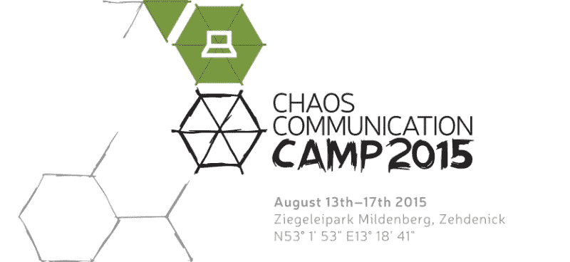

# 混沌交流营 2015 预告

> 原文：<https://hackaday.com/2015/08/11/chaos-communication-camp-2015-teaser/>

德国每四年举行一次。白昼最长，夏日炎炎。是时候打开帐篷去露营了。但是谁想去野外露营呢？那里没有千兆以太网，也没有人可以一起做项目。和其他 5000 名书呆子一起参加 2015 年混沌通信营会更好。Hackaday 会在那里！

如果你从来没有去过混沌营，这是一个令人惊叹的经历。这就像是 DIY 版的 DEF CON T1，只不过它发生在柏林郊外的帐篷里，而不是在干燥、尘土飞扬的沙漠中以赌博为主题的酒店里。在营地的时候更强调实际做事。(毕竟这是一个假期。)事实上，演示会在一天当中被关闭三个半小时，以便给人们时间进行黑客攻击和互动。

看看[项目](https://events.ccc.de/camp/2015/wiki/Static:Projects)、[事件](https://events.ccc.de/camp/2015/Fahrplan/events.html)、[会议](https://events.ccc.de/camp/2015/wiki/Static:Self-organized_Sessions)、[村庄](https://events.ccc.de/camp/2015/wiki/Static:Villages)或[会谈](https://events.ccc.de/camp/2015/Fahrplan/schedule.html)的列表，感受一下规模，记住很多最有趣的活动通常都是非正式的:人们聚在一起工作。有足够的灵感和合作空间。

像这些天的许多反对者一样，徽章本身无疑将作为至少一个这样的灵感来源，并且 2015 年营地的徽章是令人敬畏的。它本质上是一个 [HackRF One](https://greatscottgadgets.com/hackrf/) ，带有 LPC4300 ARM Cortex M4 微处理器、大容量闪存、USB、电池、音频和板载 LCD 屏幕。加上天线，你就有了一个多才多艺的独立无线电黑客平台。我们[在预期中挖掘文档](https://rad1o.badge.events.ccc.de/start)。因此，预计未来几个月将会有 5000 名黑客获得 SDR 和 RF 技术。

如果去不了(现在票已经卖完一段时间了)，可以去看看[直播流](https://streaming.media.ccc.de/)。不仅会谈会在发生时被展示，而且为了与 CCC 的民主精神保持一致，任何可以建立 icecast 服务器的人都可以建立他们自己的流。

当然，我们会尽可能多地报道。如果有任何你感兴趣的东西，你想让我们帮你看看，请在这里评论。我们不能承诺不可能的事情，但我们会努力。如果你也要去露营，留意一下埃利奥特，跟他打个招呼。