# DEF CON 优步徽章热到有放射性

> 原文：<https://hackaday.com/2015/08/07/def-con-uber-badge-so-hot-its-radioactive/>

我今天早上去了 DEF CON 23 的开幕式，想了解更多关于徽章挑战的信息，我没有失望。这次谈话涉及到优步徽章，从字面上的放射性意义上来说，这是一个热点。这个徽章，也被称为黑色徽章，是为第一个解决官方 DEF CON 挑战的人保留的。它允许终身免费进入，只要你的简历上有列出，它就为你打开了任何一扇门。

 [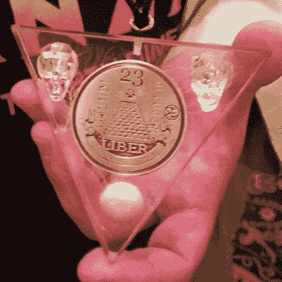](https://hackaday.com/2015/08/07/def-con-uber-badge-so-hot-its-radioactive/uber-badge-defcon-23-front-square/) DEF CON 23 Uber Badge (front) [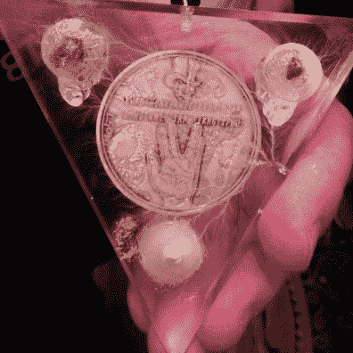](https://hackaday.com/2015/08/07/def-con-uber-badge-so-hot-its-radioactive/uber-badge-defcon-23-back-square/) (back)

### 利希滕贝格图形

亚克力三角形本身装饰有 [Lichtenberg 图案](https://en.wikipedia.org/wiki/Lichtenberg_figure)。这是徽章上的一道闪电。通过建立极高的电压，放电留下了独特的模式。在这种情况下，这是一个 500 万伏，150 千瓦的粒子加速器，使数字。

这个三角形的基板上贴着一个奖章，这显然是这个周末每个人都试图解决的难题的一部分。不太清楚的是这个徽章的放射性同位素是如何参与这项挑战的。

## 喔，哦，哦，哦，我有放射性，放射性

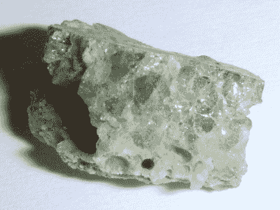

Trinitie [Photo by Shaddack](https://en.wikipedia.org/wiki/Trinitite#/media/File:Trinitite-detail2.jpg) – CC BY 3.0

[LoST]凭借这枚徽章将[[理查德·费曼](https://en.wikipedia.org/wiki/Richard_Feynman)的灵感提升到了一个新的高度。[费曼]参与了“小玩意”实验，我更熟悉的是，第一次引爆核武器。这个徽章包含了那次爆炸的同位素。

[Trinitite](https://en.wikipedia.org/wiki/Trinitite) (拿到了，来自三位一体爆炸？)是一种绿色玻璃状物质，由钚基炸弹爆炸产生。[LoST]特意解释说徽章上的 Trinitite 样本产生了一种独特的放射性特征，这种特征不仅可以追溯到这次爆炸，而且实际上表明了离爆炸中心的精确距离。

徽章中还嵌入了掺杂 3%铀 238 的玻璃球。用于出口标志的氚是徽章上的第三种放射性源。与此同时，另一种标记物是晶质铀矿、沥青铀矿、肌肽、树胶和黄饼的组合。

有趣的故事，氚在这个国家受到高度管制，但假设有可能从欧洲进口氚，由卖家密封在咖啡包里运输。假设。

开幕式演讲以[黑暗切线]的一些鼓舞人心的话结束。下面是它的图片和一些[lost 的]幻灯片。如果您正在进行徽章挑战，请加入我们在 Hackaday.io 上开始的[合作徽章解密](https://hackaday.io/project/7087-defcon-23-badge-hacking)活动。如果您正在参加 DEF CON，请务必在周日与我们一起参加[早餐会](https://hackaday.io/event/7066-breakfast-at-defcon-23)。

 [![[Dark Tanget] and [LoST]](img/11aff6e5c016ee4b422c0a3b256ddf28.png "DSC_0398")](https://hackaday.com/2015/08/07/def-con-uber-badge-so-hot-its-radioactive/dsc_0398/) [Dark Tanget] and [LoST] [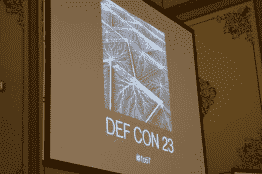](https://hackaday.com/2015/08/07/def-con-uber-badge-so-hot-its-radioactive/dsc_0387/) Uber Badge base plates [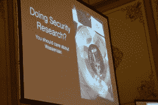](https://hackaday.com/2015/08/07/def-con-uber-badge-so-hot-its-radioactive/dsc_0391/) Artist badge [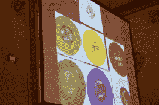](https://hackaday.com/2015/08/07/def-con-uber-badge-so-hot-its-radioactive/dsc_0392/) Every type of LP badge produced [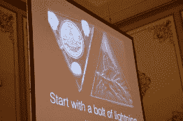](https://hackaday.com/2015/08/07/def-con-uber-badge-so-hot-its-radioactive/dsc_0393/) Uber Badge overview [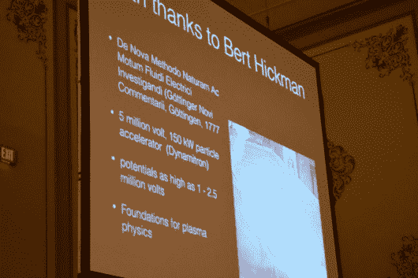](https://hackaday.com/2015/08/07/def-con-uber-badge-so-hot-its-radioactive/dsc_0394/) How the figures were made [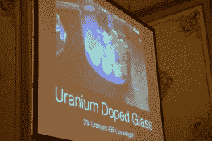](https://hackaday.com/2015/08/07/def-con-uber-badge-so-hot-its-radioactive/dsc_0395-2/) Uranium Doped Glass [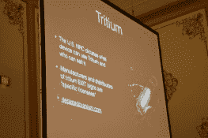](https://hackaday.com/2015/08/07/def-con-uber-badge-so-hot-its-radioactive/dsc_0396-3/) Tritium [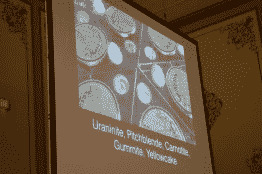](https://hackaday.com/2015/08/07/def-con-uber-badge-so-hot-its-radioactive/dsc_0397/) Uranium-based-cocktail