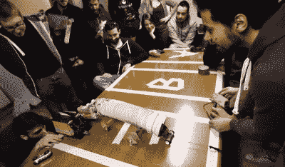

# 希伯来语及其重要性

> 原文：<https://hackaday.com/2015/08/12/hebocons-and-why-they-matter/>

每个人都记得*战斗机器人*，我们这些感受到怀旧之痛的人已经调到了 ABC 最近的重新开机节目。正如*战斗机器人*的黄金时代一样，所有的机器人格斗比赛最终都变成了为任务完美设计的机器之间的战争。在最初运行的*战斗机器人*中，这意味着一个装满楔形机器人的支架，非常酷的机器人年复一年地被淘汰。

你看纳斯卡不是为了比赛，你看的是撞车，职业机器人格斗比赛总是会变成几百圈的左转。火和火花是伟大的，但有一个更好的机器人格斗比赛，这一次任何人都可以进入游戏，而无需花费数年时间研究机器人。

它被称为 Hebocon ，它被宣传为“为那些不具备实际制造机器人的技术技能的人举办的相扑比赛”。我见过的最好的翻译是，“低劣的机器人战斗”，这正是机器人战斗应该是什么样的:通过诡计战胜技术掌握，通过巧妙的策略大规模扰乱。你不会得到火和火花，但有一点是肯定的:没有机器人会让它完全发挥功能，但那只是因为它们一开始就没有完全发挥功能。

Hebocon 的名字来自日语:ヘボい，或“笨拙”。这些都不是技术娴熟的机器人，在 2014 年日本媒体艺术节(Japan Media Arts Festival)的第一届 Hebocon 上，一辆戴着 iPhone 外壳的电池驱动汽车击败了最明显的赢家——一个跑过环场的楔形机器人。垃圾战胜了策略，一个楔形机器人被打败了，一切都好了。

[2015 Hebocon in Rome](https://www.youtube.com/watch?v=zsAPEiVz9p0)

Hebocon 背后的基本想法是将两个机器人放在一个 100 厘米×50 厘米的圆环的两边。回合开始，第一个将对方击倒的机器人获胜。鼓励技术不成熟，惩罚远程控制(无线和有线)或自动化操作。这里最好的机器人完全是哑巴；一辆上了发条的汽车比一个由树莓派控制的复杂的 sumobot 更有可能赢得 Hebocon。在去比赛的路上忘记带机器人的人最有可能获胜。

在过去的一年里，Hackaday 参加了几个赫伯康展，包括在 [Sparklecon](http://www.sparklecon.org/wiki/index.php?title=Main_Page) 和 [Layer One](http://www.layerone.org/hebocon-robot-battles/) 的活动。在第一层，参赛者只是去了无线电小屋(是的，它是*仍然*开放)，买了一些看起来可以移动的东西，并用鸭子胶带和拉链制作了一个机器人。

“[Robot Barbie](https://www.youtube.com/watch?v=XgtPkVIh03Y)” from CTRL-H Hebocon in Portland back in May

本周末，我将成为 fuba con 的评委，这是一场在 Fubar Labs 位于新泽西州新不伦瑞克的新黑客空间举行的 Hebocon。Fubar Labs 的工作人员将主持一个充满马达、电池和工艺用品的建造会议，而不是简单地把游戏场地放在桌子上并运行计时器。这是对机器人技术的介绍，即使最垃圾的机器人赢了。

长期以来，机器人竞赛一直集中在最有能力、最优雅的解决方案以及最先进的工程技术上。你不需要从*战斗机器人*中寻找这方面的证据。对于成千上万的高中生来说，第一机器人俱乐部是一个了不起的工程入门，但即使这样也没有赫伯康那样的公众影响力。Hebocon 是每个人的机器人竞赛；任何人都可以参与的活动将不可避免地让更多的人参与进来。

它没有火焰、火花和旋转的死亡之刃*战斗机器人，*但是如果你想玩得开心，我赌 Hebocon。