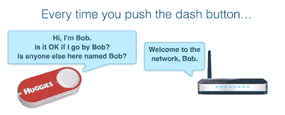

# 黑掉亚马逊破折号按钮来记录你想要的任何东西

> 原文：<https://hackaday.com/2015/08/10/hacking-the-amazon-dash-button-to-record-whatever-you-want/>

我们仍然不太确定亚马逊破折号按钮是一个出色的营销和广告策略，还是彻头彻尾的愚蠢。但我们知道的是，只需 5 美元，就有很多可破解的技术可以用于更有用的目的。大 A 出售这些 dash 按钮只有一个目的——你按下按钮，几天后，分配给它的任何产品都会出现在你的门口。[泰德·本森]希望他们做得更多，所以他把几个 dash 按钮变成了一种[跟踪他宝宝健康的方式！](https://medium.com/@edwardbenson/how-i-hacked-amazon-s-5-wifi-button-to-track-baby-data-794214b0bdd8)

显然，获取宝宝起床时间和便便的数据有助于识别健康模式。[Ted]尝试使用一些手机应用程序来跟踪这些东西，但发现如果墙上有一个大按钮或其他东西，会容易得多……这就是他利用亚马逊 Dash 按钮的想法。

这其实很简单。购买破折号按钮，用亚马逊做设置…但是不要做最后一步:选择你想要订购的产品。如果你不选择任何东西，你就不会点任何东西…

 dash 按钮的妙处在于它是为省电而设计的，也就是说它只有在你按下按钮时才会自动开启。

每次启动时，它必须重新连接到您的 WiFi 网络。使用一个简单的 Python 脚本来跟踪和记录这是一件非常简单的事情。

记录下每个 dash 按钮的 MAC 地址，你所要做的就是嗅探 WiFi 网络，寻找按钮发出的 ARP 探测！它非常简单，你几乎可以从[Ted 的]博客中复制并粘贴代码，然后自己动手做。觉得这对你没用？人类的手指并不是按按钮的唯一方式——机械地或电气地装配它，你可以很容易地记录重复发生的事件。

[https://www.youtube.com/embed/qKSqV44RZ3E?version=3&rel=1&showsearch=0&showinfo=1&iv_load_policy=1&fs=1&hl=en-US&autohide=2&wmode=transparent](https://www.youtube.com/embed/qKSqV44RZ3E?version=3&rel=1&showsearch=0&showinfo=1&iv_load_policy=1&fs=1&hl=en-US&autohide=2&wmode=transparent)

关于仪表盘按钮内部技术的更多信息？查看我们的[仪表板按钮拆卸覆盖范围](http://hackaday.com/2015/05/12/inside-the-amazon-dash-button/)。