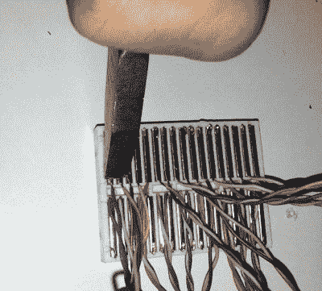

# 面板安装的试验板附件

> 原文：<https://hackaday.com/2015/08/14/panel-mounted-breadboard-accessories/>

[Chuck Stephens]伴随着 Radio Shack 100 合 1 电子套件长大。有很多元件和弹簧端子的那种，可以连接成收音机、防盗报警器或其他什么的。[Chuck]升级到无焊试验板，但确实错过了容易获得的面板安装组件，如电位计和开关。所以他一直在制作自己的配件箱。

当然，将试验板的电线连接到元件上是很容易的，但是[Chuck]做得更好。他使用不同类型的盒子(包括一个雪茄盒)，将元件正确安装，并将它们连接到试验板上，以便于连接。

如果你曾经试图焊接到试验板弹簧(我们有)，你会发现它很难附着在闪亮的金属上。[查克]通过在弹簧上卷曲小铁丝钩解决了这个问题。结果是一个好看的和功能性的原型辅助工具。

他们确实制作了小型试验板式触点(称为连接点块；[祝你好运找到适合这种应用的](http://www.findchips.com/search/923297-I)，但是压接技术在普通的试验板上也能工作。这些很便宜，也很容易找到。

当然，如今，我们更希望[安装 SMD](http://hackaday.com/2014/07/25/using-surface-mount-devices-on-a-breadboard/)而不是面板安装控制器。现在，如果我们能够[找出在哪里放置组件](http://hackaday.com/2013/11/06/augmented-reality-breadboarding/)。如果你想要一些不那么复杂的东西，看看下面的视频。

[https://www.youtube.com/embed/6r_FSjZbUT0?version=3&rel=1&showsearch=0&showinfo=1&iv_load_policy=1&fs=1&hl=en-US&autohide=2&wmode=transparent](https://www.youtube.com/embed/6r_FSjZbUT0?version=3&rel=1&showsearch=0&showinfo=1&iv_load_policy=1&fs=1&hl=en-US&autohide=2&wmode=transparent)