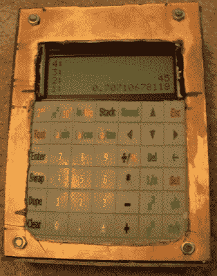
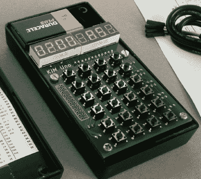
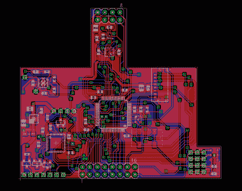

# hacklet 70–计算器项目

> 原文：<https://hackaday.com/2015/08/14/hacklet-70-calculator-projects/>

黑客、制造商和工程师长期以来一直热衷于数字运算。特别是那些让处理数字更容易的机器。今天，它可能是电脑、智能手表和智能手机，但并非总是如此。在 50 年代和 60 年代，计算尺风靡一时。工程师会把它们放在皮带包里随身携带。到了 70 年代早期，袖珍计算器革命已经开始。从那时起，计算器就在黑客和工程师的手边。本周的 Hacklet 在 [Hackaday.io](https://hackaday.io) 上庆祝了一些最好的计算器项目！

 我们先从【乔伊·谢泼德】和 [RPN 科学计算器](https://hackaday.io/project/6468)说起。这里不需要等号；[Joey]设计这个计算器是为了使用[反向波兰符号](https://en.wikipedia.org/wiki/Reverse_Polish_notation)，就像惠普早期的许多机器一样。堆栈对于 RPN 计算器来说非常重要，这款计算器有足够的双 200 层堆栈空间。两个主处理器是德州仪器的 MSP430s。用户界面是一个 4 行 x 20 字符的 LCD 和 42 个手动连线按钮。这两个处理器相当巧妙。他们通过 UART 通信。一个处理器处理键盘和显示器，而另一个处理器专注于处理数字并将数据存储在 SRAM 中。这个计算器的外壳是由焊接的覆铜板制成的。它的机械强度很高，特别是因为[乔伊]在每个接缝处都加了一圈焊料。如果您想了解更多关于这种技术的信息[，请查看有关 FR4 机箱的指南](http://hackaday.com/2015/06/03/how-to-build-beautiful-enclosures-from-fr4-aka-pcbs/)。

[Joey]这个项目绝对提高了他的焊接技能。每条线和连接，包括完整的 SRAM 地址和数据总线都是在原型板上手工布线的。我们特别喜欢这个项目中可爱的激光切割键盘！

 接下来是【kodera2t】，带着[一个微型科学计算器](https://hackaday.io/project/4969)。[kodera2t 的]机器绝对有一个微型有机发光二极管显示器！它实际上不仅仅是一个计算器。此项目运行增强的 basic (EhBasic)。唯一的问题是 EhBasic 是用 6502 汇编写的。不用担心，[kodera2t]只需在他用作主处理器的 ATmega1284 上运行 6502 仿真器。这个项目最好的部分之一是键盘。[kodera2t]没有连接大量的按钮、触摸开关或橡胶膜，而是使用了触摸屏——但没有屏幕部分。一个没有 LCD 的难以控制的触摸面板被连接到微处理器上。放在触摸面板下的纸张。标识每个按钮的功能。

 说到 6502 处理器，【Oscarv】创造了 [KIM Uno:一个简单的 KIM-1 复制品](https://hackaday.io/project/4802)。Kim Uno 是经典的 KIM-1 单板计算机的再创造。在运行 ATmega328 的 Arduino Pro Mini 上用模拟 6502。整个系统已经缩小到袖珍计算器大小。金宇野拥有金-1 从未有过的东西:一个外壳。嗯，至少半个围栏给[奥斯卡尔的]单位。一些无畏的金宇野爱好者已经在这个令人敬畏的项目中添加了完整的案例。为了适应计算器的大小，[Oscarv]在他的项目中加入了可编程计算器模式。程序存储是通过 ATmega328 的 1K 的 EEPROM，这肯定胜过原来的 KIM-1 的盒式磁带！

 当你从一个标准的德州仪器图形计算器开始，然后在一个子板上添加除厨房水槽之外的所有功能，你会得到什么？根据肖恩·迪伦·戈夫的说法，你会得到[卡尔查克](https://hackaday.io/project/2491)。CalcHack 设计用于 TI 的任何黑白图形计算器。它包含相当多的硬件，包括两个 CPU:一个 ARM Cortex M4 和一个 M3，一个 9 轴 IMU，实时时钟，SD 卡插槽，麦克风，扬声器，2.4 GHz 无线电，以及一长串其他功能。像任何优秀的课堂黑客一样，[Sean]将 CalcHack 设计成一个秘密事件。用户必须输入密码才能启用该设备。一旦运行，CalcHack 通过计算器的链接端口接管。如果老师(或老板)靠近，一个紧急按钮(DEL 键)会导致 CalcHack 关闭，让用户回到正常、无聊的计算器。

如果您需要更精确的计算，请查看我们全新的[计算器项目列表](https://hackaday.io/list/7200-calculator-projects)！如果我错过了你的项目，请不要犹豫[在 Hackaday.io](https://hackaday.io/adam) 上给我留言。这就是本周的 Hacklet。一如既往，下周见。同样的黑客时间，同样的黑客频道，带给你最好的 [Hackaday.io](https://hackaday.io/) ！