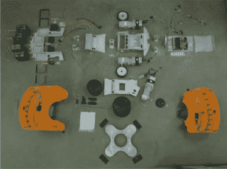

# 私人实验室大师的课程

> 原文：<https://hackaday.com/2015/08/18/lessons-from-the-fablab-masters/>

我最近花了一些时间参加了 [Fab11](http://www.fab11.org/) 会议，这是一个在世界各地涌现的 [Fab Labs](http://www.fabfoundation.org/fab-labs/what-is-a-fab-lab/) 背后的人的聚会，企业家、黑客和好奇者可以在这里学习制造东西。因此，毫不奇怪，这是一个收集一些设计、构建和破解技巧的好地方。以下是我在这个迷人的法布伯聚会上学到的一些经验。

### 快速构建

> 如果你能在一小时内做好一件事，一天之内你就会做得更好

乔里斯·范·特伯根说。他知道一些制造不寻常东西的方法，因为他 3D 打印了一只全尺寸的大象。为此，他研究出如何破解 Ultimaker 2 3D 打印机，通过[将打印机上下翻转](http://www.rooiejoris.nl/z-unlimited/)并移动 Z 电机来提升打印机而不是打印头，从而打印到无限的 Z 高度。只要对软件稍加调整，他就可以打印全高的大象切片，从而加快打印过程。他是绝对正确的:虽然不停地摆弄纸上的概念很诱人，但通过构建原型，你会学到更多，即使它不起作用。

[https://www.youtube.com/embed/nzwaVQaQgmI?version=3&rel=1&showsearch=0&showinfo=1&iv_load_policy=1&fs=1&hl=en-US&autohide=2&wmode=transparent](https://www.youtube.com/embed/nzwaVQaQgmI?version=3&rel=1&showsearch=0&showinfo=1&iv_load_policy=1&fs=1&hl=en-US&autohide=2&wmode=transparent)

### 快速迭代

![The mantra of Boston Robotics founder [Marc Raibert]](img/d9d9ef559ae5c217a78effd4dda43662.png)

波士顿机器人公司创始人【马克·雷伯特】

的口头禅在关于[制造机器人](https://vimeo.com/135452422)的环节中，机器人公司[波士顿动力](http://www.bostondynamics.com/)的创始人【马克·雷伯特】非常简单地描述了他的设计哲学:“建造它，打破它，修复它。在机器人出现的早期，我们一天要绕这个圈 10 次。我们建立了我们整个团队的理念，即一开始不会是正确的。或者，即使它是正确的，如果我们把它带到世界上，稍微敲打一下，它会变得更正确”。他鼓励他的工程师建造原型，推动它们直到它们失败，然后找出如何修复失败的部分。然后冲洗，重复。这是一个很好的方法，尤其是对于像他的公司正在制造的[大狗和 Atlas 机器人](http://hackaday.com/2015/08/17/taking-atlas-for-a-walk)这样的大问题。

### 有时候足够好就足够好了

然而，无休止地修改设计是许多黑客掉进的一个兔子洞。很容易陷入这种无休止调整的循环中，而不是后退一步，决定某件事已经足够好了，然后继续项目的其他部分。[乔里斯]在讨论他的打印机黑客时谈到了这一点。作为让 Ultimaker 生产无限 Z 高度打印的一部分，他必须想出如何让打印机反转打印轴，而不用担心 Z 高度更大。他没有黑掉 Ultimaker 的固件，而是在 Cura 进行了修改，并手动调整了他测试模型的 g 代码。这种手工(相当不雅观)的方法意味着他可以专注于确保他的概念能如他所希望的那样工作的主要问题，然后他可以回去处理技术细节。这正是他所做的:在他决定做一个 Kickstarter 向用户提供黑客攻击后，他为 Ultimaker 2 创建了一个自定义固件映像，解决了这个问题。但是如果他先这么做，整个项目可能会陷入困境。

### 简单是关键

  An exploded view of a Kiva warehouse robot [![Kiva Warehouse Robots [Photograph by Joel Eden]](img/7ab285ac2fb9ed126ab17f4afa901fe8.png "kiva-warehouse-robot")](https://hackaday.com/2015/08/18/lessons-from-the-fablab-masters/kiva-warehouse-robot/) Kiva Warehouse Robots [Photograph by Joel Eden]

在制造机器人会议上，Kiva Systems 的[Mick Mount]讨论了他的公司如何制造机器人，这些机器人可以在亚马逊等公司的仓库中移动货架，将产品送到包装人员手中。虽然你可能会认为这是一个建造一个会唱歌、会跳舞的高科技机器人的好借口，但他让他的小家伙们保持简单，使用汽车电池和现成的致动器而不是尖端技术来建造它们。与其他机器人研究人员展示的相比，他形容他的机器人就像乐高思维风暴。

> 我们制造了一个非常简单的机器人……我们尽量让它便宜，这样我们就可以在一个仓库里做成千上万个

他在会议上说。但这个简单的机器人足以说服臭名昭著的节俭在线零售商亚马逊在 2012 年以 7.75 亿美元收购他的公司，所以他的想法显然有道理。他提出了一个很好的观点:当你在构建一些东西来完成一个特定的任务时，最简单和最直接的解决方案通常是最好的。我们都想使用最新最棒的技术来建造一些东西，但通常更有用的是专注于手头的任务，而不是可能让你达到目的的技术。

### 黑客很有趣，但是教育其他人更有趣

私人实验室运动的目标之一是创造空间，通过向人们展示数字制作有多简单来教育他们。这是一个值得称赞的目标，我们作为黑客应该记住。虽然创造有趣的黑客很有趣，但教别人也很重要，向他们展示他们可以自己构建东西。私人实验室运动的基本目标是创造空间，人们可以在那里制造自己的产品，或者出售，或者只是为了娱乐。但是不管动机是什么，你通过教授他人比保守知识秘密收获更多。