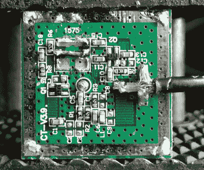

# 用 RTL-SDR 和被黑的 GPS 天线解码基于卫星的文本消息

> 原文：<https://hackaday.com/2015/08/21/decoding-satellite-based-text-messages-with-rtl-sdr-and-hacked-gps/>

刚刚发现 RTL-SDR 的另一个用途。他一直用它解码 Inmarsat STD-C EGC 电报。Inmarsat 是一家英国卫星电信公司。它们向全世界没有可靠地面通信网络的地方提供通信。STD-C 是一种主要由海事运营商使用的文本消息通信渠道。该频道包含增强型群组呼叫(EGC)消息，其中包括搜索和救援、海岸警卫队、天气等信息。

这不需要太多设备，只需要 RTL-SDR 加密狗、天线、计算机和将它们连接在一起的电缆。一旦收集了所有的设备，[卡尔]就使用一个名为卫星 ar 的 Android 应用程序来定位他最近的 Inmarsat 卫星。由于这些卫星是同步的，一旦天线指向正确的方向，他就不必移动天线。

Hacked GPS antenna

至于天线，[卡尔]推荐一个碟形或螺旋天线。如果你不想花钱买那种花里胡哨的东西，他还解释了如何修改一个 10 美元的 GPS 天线来达到这个目的。他承认这不是最好的天线，但它可以完成任务。典型的 GPS 天线将被调谐到 1575 MHz，并且将包含一个带通滤波器，该滤波器防止天线拾取偏离该频率 1-2MHz 的信号。

要拆下过滤器，必须先拆下塑料盒。然后，需要使用烙铁从天线底部移除金属反射器。实际的天线电路隐藏在反射器下面。滤波器通常是电路板上最大的元件。脱焊后，输入和输出焊盘桥接在一起。整个事情可以放回一起使用这个项目。

一旦一切都连接起来，天线指向正确的位置，来自加密狗的音频输出就通过管道进入 SDR#调谐器软件。在调到正确的频率并设置好所有的音频参数后，音频被另一个名为 tdma-demo.exe 的程序解码。如果一切都调整得恰到好处，软件将能够解码音频信号，并开始显示信息。[Carl]贴了一些有趣的例子，包括一些海盗警告。

如果你不能得到足够的 RTL-SDR hacks，一定要检查一下[的](https://hackaday.com/2014/02/25/using-sdr-to-read-your-smart-meter/)[一些](https://hackaday.com/2014/11/19/rtl-sdr-as-a-spectrum-analyzer/)其他我们已经在过去的的[中](https://hackaday.com/2013/10/22/cracking-gsm-with-rtl-sdr-for-thirty-dollars/)[精选了](https://hackaday.com/2013/11/09/transmitting-data-with-a-pi-and-rtl-sdr/)。不要忘记[发送你自己的黑客链接](https://hackaday.com/submit-a-tip/)！