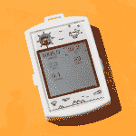
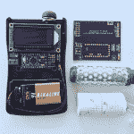
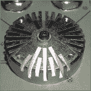
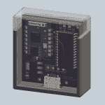
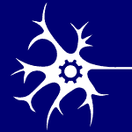
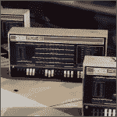
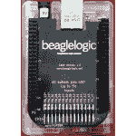
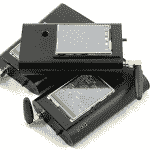
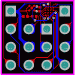
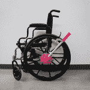

# 10 个最佳产品入围名单公布

> 原文：<https://hackaday.com/2015/08/24/10-best-product-finalists-announced/>

2015 年[hack aday 奖](http://hackaday.io/prize)中的最佳产品竞赛强调了任何硬件开发者或初创公司从原型到可制造产品的工作。为了竞争，每个参赛作品都必须远远超过 Hackaday 奖的标准要求，提供更深入的文档，并运送三个工作测试版到 Hackaday 进行评判。

下面介绍的 10 款入围产品都非常出色，将在接下来的四周内角逐最佳产品。除了第一名之外，他们还将获得 10 万美元的现金奖励，在加州帕萨迪纳的 Supplyframe 设计实验室实习 6 个月，并帮助建立推动产品发展所需的联系。对于产品工程师、硬件初创公司或任何能够设计下一个伟大事物的人来说，这是一场完美的竞赛。

上周，我们对最佳产品竞赛的所有参赛作品进行了评审，结果已经出来了。谁是赢家？哪些产品将进入下一轮评审？查看[所有最佳产品决赛入围者的全部详情](https://hackaday.io/list/7403-2015-best-product-finalists)或浏览以下摘要，排名不分先后。

[【x-labs】的紫外线徽章](https://hackaday.io/project/4706-uv-badge)是一款小型可穿戴设备，可以测量紫外线指数、温度、湿度和压力。如果你曾经想知道多久会晒伤，或者是否会下雨，这是你想要夹在你的背包上的设备。

【Renier van der Lee】的 [Vinduino](https://hackaday.io/project/6444-vinduino-a-wine-growers-water-saving-project) 是一个葡萄园的节水项目。[Renier]发现地下多个深度的水传感器是一种更有效的测量灌溉效率的方法。这意味着他需要大量的水传感器，并在自制石膏水传感器中找到了答案。

[来自【Dean Gouramanis】的 PowerPeg 热管理系统](https://hackaday.io/project/6874-powerpeg-thermal-management-system)是一款针对 SMD 零件的热管理系统。一个微小的铜凸台被焊接到一个部件下面的焊盘上，一个散热片从另一侧拧入。如果你正在设计一个大电机控制器或大功率发光二极管，这是一个值得关注的项目。

 最近有一种趋势是室内位置传感器，一些公司推出了可以从几个基站对一个位置进行三边测量的设备。[Blecky]的[subps 定位系统](https://hackaday.io/project/4872-subpos-positioning-system)做同样的事情，但他使用的是 ESP8266 WiFi 模块。这是你能找到的最便宜的室内位置传感器，也是一个有很多有趣用例的项目。

【zakqwy】的[神经元，神经元，神经元](https://hackaday.io/project/3339-neurons-neurons-neurons)是一个神经网络的物理表现。每个神经元都有几个抑制性和兴奋性输入，以及一个输出。几千个神经元将会模拟蠕虫的大脑，但是仅仅几个物理神经元就可以进行有趣的演示。

 喜欢旧电脑，却不想每个月给自己的电费增加几百千瓦时？[Oscarv]的 [PiDP-8/I](https://hackaday.io/project/4434-pidp-8i) 是一个使用树莓 Pi 的经典小型机的奇妙复制。这是对 PDP-8/I 的完美模拟，由运行 SIMH 的树莓 Pi 驱动。包括闪光灯和拨动开关。

 【库马尔·阿布舍克】的[比格犬逻辑](https://hackaday.io/project/4395-beaglelogic)是比格犬骨骼黑色和绿色的逻辑分析器。它有 14 个通道，捕捉速度为 100Msps，在 BeagleBone 上有 300 多 MB 的内存，它有一些疯狂的捕捉深度。[Kumar]还在软件栈上做了一些工作，使 BeagleLogic 成为一个网络可访问的逻辑分析仪。

【radu . moti San】的 2014 年 Hackaday 奖参赛作品是 uRADMonitor，这是一款联网的辐射监测器，可跟踪全球的β和γ辐射。今年，他将带着[便携式环境监测器](https://hackaday.io/project/4977-portable-environmental-monitor)走向移动。它测量α、β和γ辐射、灰尘、空气质量、温度和压力。这是通过一个便携式的手持设备来实现的，它通过 WiFi 连接将数据上传到互联网。

【antti . lukats】对今年 Hackaday 奖的贡献是惊人的。他已经开发了一个 FPGA Arduino 盾，一个基于 Xilinx 的 Zynq SOC 的盾，以及 Parallax Propeller 软核的硬件。他最令人印象深刻的项目也是他最小的项目:[迪西](https://hackaday.io/project/6592-dipsy)是一个微小的 DIY 系统芯片，BOM 成本约为 1.5 美元。它非常非常小，非常非常酷。

 【凯特·里德】和【纳撒尼尔·童】接受挑战，改装轮椅。研究表明划船运动更符合人体工程学，但是手动适配器非常昂贵。她决定建造自己的。它被称为[手动驱动](http://hackaday.io/project/7221-hand-drive)，用 3D 打印部件为轮椅增加了划船动作，价格约为 40 美元。

* * *

这就是 2015 年 Hackaday 奖最佳产品竞赛的决赛选手。每一个参赛作品都很棒，但上面的十个项目是最棒的。这些产品的下一站是我们的 [Hackaday 奖评委团](https://hackaday.io/prize/judges)。

#### 2015 年[黑客日奖](http://hackaday.io/prize)由以下机构赞助:

