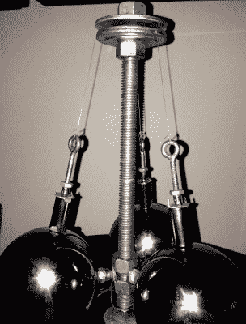

# 我们有一个问题:地震预测

> 原文：<https://hackaday.com/2015/08/26/we-have-a-problem-earthquake-prediction/>

**尼泊尔| 2015 年 4 月 25 日|国家标准时间 11:56**

对于尼泊尔这个位于中国和印度之间的南亚小国的 2700 万居民来说，这是普通的一天。男人和女人像往常一样做着他们的日常工作。孩子们在学校操场上快乐地跑来跑去，而他们的父母则在这个国家众多行业中的一个行业谋生。他们谁也没有预见到不可思议的毁灭会毫无预兆地降临。这场 7.8 级的地震震动了这个国家的中心。那天有 9000 人死亡。有多少不是必须的？

历史上充满了地震和惊人的死亡人数。因为许多人死于倒塌的基础设施，即使 60 秒的预警也能挽救成千上万人的生命。为什么我们不能这样做？或者一个更好的问题——我们为什么不这样做？认识一下【迈克尔·杜迪】，一位拥有物理生物化学博士学位的生殖内分泌学家。虽然他没有开创地震预测新方法所需的背景，但他有一个好的开始。

他在设备的核心使用压电压力传感器，但它们远不是最有趣的部分。三个钢珠，每个重四磅，悬挂在一根中心立柱上。磁铁被用来平衡彼此相距 120 度的球。它们在压电传感器上施加横向力，允许检测到立柱的任何移动。Arduino 和一些放大器用于观察压电传感器。

该系统不是用来测量实际振动数据的。相反，它查看噪声基底，并使用统计分析来查看背景噪声的任何变化。沿着断层线将几个这样的传感器联网，你就有了一个低成本的系统，可以预见地震的来临，潜在地挽救成千上万人的生命。

[Michael]在他的项目页面上有大量数据。虽然他显然非常熟练，但他不是一个电子工程或软件的家伙。他可以在信号分析和其他方面得到一些帮助。如果你想伸出援助之手，让这个世界变得更美好，请与他联系。

他在这段视频的叙述中提出了一个很重要的观点:地震不成比例地影响着穷人，因为他们生活和工作在成本较低的建筑中，这些建筑不太可能具备抗震能力。支撑基础设施是一项巨大而昂贵的任务。发现像[迈克尔]正在这里测试的早期预警系统将会以最小的代价产生直接而广泛的影响。

[https://www.youtube.com/embed/CZB1SvlnqKU?version=3&rel=1&showsearch=0&showinfo=1&iv_load_policy=1&fs=1&hl=en-US&autohide=2&wmode=transparent](https://www.youtube.com/embed/CZB1SvlnqKU?version=3&rel=1&showsearch=0&showinfo=1&iv_load_policy=1&fs=1&hl=en-US&autohide=2&wmode=transparent)