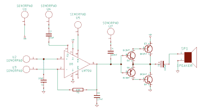

# Kraakdoos——古代运算放大器的音乐滥用者

> 原文：<https://hackaday.com/2015/09/03/the-kraakdoos-musical-abuser-of-an-ancient-opamp/>

一位来自新成立的 Yeovil Hackerspace 的朋友向我介绍了一种被称为“Kraakdoos”或 cracklebox 的设备。

cracklebox 是 20 世纪 70 年代由 STEIM 生产的早期电子乐器。该仪器由一个 PCB 组成，一侧有许多裸露的铜焊盘。演奏者触摸键盘，乐器发出……[的声音](https://www.youtube.com/watch?v=EO96lK0Fvx4)，这种声音或许可以被描述为挤压声和尖叫声。

虽然 cracklebox 最初是作为一个完整的仪器出售的，但该设备已经过逆向工程，并且[原理图记录了](http://www.eam.se/kraakdoos/)。里面的东西相当迷人。

脆皮盒子的核心是一个古老的运算放大器，LM709。LM709 是著名的 LM741 的前身。与 741 不同，709 没有内部[频率补偿](http://sites.fas.harvard.edu/~phys123/analog_notes/compensation_note_june09.pdf)。频率补偿用于有意限制运算放大器的带宽。随着输入频率的增加，运算放大器的相移也会增加。这可能会导致不良振荡，因为反馈网络会形成无意的[相移振荡器。](https://en.wikipedia.org/wiki/Phase-shift_oscillator)

大多数现代运算放大器都有内部频率补偿，但 709 没有。让我们看看这是如何在 cracklebox 中使用的:

crackerbox 没有使用预期的频率补偿引脚，而是将它们路由到焊盘。事实上，cracklebox 将运算放大器上的几乎所有引脚路由到焊盘，包括反相和同相输入。同相配置中使用一个 1mω反馈电阻。然而，报告表明，该仪器可以在没有反馈电阻的情况下工作！

因此，该仪器的确切操作细节仍是一个小小的谜。然而，很明显，如果没有任何频率补偿，运算放大器很可能像相移振荡器一样工作。运算放大器的输出进入[推挽输出级](https://en.wikipedia.org/wiki/Push%E2%80%93pull_output)。这种配置通常用于提高效率。然而，由于晶体管不能在低于 0.7 伏的电压下工作，因此还存在死区，这会导致爆裂声盒中的信号失真，并且还会滤除低电平背景信号。

虽然研究 cracklebox 设计很有趣，但它的创建可能涉及大量的[电路弯曲](https://en.wikipedia.org/wiki/Circuit_bending)，玩弄元件值和布局，直到电路听起来“酷”，而不是遵循任何设计规则。因此，cracklebox 是电路设计作为工程和艺术的有趣融合。

[https://www.youtube.com/embed/EO96lK0Fvx4?version=3&rel=1&showsearch=0&showinfo=1&iv_load_policy=1&fs=1&hl=en-US&autohide=2&wmode=transparent](https://www.youtube.com/embed/EO96lK0Fvx4?version=3&rel=1&showsearch=0&showinfo=1&iv_load_policy=1&fs=1&hl=en-US&autohide=2&wmode=transparent)