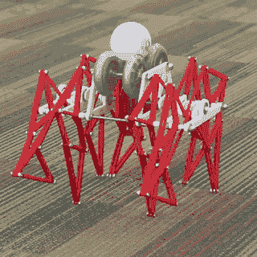
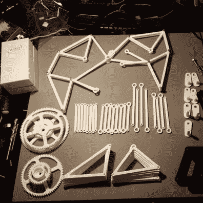

# Sphero Riding Strandbeest 是一个带有外骨骼的机器人

> 原文：<https://hackaday.com/2015/08/26/sphero-riding-strandbeest-is-a-robot-with-an-exoskeleton/>

[Theo Jansen]做了很棒的东西叫做 Strandbeests 漫游在海滩和美术馆的风力驱动机器人。它一直是我们最喜欢的机制之一。更新，但也是最受欢迎的是 Sphero 智能手机控制的球体。[两者的组合](http://www.thingiverse.com/thing:428931)堪称史诗！

你可能记得看到过 [Sphero 曾经创造了一个微小的 BB8 复制品](http://hackaday.com/2015/04/19/mini-bb-8-droid-made-from-a-sphero/)。球体内部是一个小型机器人，它能够像仓鼠轮子一样向任何方向滚动。这是一个相当强大的机器人，这使得 Sphero 很快。高转速使这种黑客攻击成为可能。Sphero 坐在一些滚轮上快速旋转。传动装置将此转化为 Strandbeest 的滚动运动。

    

最初的概念是一年前发布的，但直到现在才引起我们的注意，是由[fhareide]设计的他自己的由 sp hero 驱动的更小的 Strandbeest。由于原始发布中没有装配细节，您可以遵循[fhareide 的]文档来完成您自己的构建。到目前为止[fhareide]将 STL 模型导入到 Autodesk Inventor 中，打印出一组齿轮以确保打印机分辨率可以处理它，并组装了一组腿。
我们认为这是一种 Sphero 的外骨骼。我们将通过装配来关注这一点，测试驱动机制，然后整个事情变得有自我意识，要么逃跑隐藏，要么结束他。

[https://www.youtube.com/embed/PNDzJODfq6c?version=3&rel=1&showsearch=0&showinfo=1&iv_load_policy=1&fs=1&hl=en-US&autohide=2&wmode=transparent](https://www.youtube.com/embed/PNDzJODfq6c?version=3&rel=1&showsearch=0&showinfo=1&iv_load_policy=1&fs=1&hl=en-US&autohide=2&wmode=transparent)