# 在哈佛大学展示科学

> 原文：<https://hackaday.com/2015/09/04/demonstrating-science-at-harvard-university/>

如果有一份工作是你建造、服务和准备科学演示会怎么样？这意味着炫耀一切，从物理原理，到电子理论，到化学和生物。你会双手抓住那份工作，永不放手吗？这是我见到哈佛大学科学讲座演示者丹·罗森伯格时的反应。他带我参观了科学中心，并在幕后看了一些他工作和建造的设备。

### 电子和物理演示设备

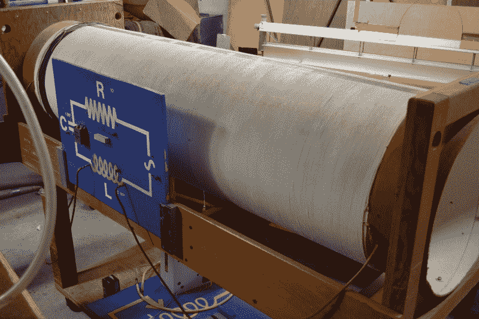

这是一个很好的电子原理物理演示的例子。到了解释电感器的时候，[丹]把这个小东西拿出来给教授们看，并确保它能及时投入课堂。巨大的管道用电线包裹，并连接到机架前面的原理图板。

  Microwave source [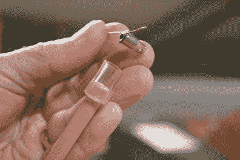](https://hackaday.com/2015/08/28/building-a-business-around-generative-design/dsc_0219-3/) Illuminates this light bulb on a stick

当然，哈佛科学中心涵盖的不仅仅是电子学。这是一个微波演示，使用这个黑色的大喇叭来产生微波。小白炽灯泡装在一根棍子末端的塑料管里。把它插入无线电波的路径，它就亮了。我们想知道如果你不把你的手放在火线之外，你的手会不会感到热？

说到波形，储存在感应器演示旁边的是一个波形表，可以将波形投射到屏幕上。这是一个非常聪明的设置，早于教室中文件相机的扩散。

你可以辨认出一片平放的玻璃。右上方是一个音频扬声器支架，面朝下对着玻璃板。要使用这种仪器，你需要将水倒在玻璃杯上，然后将扬声器连接到信号发生器上。光线从玻璃下方照射过来，将水中的波浪图案反射到镜子上，镜子以 45 度角安装，将图像投射到白色屏幕的背面。我记得在高中物理课上，在一个卷对卷的胶片上看到过这些波的演示。我认为，与预先录制的视频相比，该设备在这个演示中很容易使冷却系数翻倍。

 [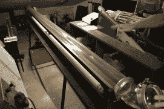](https://hackaday.com/2015/08/28/building-a-business-around-generative-design/dsc_0231-3/) Oil-filled tube for standing waves [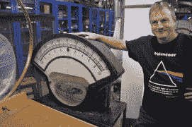](https://hackaday.com/2015/08/28/building-a-business-around-generative-design/dsc_0223-2/) Really big meter [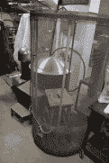](https://hackaday.com/2015/08/28/building-a-business-around-generative-design/dsc_0224-3/) Faraday cage [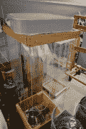](https://hackaday.com/2015/08/28/building-a-business-around-generative-design/dsc_0233-2/) fire tornado demo

对于驻波和波长，有一个长而透明的充油管。一端的扬声器产生声波，当调到正确的波长时，就会产生非常明显的驻波。有内置的荧光灯管，使油容易看到。

丹在一个很大的仪表旁边摆了个姿势。同样，你可以很容易地得到一个无头仪表，并将其输出投影到屏幕上，但你必须承认，这感觉更棒。我认为演示龙卷风和把一个新生锁在法拉第笼里，而电风暴(演示)在他们周围肆虐是一样的。

 [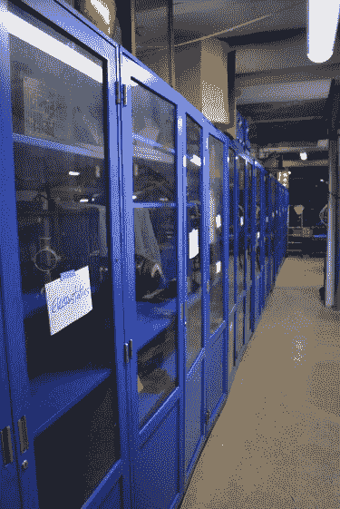](https://hackaday.com/2015/08/28/building-a-business-around-generative-design/dsc_0226-3/) Cabinets full of demos [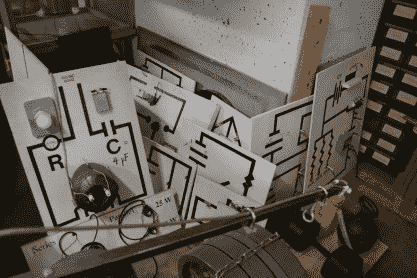](https://hackaday.com/2015/08/28/building-a-business-around-generative-design/dsc_0228-3/) Piles of “circuit boards”  Can I say I studied at Harvard?

这只是冰山一角。储藏室排列着装满演示的柜子，每一点地板空间都被更大的构建或收藏所占据，就像这堆电路插图板。

因为这是一次即兴参观，我只能拍下[丹]负责的区域的照片。但我们确实走过了化学和生物集结地。除了这些实物展品之外，演示服务还负责为这些演示准备化学品，并在演示结束后进行清理。甚至有一个 7 英尺高、直径约 2 英尺的人类 DNA 双螺旋。[丹]用成千上万的零件组装了这个。他用汤姆·索亚的方法在午餐区做单调乏味的工作——像苍蝇一样吸引渴望帮助的学生。

### 构建这些演示

 [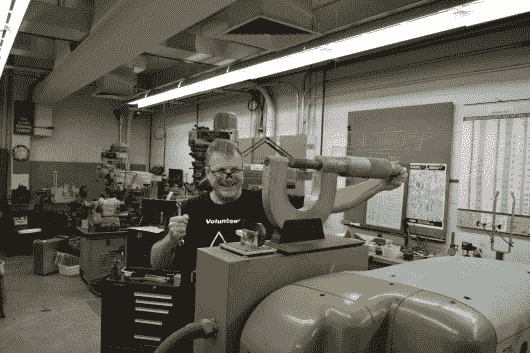](https://hackaday.com/2015/08/28/building-a-business-around-generative-design/dsc_0211-2/) Giant micrometer (works) built in this shop [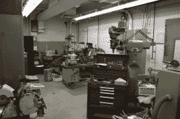](https://hackaday.com/2015/08/28/building-a-business-around-generative-design/dsc_0207-2/)  [![[Dan] saves hard drive magnets](img/5b3830093e63d3626cfb1c7c05fa6723.png "DSC_0198")](https://hackaday.com/2015/08/28/building-a-business-around-generative-design/dsc_0198-3/) [Dan] saves hard drive magnets [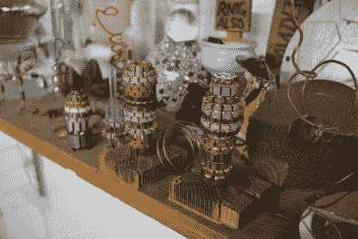](https://hackaday.com/2015/08/28/building-a-business-around-generative-design/dsc_0201-4/) Art made of old motor commutators [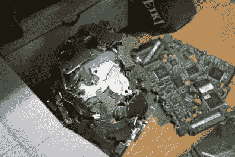](https://hackaday.com/2015/08/28/building-a-business-around-generative-design/dsc_0205-3/) More HDD magnets

如果你想建造伟大的东西，你需要一个商店和工具。[Dan]和他的几个同事有一个小的办公空间，但是穿过一扇门进入这个相当大的车间。有一吨可怕的机床；不知何故，我只拍到了半个商店的照片，我身后的另一个区域有其余的设备。

和其他黑客一样，[丹]喜欢放一个装满垃圾的垃圾箱。这个区域周围的架子上装饰着由残渣制成的艺术品。我真的很喜欢用旧电机换向器制作的雕塑。也很难错过装饰在许多金属表面的一堆硬盘磁铁。它们有数百种，丹肯定有一天他会发现它们真的很酷。

### 美国第一台可编程计算机

 [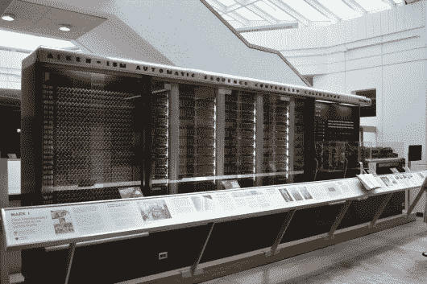](https://hackaday.com/2015/08/28/building-a-business-around-generative-design/dsc_0193-2/) The Harvard Mark I [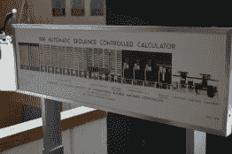](https://hackaday.com/2015/08/28/building-a-business-around-generative-design/dsc_0192-3/) Diagram of the computer [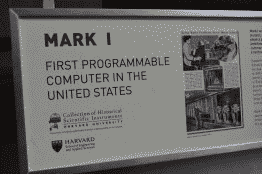](https://hackaday.com/2015/08/28/building-a-business-around-generative-design/dsc_0196-3/)  [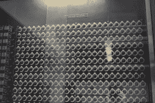](https://hackaday.com/2015/08/28/building-a-business-around-generative-design/dsc_0194-3/) Input registers [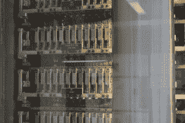](https://hackaday.com/2015/08/28/building-a-business-around-generative-design/dsc_0195-3/) Component parts [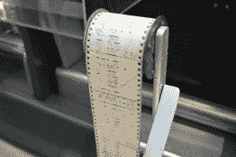](https://hackaday.com/2015/08/28/building-a-business-around-generative-design/dsc_0238/) This tape has the program on it

这趟旅行的一大收获是安装在大楼大厅的巨大电脑。这就是[哈佛 Mark I](https://en.wikipedia.org/wiki/Harvard_Mark_I) ，美国制造的第一台可编程计算机。这台机器在输入磁带上记录一个程序，以及一个巨大的设置寄存器的位置，并自动计算出一个输出。在曼哈顿计划中，它被用来计算开发第一颗原子弹 Trinity 时使用的内爆模型。

### 这个链是一个谎言和示范服务视频

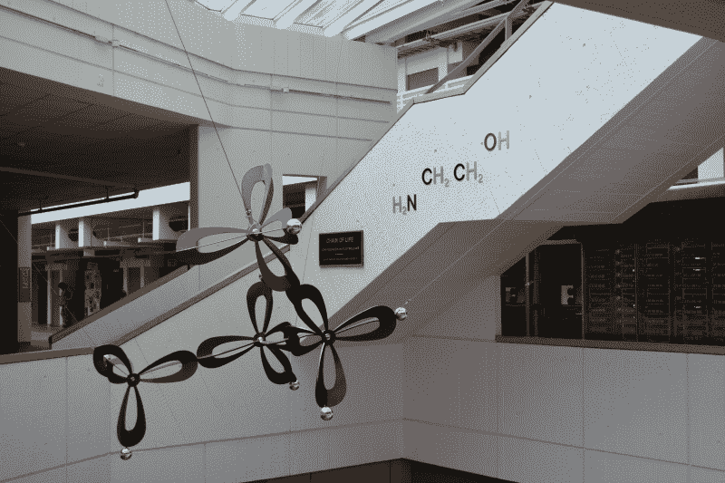

在旅行中加入一些谜语总是很有趣的。在大厅中与标志 I 相同的地方(从后面看)，有一个分子雕塑，它后面的楼梯上贴着它的构成标签。[丹]告诉我“链是一个谎言”，但我的化学印章缺乏，所以我不能自己解决它。你能发现问题吗？如果是这样，请在下面的评论中留下你的解释。

如果你和我一样发现这些科学讲座演示很吸引人，你会想要浏览他们的 YouTube 频道。我在下面挑选了两个我最喜欢的。第一个特征[丹]显示氧的副卤化作用。第二个是我童年的一个爆炸；我第一次记得是在很小的时候，在*巫师先生的世界*电视节目中，用捕鼠器和乒乓球进行的裂变演示。

如果这还不够的话，所有的演示都在演示服务网页上进行了分类。

[https://www.youtube.com/embed/Lt4P6ctf06Q?version=3&rel=1&showsearch=0&showinfo=1&iv_load_policy=1&fs=1&hl=en-US&autohide=2&wmode=transparent](https://www.youtube.com/embed/Lt4P6ctf06Q?version=3&rel=1&showsearch=0&showinfo=1&iv_load_policy=1&fs=1&hl=en-US&autohide=2&wmode=transparent)

[https://www.youtube.com/embed/vjqIJW_Qr3c?version=3&rel=1&showsearch=0&showinfo=1&iv_load_policy=1&fs=1&hl=en-US&autohide=2&wmode=transparent](https://www.youtube.com/embed/vjqIJW_Qr3c?version=3&rel=1&showsearch=0&showinfo=1&iv_load_policy=1&fs=1&hl=en-US&autohide=2&wmode=transparent)