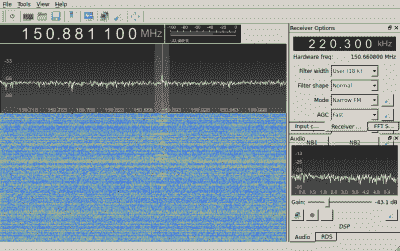

# 逆向工程一种不同的总线

> 原文：<https://hackaday.com/2015/08/27/reverse-engineering-a-different-kind-of-bus/>

无线电爱好者窃听非广播电台的历史由来已久——比如警察、消防和公共交通频率。然而，如今许多有趣的通信都是数字化的。当[bastibl]想要读取公交站牌上显示的数据时，[他转向软件无线电](http://www.bastibl.net/reversing-bus-telemetry/)。他使用 gr-fosphor 监测公共汽车驶过时的无线电频谱，并在 151 MHz 附近发现了一个强信号(见下图)。

然而，这仅仅是开始。利用各种工具，他想出了调制方案，数据帧如何工作，甚至纠错方案。有了所有的信息，他建造了一个 GNU 无线电接收器来接收数据。通过一些数字运算和编程，[bastibl]能够恢复关于每辆公交车的数据，包括它们的位置和时间表。

 稍加编程，你就能得到实时公交地图。当然，如果你不住在德国的帕德博恩，这可能对你没有直接的用处。但这是一个值得电台版 CSI 的侦探故事。

显然，如果你有一些天生的侦探技能，拥有 SDR 会更有趣。不过，[从基础的](http://hackaday.com/2012/06/27/getting-started-with-software-defined-radio/)开始并不难。

[https://www.youtube.com/embed/pJwQUHeWftc?version=3&rel=1&showsearch=0&showinfo=1&iv_load_policy=1&fs=1&hl=en-US&autohide=2&wmode=transparent](https://www.youtube.com/embed/pJwQUHeWftc?version=3&rel=1&showsearch=0&showinfo=1&iv_load_policy=1&fs=1&hl=en-US&autohide=2&wmode=transparent)