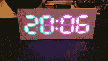

# 从零开始制作七段钟

> 原文：<https://hackaday.com/2015/09/01/seven-segment-clock-made-from-scratch/>

[大卫·霍普金斯]建造了一个七段钟，但不是以你想象的方式。一般来说，如果想做这样的东西，可以从七段 led 开始。[David]希望将其提升一个档次，使用 RGB LEDs 来获得各种不同的颜色，但发现现成的组件成本过高。所以，他做了任何优秀黑客都会做的事情。他制作了自己的《T1》。

简单部分由 Neopixels、Arduino Nano 和 DS3231 实时时钟组成。硬质部分由塑料卡片和多形扩散器组成。塑料卡片也被称为聚苯乙烯，并且是片状的。[David]将 Polymorph 描述为一种可塑尼龙，它受热软化，工作温度足够低，沸水就足够了。

他能够切割出单独的部分来制作一个令人印象深刻的座钟。