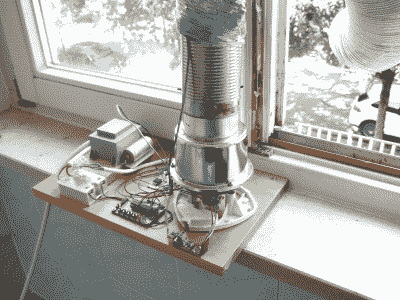
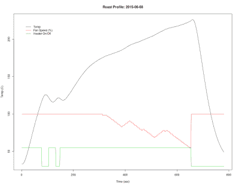

# 嵌入 Elliot:实用状态机

> 原文：<https://hackaday.com/2015/09/04/embed-with-elliot-practical-state-machines/>

玫瑰上的雨滴，小猫的胡须。它们还不错，但是状态机绝对是我们最喜欢的东西。

可能有多少程序员就有多少实现状态机的方法。这些范围从极其复杂、一刀切的框架到简单地编写一个`switch...case`块。框架最终有点像一个黑盒，尤其是如果你刚刚开始，而`switch...case`版本很容易被破解，但它们并不能真正帮助你写出清晰、结构化的代码。

在这篇超长版的 Embed with Elliot 中，我们将尝试跨越中间地带，演示几个状态机，重点放在实用编码上。我们将通过几个例子来说明它们在代码中的不同实现方式。在这个过程中，我们将为我的一个特定应用程序开发 Goldilocks 解决方案，控制一个已经被入侵到咖啡烘焙器中的爆米花机。希望你喜欢。

## 什么是状态机？

[状态机](https://en.wikipedia.org/wiki/State_machine)基本上是你在处理问题时设置的一组约束。具体来说，你试图将你的问题分解成一系列的*状态*。在每种状态下，机器都有一个给定的*输出*，它可以依赖于该状态的变量*输入*列表，也可以不依赖于该列表。每个状态还有一个*事件*列表，这些事件可以触发*转换*到另一个状态。

根据在哪个状态下会发生什么，以及机器何时从一个状态转换到下一个状态，来规划您的应用程序有助于您清楚地定义您的问题。当你的代码有一个很容易插入这些概念的结构时，一切都很好。

例如，当您启动咖啡烘焙器时，它可能会进入初始化状态，执行一些操作，然后直接进入等待输入状态。在等待输入状态下，可能有两种事件驱动的转换:当按下一个按钮时，它可能进入预热状态，打开风扇和加热器，或者当按下另一个按钮时，它可能进入配置状态，让您设置所需的最终烘焙温度。定义状态的要点是它们限制了某些行为发生的时间——例如，你不需要担心在预热状态下设置烘焙温度。

选择合适的限制集来应用到您的项目代码中，使它具有结构，一旦您习惯了状态机结构，您可能会发现它对您很有用。当然，从状态机的角度考虑您的问题还有其他更重要的原因。

一个是它们特别容易用图形或表格来表示，这使得文档(以及后来的 bug 查找)变得更加容易。另一个原因是，对于自动代码生成和自动 FPGA 综合之类的应用，有一些复杂的工具可以将您对状态机的描述转化为成品，而无需您亲自动手编写任何实际的代码。

Hackaday 自己的 Al Williams 最近写了一篇[文章，用这些术语](http://hackaday.com/2015/08/13/becoming-a-state-machine-design-mastermind/)涵盖了状态机，他的文章是对这篇文章的一个很好的补充。如果您想了解更多的状态机背景，可以去读一读他的精彩文章。在这里，我们只是对通过展示一些经受住时间考验的可能的设计模式来使您的嵌入式编码生活变得更容易感兴趣。

## 咖啡烘焙应用程序

[](https://hackaday.com/wp-content/uploads/2015/09/dscf8126.jpg) 一个具体的例子胜过千言万语，那么让我们从一个完美的状态机应用开始:控制一个小家电。在这种情况下，一个空气爆米花机被黑客攻击为小批量咖啡烘焙服务。

以前的爆米花机有一个风扇吹爆米花，还有一个加热器在空气进入爆米花管之前加热空气。风扇和加热器都在同一个电路上，加热器线圈两端的电压降被巧妙地选择，以便剩余的电压可以或多或少地直接运行风扇电机。它还有一个防止它燃烧的热保险丝和一个开关。仅此而已，这也是这项工作所必需的。

为了把 popper 变成一个咖啡烘烤器，风扇和加热器电路被分开，分别控制。风扇有自己的 16 V DC 电源，用功率 MOSFET 开关。加热器通过一个固态继电器连接到主电源。由于烘烤器应该有温度控制，所以增加了热电偶和放大器(带 SPI 接口)。这一切都由一个微控制器联系在一起，该微控制器有四个用户按钮和复位、两个 led、一个 TTL 串行输入/输出和一个连接到 ADC 通道的电位计，以便进行良好的测量。

仅仅写下这些就能让我们更好地定义我们的状态机。例如，我们知道什么事件将驱动我们的大多数状态转换:四个按钮和一个温度传感器。实际上，机器也需要知道经过的时间，所以在微控制器内部也有一个`seconds`计数器在运行。

[](https://hackaday.com/wp-content/uploads/2015/09/roast_profile.png) 要想出相关的状态，只需思考一下想要的烤档就行了。事实证明，烘焙咖啡很像回流焊接:你加热所有东西，然后以可控的速度将温度升高到期望的最高值，然后再冷却下来。从烘烤曲线中，我们得到了与该过程的明显阶段相对应的状态“预热”、“均热”、“升温”和“冷却”。在烘烤开始之前，机器还会经历“初始化”和“等待输入”状态。

另一个“紧急关闭”状态的灵感来自现实生活中的一个事件，温度探头中的一根电线松了，烘焙器产生了木炭而不是咖啡。状态机代码的一个好处是，当您添加新状态时，您确切地知道必须修改代码的哪些部分，更重要的是，您不必接触代码的哪些部分。

在每种状态下，代码控制加热器、风扇和 led，并可能通过串行端口记录输出。这些是我们的产出。例如，在“预热”状态下，风扇和加热器达到最大值，温度上升受到监控，以确保热电偶正常工作。如果按下紧急按钮，达到保温温度，或热电偶不工作，机器将进入另一种状态。

有了这个背景，让我们来看两个不同的代码结构，它们可以实现相同的状态机。

## Switch 语句

状态机最简单的实现可以用一串`if...then...else`语句来构建。“如果在状态 A，做点什么，否则如果在状态 B，做点别的”，等等。仅仅在几个状态之后，嵌套和缩进就变得疯狂了，这就是`switch...case`语句的用途。你会看到许多状态机编码如下:

```

int main(void)
{
	enum states_e {INIT, WAIT_FOR_INPUT, PREHEAT, SOAK, ...};
	enum states_e state = INIT;
	uint16_t temperature = 21;

	while (1){
		switch(state){
			case INIT:
				doInitStuff();
				state = WAIT_FOR_INPUT;
				break;
			case WAIT_FOR_INPUT:
				if (buttonA_is_pressed()){
					state = PREHEAT;
				}
				if (buttonD_is_pressed(){
					state = SET_TEMPERATURE;
				}
				break;
			case PREHEAT:
				fanOn();
				heaterOn();
				if (temperature &gt; SOAK_START){
					state = SOAK;
				}
				if (test_thermo_not_working()){
					state = EMERGENCY_SHUTDOWN;
				}
				break;
			etc.
		}

		temperature = measure_temperature();
	} 
} 

```

代码进入无限循环，测试它处于哪个状态，然后运行相应的代码。状态之间的转换在处理函数中处理，就像将`state`变量设置为下一个状态名一样简单。代码没有使用数字来枚举状态，而是使用 C 语言的`enum`语句，该语句将易于阅读的名称与幕后的数字关联起来。(或者，这也可以用一堆`#define`语句来完成，但是`enum`更流畅，也更不容易出错。)

`INIT`状态只是完成它的工作，然后传递到下一个状态。`WAIT_FOR_INPUT`除非按下按钮，否则不会改变状态变量，因此微控制器会在这里等待。`PREHEAT`状态实际上启动了烘烤器，并测试将使其脱离预热阶段的条件，即温度变得足够热或温度探针没有插入。

`EMERGENCY_SHUTDOWN`状态是在固件生命周期的后期添加的，值得看看您需要在哪里接触代码来添加或删除状态。这里它需要一个新的`enum`条目，一个新的`switch`中的`case`语句来处理它的行为，然后将转换代码添加到每一个可能导致关机的其他状态中。

最后，在状态机外部调用温度更新例程。我们一点也不确定这是否符合状态机的正统思想，但这是一个非常方便的地方，可以定期进行轮询操作，其结果可能与下一次通过状态机有关。

对于小型状态机来说，这种编写状态机的方式简单明了，可扩展，可读性很好。但是您可以看到，随着状态数量或每个状态的代码量的增加，这种情况会很快失控。这就像一个很长的洗衣单。

对于`switch...case`语句的庞大长度，一个可能的解决方案是将每个状态的工作分解成一个单独的函数，如下所示:

```

switch(global_state){
	case INIT:
		handle_init_state();
		break;
	case WAIT_FOR_INPUT:
		handle_wait_for_input_state();
		break;
	etc.
}

```

当然，它更短，而且直到你有了很多州，它也不是不可管理的。注意，状态变量现在必须是全局的(或者可以被每个状态处理函数访问)，因为转换发生在每个状态处理函数内部。如果代码所做的只是实现状态机，那么状态作为一个全局变量可能是有意义的，所以这没什么大不了的。更令人不安的是,`temperature`变量和状态处理程序的所有其他参数都需要声明为全局变量，就像现在这样，但是让我们先看一下。

总结一下`switch...case`版本，当您添加一个新状态时，您需要做三件事:

*   向`enum`添加一个新的状态名
*   在它的`case`语句中编写新的处理程序代码
*   为所有可能导致新状态的状态写转换

## 函数指针版本

让我们看看我们能做些什么来精简和简化状态机的`switch...case`版本。每个状态名与一个且只有一个处理函数匹配，处理函数的变化是不同状态之间的差异。换句话说，处理函数实际上就是状态。为每个状态命名的`global_state`变量，我们认为是中心机制，实际上是多余的。哇哦！

我们可以去掉`switch...case`语句和`global_state`变量，只要我们能在变量中存储我们想要调用的函数。我们可以直接运行存储的状态处理程序，而不是创建从状态名到处理程序函数的大查找表。这正是 c 语言中函数指针的作用。

### 撇开函数指针不谈

这里有一个关于指针，特别是函数指针的快速概述。(将来我们必须做一个指针版的“Embed with Elliot ”,因为它们是精致的错误的来源，也是初学 c 的人的许多困惑的来源。)当你定义一个函数时，编译器将该函数的代码藏在内存中的某个地方，然后将你给该函数起的名字与那个内存位置相关联。因此，当您的代码调用函数`do_something()`时，编译器会查找同名代码所在的内存地址，然后开始运行它。到目前为止，一切顺利吗？

指针是本质上包含内存位置的变量，而函数指针是包含内存中代码地址的变量。然而，指针不仅仅是存储一个内存位置。在函数指针的情况下，它们还需要知道函数需要的参数类型和返回值的类型，因为编译器需要能够为函数调用进行设置，然后在函数返回后进行清理。因此，函数指针包含一些要运行的代码的内存地址，并且必须以与它所指向的函数相同的方式进行原型化。

如果我们定义了几个函数，并且我们想使用一个函数指针作为变量来运行这两个函数中的任何一个，我们可以这样做:

```

int add_one(int);
int add_two(int);
int (*function_pointer)(int); 

int add_one(int x){
 return x+1;
}
int add_two(int x){
 return x+2;
}

int a = 0;

function_pointer = add_one;
a = function_pointer(7); // a = 8;

function_pointer = add_two;
a = function_pointer(7); // a = 9;

```

这是怎么回事？首先我们声明函数，然后声明一个函数指针，它可以指向这些函数。注意，函数指针的声明模仿了它被允许指向的函数的原型。

在定义了两个普通函数和一个存储结果的变量之后，我们最终可以将函数指针指向一个函数。(打字很有趣！)在后台，语句`function_pointer = add_one`获取内存中存储函数`add_one`的位置，并将其保存在函数指针中。同时，它检查`add_one`函数的参数和返回值是否与函数指针的参数和返回值匹配，以保持诚实。

现在最酷的部分来了:我们可以调用函数指针变量，就像调用它所指向的函数一样。为什么这很酷？因为我们写了完全相同的代码，`a = function_pointer(7)`，并根据所指向的函数得到了不同的答案。好的，很酷，但是可能有点混乱，因为现在要理解代码，你必须知道哪个函数被指向。但这正是精简和简化我们的国家机器的秘密！

### 功能指针状态机

现在，我们可以将函数本身存储在状态变量中，而不是将状态的名称存储在变量中，然后根据名称调用不同的函数。不再需要`case...switch`语句，代码只需运行指向的任何代码。通过简单地改变当前存储在状态指针中的处理函数，就可以转换到另一个状态。

是时候举个例子了:

```

void handle_state_INIT(void);
void handle_state_WAIT_FOR_INPUT(void);
void (*do_state)(void);

uint16_t temperature = 21;

void handle_state_INIT(void){
	doInitStuff();
	do_state = handle_state_WAIT_FOR_INPUT;
}

void handle_state_WAIT_FOR_INPUT(void){
	if (buttonA_is_pressed()){
		do_state = handle_state_PREHEAT;
	}
	if (buttonD_is_pressed(){
		do_state = handle_state_SET_TEMPERATURE;
	}
}

 (etc.)

int main(void)
{
	// Do not forget to initialize me!!!
	do_state = handle_state_INIT;
	while(1){
		do_state();
		temperature = measure_temperature();
	}
}

```

正如你所看到的，所有的每状态代码都是在自己的函数中处理的，就像在流线型的`switch...case`版本中一样，但是我们已经去掉了繁琐的`switch...case`结构和`global_state`变量，用一个全局函数指针`do_state`取而代之。

现在，当您想要添加另一个状态时，您所要做的就是编写新的处理程序代码，然后添加从每个其他状态处理程序到我们新状态的转换。不必与州政府混在一起是一件不太需要担心的事情。

请注意，`main()`主体中没有任何东西需要改变；它调用全局`do_state`函数指针所指向的任何函数，并在状态处理程序中用剩余的状态代码进行更新。

就风格而言，最好将被指向的函数和指向它们的函数指针原型化到同一个地方，因为这样很容易发现任何不一致的地方，编译器也会提醒你。

您可能希望将状态处理程序分离到一个单独的模块中，考虑到上面的框架，这是非常容易的。函数和函数指针原型进入模块头，函数进入代码文件，正如你所期望的那样。处理程序所需的所有全局变量也必须在模块头中声明`extern`。

## 包裹

这里仍然有一些细节需要处理，比如正确处理用于向状态处理函数传递参数的大量全局变量。对于这种情况，一个很好的解决方案是将包含所有相关参数的`struct`传递给处理程序，但这是以后的事了。

与此同时，你很有希望被推销给你的微控制器项目在状态机方面的可能性。例如，学习状态机是制造简单机器人或家用电器的绝佳借口。试试看。要真正研究状态机，将一些复杂的行为分解成状态、事件、转换和输出会很有帮助。以这种方式思考你的项目就成功了一半。

但是一旦你在纸上画出了机器的草图，下一步就要写代码了。从一些简单的脚手架开始，无论是`switch...case`种类还是函数指针版本，并在其上扩展出你自己的代码。一旦你有了正确的结构，你会惊讶于代码流动的速度有多快，状态机可以为相当多的任务提供正确的结构。它们真的是我们最喜欢的东西之一！