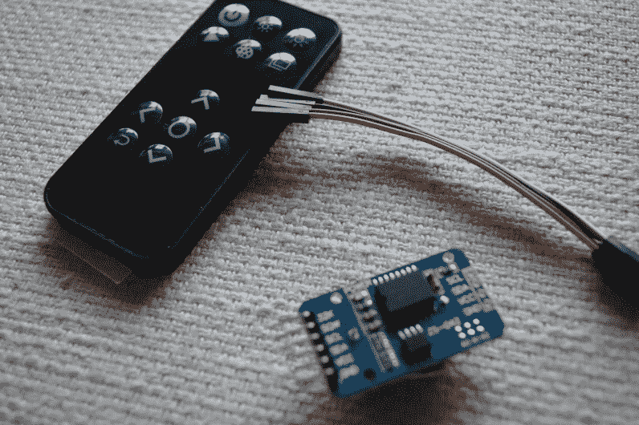

# 1 个像素的 Pacman

> 原文：<https://hackaday.com/2015/06/01/1-pixel-pacman/>

我通常看到复古游戏项目使用具有相当数量像素(64×64)的小屏幕，但我真正喜欢的是让每个像素都有价值的外观。考虑到这一点，我制作了一个 1 像素的吃豆人游戏，这是一个经典的投币游戏，但是角色只由一个像素组成。如果没有一些老式的控制，玩这样的后仰就不一样了，所以我拿起一个 Atari 操纵杆，将其连接到一个微控制器上，并开始编码。看看这个:

[https://www.youtube.com/embed/xKPRTjCqYnI?version=3&rel=1&showsearch=0&showinfo=1&iv_load_policy=1&fs=1&hl=en-US&autohide=2&wmode=transparent](https://www.youtube.com/embed/xKPRTjCqYnI?version=3&rel=1&showsearch=0&showinfo=1&iv_load_policy=1&fs=1&hl=en-US&autohide=2&wmode=transparent)

## Smartmatrix 包

  32×32 RGB panel with acrylic diffuser  Back of the Smartmatrix

这个硬件让项目的构建变得非常简单:Smartmatrix。[Louis Beaudioin]开发了 Smartmatrix，它已经在 Hackaday 商店中销售了一段时间。显示模块本身是用于 LED 广告牌的商品。配线架背面的左侧和右侧有屏蔽接头，允许它们以菊花链形式连接。Smartmatrix PCB 插入其中一个屏蔽罩，为驱动显示器的 Teensy 3.1 提供焊接足迹，并为您提供将 PCB 上的螺丝端子连接到模块上的电源端子的布线。为什么需要结实的电源跳线？在全白的情况下，这个东西可以消耗大约 3.5A 的电流，不要担心，套件中包含一个电源。

同样使这看起来不错的是磨砂丙烯酸扩散板。Smartmatrix 被设计为安装在 shadowbox 框架中；它甚至包括一个框架支持板，带有一个用于 Teensy 3.1 的切口，因此无需打开它就可以进行编程。我喜欢看内脏，所以我离开我的自由浮动，直到我想出一个有趣的方式来安装作为一个单位的一切。

## 从头开始编程吃豆人

如果你以前没看过，吃豆人的幽灵人工智能和游戏细节绝对精彩。[岩谷彻]在原著上做得非常出色，你应该看看这些年来所做的所有分析。我能找到的最好的收藏是吃豆人档案，我的大部分 T2 代码都是基于那里描述的规则。

基本上鬼有两种模式，追逐和分散。这些模式设定不同的敌人目标；分散游戏中棋盘四角的点数，以及追逐游戏中相对于玩家的点数。相对部分是关键；只有红色的敌人在追你。另一个观察红方敌人的距离和角度，瞄准那个向量的反射。非常简单，非常聪明，导致敌人的行为是可信的。不仅仅是敌人的移动，玩家每吃掉一个点就会受到速度惩罚(1/60 秒),这意味着如果你不停地吃，敌人会追上来，但是你可以通过已经被吃掉的路逃跑。

## 库、DMA 和额外的硬件

  Teensy 3.1  DB9 Connector for Joystick  Extras in the Bundle  Kickstarter remote and RTC Module

运行 Smartmatrix 的硬件和软件使项目的显示部分变得非常简单。首先，Teensy 3.1 很快，在这种情况下运行在 96MHz。其次，它有直接内存访问(DMA)，这是[Louis]在[smart matrix 库](https://github.com/pixelmatix/SmartMatrix)中使用的。这意味着驱动显示器几乎完全不占用 CPU 时间，剩下的留给自己用。这个游戏的例子没有充分利用这种能力…它完全能够进行全动态视频和动态计算惊人的可视化。

承载 Teensy 3.1 的 PCB 向一侧伸出几个引脚。我不确定我将来会添加什么，所以我实际上使用了 Teensy 底部额外的表面贴装 IO 引脚来连接 Atari 操纵杆(这只是一组开关)。这是足够的两个操纵杆垫，所以我用引脚插座接口 Teensy 的印刷电路板，以便我可以再次得到它。

该套件还包括一个红外接收器和遥控器，以及一个用于加载动画的 microSD 卡(PCB 上有一个 SD 插座)。Hackaday 商店中的捆绑包是你自己焊接的套件，但[Louis']公司 Pixelmatix，[有一个 Kickstarter 运行](https://www.kickstarter.com/projects/pixelmatix/smartmatrix-dynamic-led-art-display-and-music-visu)的完全组装版本，带有黑色遥控器和声音可视化硬件。

## 未来的改进

游戏完全正常，但是有几个关键的东西我真的想补充一下。Teensy 3.1 只有一个 DAC 引脚可用。我相当肯定最初的投币游戏有单声道音频。用这块板应该可以相当准确地再现声音。这会让这个项目真正流行起来。

还有一堆修饰需要发生。我想添加一个玩家被敌人吃掉时的动画，以及关卡重启前的倒计时。分数，以二进制显示在右栏，当游戏结束时，应该以十进制滚动出来，没有高分屏幕的投币游戏是什么？