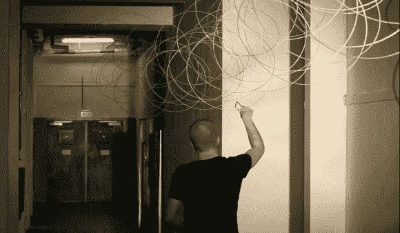

# 100 米弹簧混响让我们听到恶魔的声音

> 原文：<https://hackaday.com/2012/11/28/100-meter-spring-reverb-makes-us-hear-satanic-voices/>

当谈到吉他放大器时，我们习惯于听到弹簧混响。这是一个螺旋弹簧，延伸到放大器外壳的长度。一端输入吉他信号，另一端用拾音器采集输出。但是今年春天的混响要大得多。[Jochem van Grieken]在一条长长的走廊上悬挂了 100 米长的钢丝，结果听起来有点邪恶。

一个简单的压电元件被用作拾音器来放大弹簧发出的声音。上图[Jochem]正在使用看起来像珠宝商的锯子的东西在 3.5 毫米的电线上制造一些声音。在我们看来，这部分视频听起来很邪恶。在演示的后半部分，他用一把尺子敲击电线，制造出许多科幻电影中的皮尤效应。

这不是他第一次尝试这个概念，只是他最大的一次。休息之后还发现了一对他其他装置的链接。

[https://www.youtube.com/embed/oXItDwgf6hM?version=3&rel=1&showsearch=0&showinfo=1&iv_load_policy=1&fs=1&hl=en-US&autohide=2&wmode=transparent](https://www.youtube.com/embed/oXItDwgf6hM?version=3&rel=1&showsearch=0&showinfo=1&iv_load_policy=1&fs=1&hl=en-US&autohide=2&wmode=transparent)

[模拟声音实验室 1](http://jochemvangrieken.wordpress.com/2012/04/01/analogue-soundlab/)

[模拟声音实验室 2](http://jochemvangrieken.wordpress.com/2012/09/11/analogue-soundlab-2/)