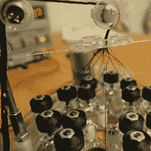
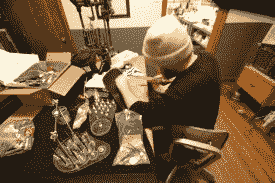
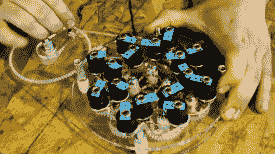

# 受剩余库存启发的 16 筒绳编织机

> 原文：<https://hackaday.com/2014/07/29/16-bobbin-rope-braiding-machine-inspired-by-surplus-store-find/>

当红牛创造建造的日子过去后，[大卫]把我们拉到一边，问我们是否想看看他一直在工作的机械黑客。在他哥哥[杰德]的帮助下，他制造了这台使用 16 个线轴的编织机。

项目的想法总是来自有趣的地方。[David]在 Ax-man 盈余公司找到一台绳索编织机后想出了这个。这家位于双城(明尼苏达州明尼阿波利斯/圣保罗)的商店是无数黑客的发源地。我想到的一个是 90 年代的电动滑板车项目。

[https://www.youtube.com/embed/_azy4HQfbcI?version=3&rel=1&showsearch=0&showinfo=1&iv_load_policy=1&fs=1&hl=en-US&autohide=2&wmode=transparent](https://www.youtube.com/embed/_azy4HQfbcI?version=3&rel=1&showsearch=0&showinfo=1&iv_load_policy=1&fs=1&hl=en-US&autohide=2&wmode=transparent)

[David]想了解将线轴分成多组轨道线轴的机制实际上是如何工作的。这既令人着迷，又很难想象它是如何工作的，除非真的进去看看传动装置。谢天谢地，如果他按照他的计划把它变成一个工具包，你就可以做到这一点。

如果你认不出他，[大卫]在今年的创作中是 1.21 吉加瓦特团队的成员。我们过去也见过他的几个黑客，比如这个[半色调鼓式打印机](http://hackaday.com/2011/11/14/half-tone-cnc-with-man-powered-z-axis/)，还有这个[自行车车架焊接夹具](http://hackaday.com/2012/02/22/cnc-milled-bicycle-frame-jig/)。

  Assembling the prototypes  Outfeed used to help with even braids  Testing prototypes  Machine being demonstrated