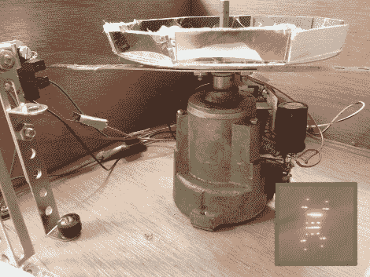

# 16×8 像素激光投影仪

> 原文：<https://hackaday.com/2012/09/14/16x8-pixel-laser-projector/>

[Michiel]用他最近完成的 16×8 像素激光投影仪画出了 Hackaday 的标志，给了我们一个小小的惊喜。它使用一组旋转的镜子，以稍微不同的角度安装，来改变红色激光二极管的路径。

投影仪由 Arduino 驱动。为了让它不仅仅是一个硬编码的存在[Michiel]包含了一个 Xbee 模块。这让他可以用电脑连接到它，以便传输信息。他的项目日志中链接的一个演示视频显示了他编写的 web 界面，该界面将把提交表单中键入的消息推送到投影仪，在投影仪上像字幕一样滚动。

这种旋转显示器是制作激光投影仪的几种常见方法之一。在上图中，你可以看到用于同步二极管和旋转镜的光学传感器，每个旋转镜负责不同的像素行。他列举了几件他在做这个项目时学到的事情。我们认为最重要的是这样做的时机问题。