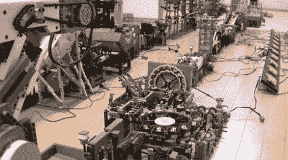

# 17 阶段伟大的球装置必须使用所有的乐高块

> 原文：<https://hackaday.com/2012/09/19/17-stage-great-ball-contraption-must-use-all-the-lego-pieces/>

看着这个 [17 级大球装置](http://www.youtube.com/watch?v=sUtS52lqL5w)让我们觉得【Skiyuky】应该在工业自动化领域工作。这个建筑是由不计其数的乐高零件组装而成的，它将一个由圆形塑料球组成的容器绕着一个回路移动。每个模块展示了处理部件的不同机械方式。这当然不是我们看到的第一个 GBC，但是[以前的产品](http://hackaday.com/2010/06/15/great-ball-contraption/)结合了来自许多不同制造商的阶段。[Skiyuky]在过去的两年里自己建造了这个。

休息后的视频从小型足球和篮球的主要存放处开始。为了帮助说明绕整个赛道一周需要多长时间，Skiyuky 添加了一个红色和蓝色的球，这两个球都很容易被发现。从那里，它是一个威利 Wonky 类型的乘坐通过各种各样的装置。我们对所有阶段操作的准确性和效率印象深刻。

[https://www.youtube.com/embed/sUtS52lqL5w?version=3&rel=1&showsearch=0&showinfo=1&iv_load_policy=1&fs=1&hl=en-US&autohide=2&wmode=transparent](https://www.youtube.com/embed/sUtS52lqL5w?version=3&rel=1&showsearch=0&showinfo=1&iv_load_policy=1&fs=1&hl=en-US&autohide=2&wmode=transparent)

[谢谢福兹维斯]