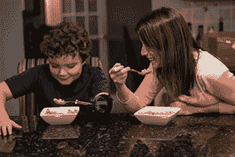

# 2015 年 THP 灵感:医疗黑客

> 原文：<https://hackaday.com/2015/03/10/2015-thp-inspiration-medical-hacks/>

去年的 Hackaday 奖关注于构建一些酷的、有用的和开放的东西。这导致了给人印象深刻的四轴飞行器(绰号“十爪龙”),以及像万能收音机一样有用的设备。这是一个很大的领域，如果你想建造一些会赢的东西，你首先需要一个想法。

今年，我们将让这部分流程变得更简单一些。我们在寻找对有影响的产品，无论是监测污染、为全体人口提供食物、为整个城市的供电奠定基础的设备，还是降低成本和增加医疗服务的设备。

医疗建筑是一个棘手的话题，但是这些年来我们已经看到了一些突出的例子。有些可以简单到[一个药丸分配器，当你不吃药时它会告诉互联网。](http://hackaday.com/2013/08/09/pill-dispenser-tattles-to-the-internet-when-you-dont-take-your-pills/)这种类型的构建实际上很受欢迎，有几次迭代，[一次是处理药瓶的](http://hackaday.com/2011/07/29/a-pill-reminder-box-to-be-proud-of/)。

也许你能在药店找到的小玩意并不适合你。没关系，相反你可以把注意力转向先进的医学成像，比如 3D 打印脑瘤，防止误诊。[我们已经看到 3D 打印的 MRI 和 CT 扫描](http://hackaday.com/2014/06/22/converting-cts-and-mris-into-printable-objects/)有一段时间了，推出一个自动化过程的系统将是 Hackaday 奖的一个很好的参赛作品。

当然，有了 3D 打印机，你就有了一堆假体应用；从一个九岁的[设计了他自己的假肢](http://hackaday.com/2014/12/07/kid-designs-his-own-prosthetic-arm-at-a-summer-camp/)，一个陌生人的打印的[假肢，或者像我们自己的【Bil Herd】的](http://hackaday.com/2014/08/27/3d-printing-a-beautiful-prosthetic-hand-for-a-stranger/)[寻求重建一个手指](http://hackaday.com/2014/08/27/bils-quest-for-a-lost-finger-episode-i/)这样简单的东西。

这些都是简单的构建，但是显然符合做有意义的事情的标准。天空是无限的，如果你想[改进台式 CT 扫描仪](http://hackaday.com/2013/10/23/towards-a-low-cost-desktop-ct-scanner/)，从自动化助手那里(正确地)学习心肺复苏术，或者用你自己的设计让[起死回生](http://hackaday.com/2015/02/06/developer-saved-years-later-by-his-own-hardware/)，这些都在今年 Hackaday 奖的目标之内。