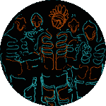
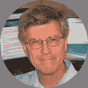
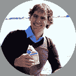

# 2015 THP:评委和赞助商

> 原文：<https://hackaday.com/2015/03/10/2015-thp-judges-and-sponsors/>

现在是时候承认使 Hackaday 奖成为可能的很大一部分了:我们的评委和我们的赞助商。首先是评委。今年，我们再次有幸邀请到来自世界各地的顶级专家。我们*将*在这篇文章中简要地触及每一个，但是你真的应该[访问评委的个人简介和每个人的链接](http://hackaday.io/prize/judges)。

## 2015 年的新法官

Akiba

Pete Dokter

Lenore Edman

Heather Knight

Ben Krasnow

Windell Oskay

Micah Scott

今年我们有七位新法官加入陪审团:

我们喜欢看到 pic 被用作头像的项目，freaklabs 的[Akiba]没有让人失望；我们在 2013 年报道了那个项目。根据 *皮特* 以 [*而闻名的【皮特·多克特】，从 Sparkfun 加入我们。[丽诺尔·埃德曼]和[温德尔·奥斯凯]是邪恶疯狂科学家实验室*](http://hackaday.com/2015/01/24/a-primer-on-buck-and-boost-converters/)*[背后的力量。Marilyn Monrobot](http://hackaday.com/2014/10/03/trek-to-evil-mad-scientist-laboratories/) 的[Heather Knight]即将在卡内基梅隆大学完成她的机器人博士学位。[本·克拉斯诺]应该不需要介绍；以前是 Valve 的，现在是 Google[x]的，一直是[应用科学](http://hackaday.com/2014/11/01/the-platinum-catalyst-use-in-a-vintage-lighter/)的。[Micah Scott]是艺术家/工程师/黑客，[她的蓝光光驱作品](http://hackaday.com/2014/10/30/reverse-engineering-a-blu-ray-drive-for-laser-graffiti/)是我们 2014 年最喜欢的黑客作品之一。*

## 返回法官

Limor “Ladyada” Fried

Jack Ganssle

Dave Jones

Ian Lesnet

Elecia White

我们 2014 年 Hackaday 奖的五位朋友将于今年回归:

除了[Ladyada]之外，我们很难称呼 Adafruit 的创始人，但你可能知道她叫[Limor Fried]。硬件设计地点*甘斯勒集团*在[由](http://hackaday.com/2014/06/21/delving-deep-into-high-speed-digital-design/)【杰克甘斯勒】打头阵。你知道[达夫·琼斯]是因为他在 EEVblog 上的电子设计和[逆向工程视频](http://hackaday.com/2015/03/04/reverse-engineer-a-vfd-after-exploring-how-they-work/)以及 Amp Hour 播客。[Ian Lesnet]是一名黑客校友，危险原型的创造者，也是中国制造方面的专家。最后，[Elecia White]是一位杰出的嵌入式工程师，Logical Elegance 和嵌入式播客的创始人。

欢迎回来，很高兴今年有了新的评委！

## 2015 年黑客日奖赞助商

2015 年 Hackaday 奖由[supply frame](http://supplyframe.com/)(hack aday 的母公司)颁发。今年我们增加了硬件世界的五大巨头作为赞助商。我们不记得见过这么多的主要参与者为了一个单一的倡议走到一起。我们很高兴他们分享了我们支持设计计划的愿景。请跟随他们的 Hackaday.io 页面感谢他们: [Atmel](http://hackaday.io/atmel) 、[飞思卡尔半导体](http://hackaday.io/freescale)、[微芯片](http://hackaday.io/microchip)、Mouser 电子公司[德州仪器](http://hackaday.io/ti)。感谢赞助商！