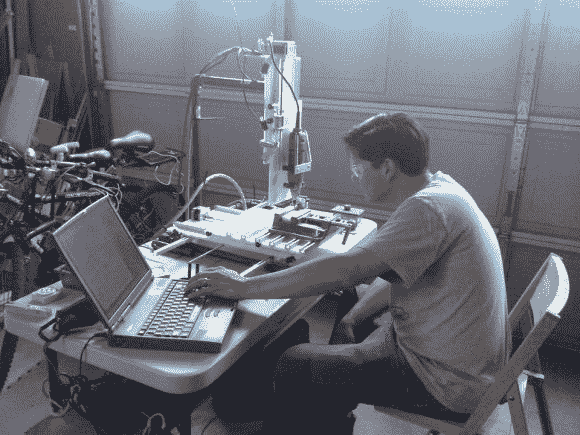
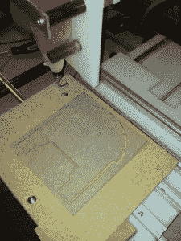

# $250;推动廉价(和功能)数控机床制造的极限

> 原文：<https://hackaday.com/2014/06/28/250-pushing-the-limit-on-cheap-and-functional-cnc-machine-builds/>

当购买或建造一台数控机床时，成本总是一个缺点和障碍，尤其是当建造它只是为了娱乐或爱好时。[Eric]花了大约 250 美元，去了几次五金店，花了很多时间，拼凑出了一台基于三轴旋转工具的机器。

这台机器的设计大致基于他在 Instructables 上找到的这台机器。[Eric]之所以选择这种方式，是因为他觉得悬臂式工具比龙门式机器更稳定，也更容易制造。滑板轴承，高密度聚乙烯滑块和 c 型铝用于支撑 XY 工作台，而不是传统的线性轴承和轨道。所有三个轴都由步进电机和 1/4 英寸-20 英寸的螺杆驱动。Harbor Freight dremel 式旋转工具有助于降低整体成本。

【埃里克】使用[涡轮数控](http://www.dakeng.com/turbo.html)作为控制软件，真是老派了。TurboCNC 在 DOS 和基于 DOS 的操作系统(Windows 3.1/95/98)上运行。软件通过并行端口与步进驱动器通信。由于这台专用电脑不具备 WiFi 或 USB 功能，将文件下载到这台电脑有点困难。我们可以建议一台稍微新一点的电脑(带 USB)并检查一下 [LinuxCNC](http://www.linuxcnc.org/) 吗？

虽然到目前为止，该机器已经成功切割了中密度纤维板和泡沫塑料，但固体塑料一直是一个挑战。最终目标是磨出电路板。[Eric]试着切了一些，现在知道有多难了。他在不断进步，我们期待看到他的进步。

[https://www.youtube.com/embed/dgM-o0_eUyY?version=3&rel=1&showsearch=0&showinfo=1&iv_load_policy=1&fs=1&hl=en-US&autohide=2&wmode=transparent](https://www.youtube.com/embed/dgM-o0_eUyY?version=3&rel=1&showsearch=0&showinfo=1&iv_load_policy=1&fs=1&hl=en-US&autohide=2&wmode=transparent)